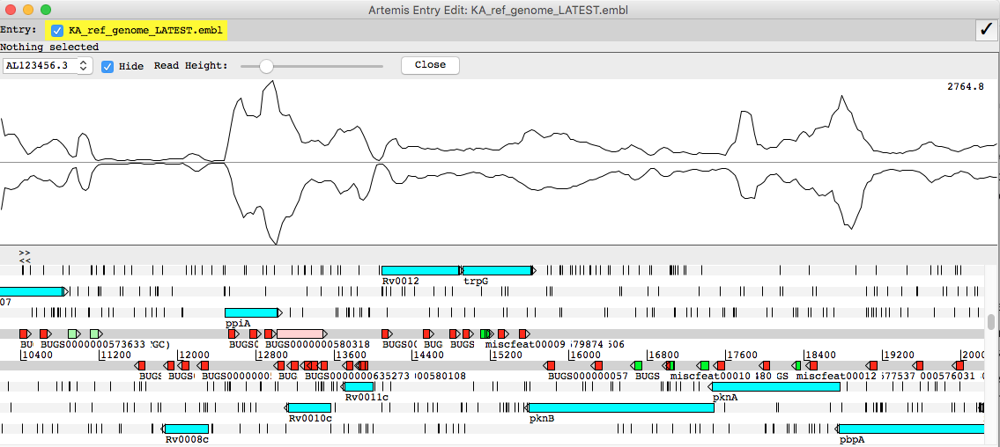
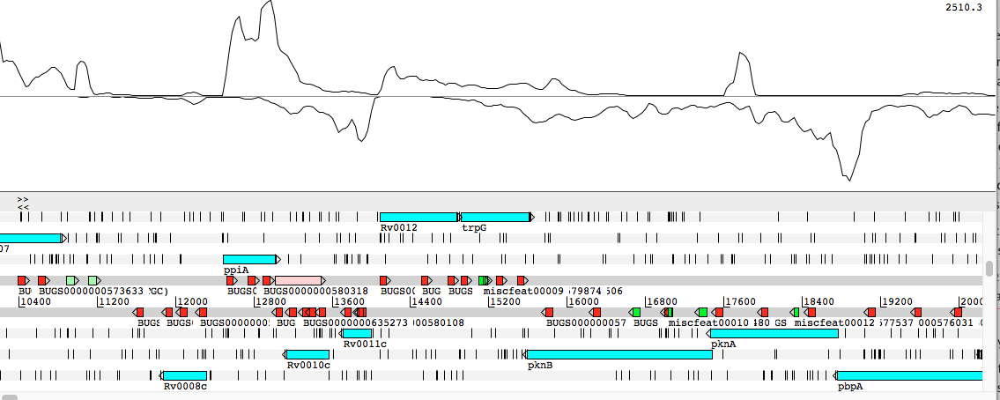
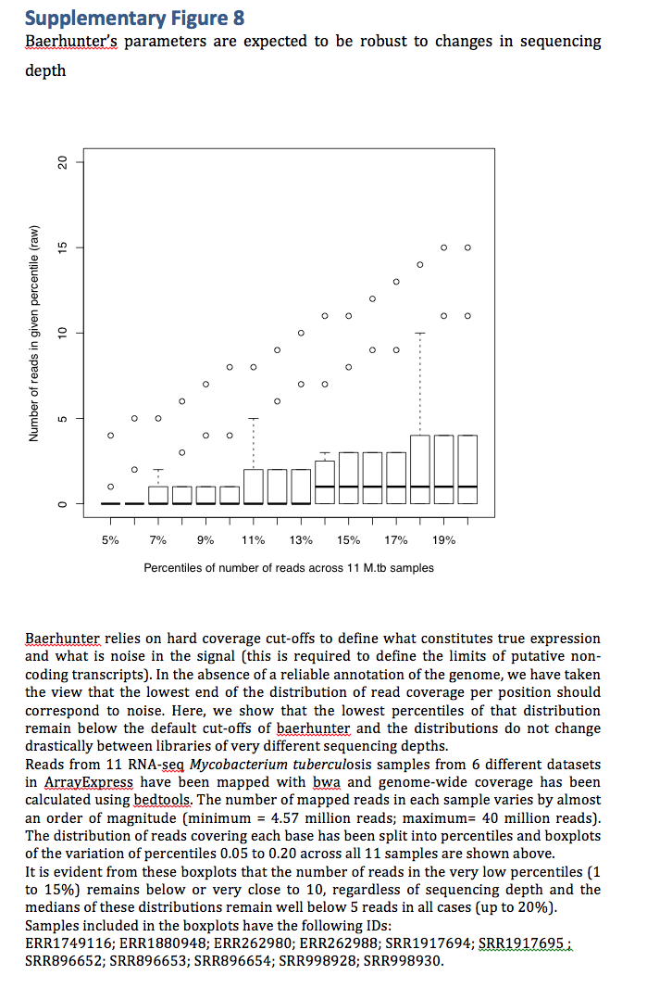
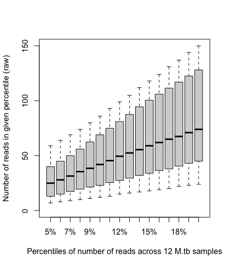
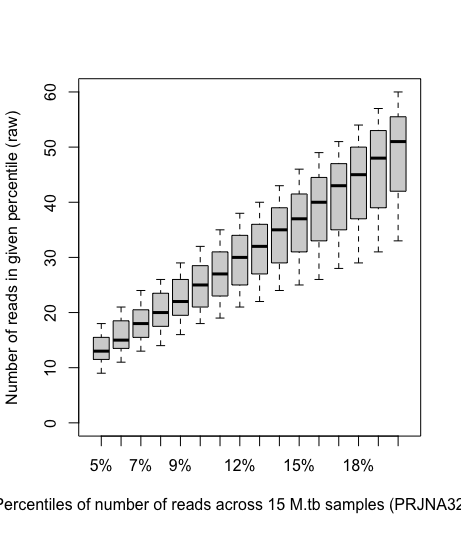
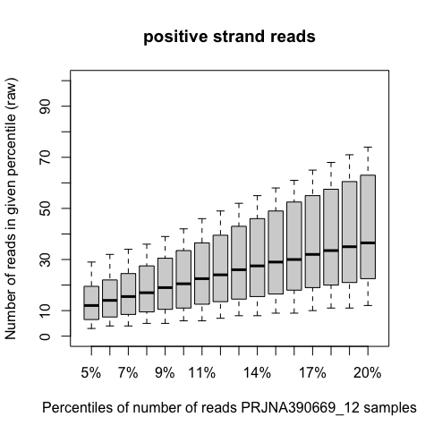
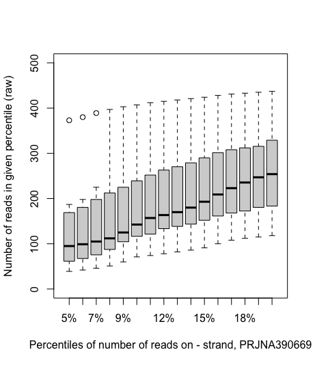
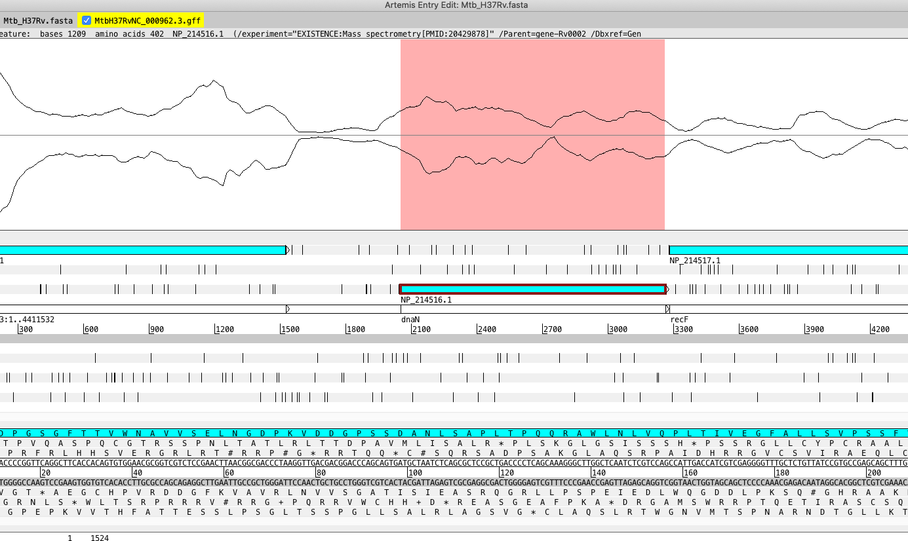
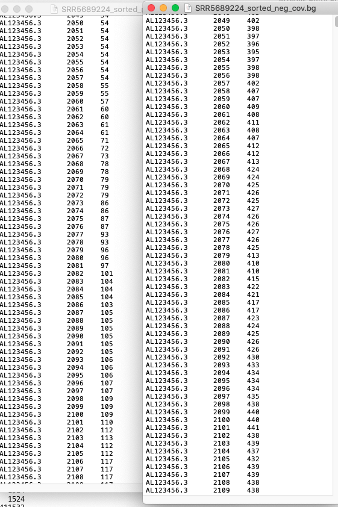
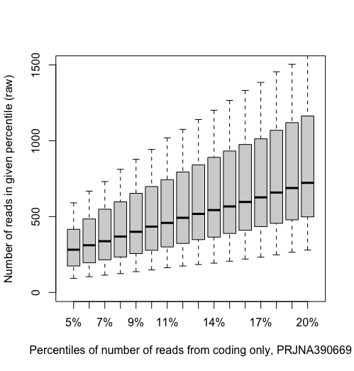

******
#Reading and Resources

1. Yen Yi's MRes report [Large Scale Computational Analysis of Coding and Non-coding Element Expression in Mycobacterium tuberculosis](Mycobacteria_project/HBXV7_AMS_MSCI_DISSERTATION_SUBMISSION.pdf)

2. Rosanna's MRes report [Computational analysis of combined RNA-seq datasets to predict novel ncRNAs in Mycobacterium tuberculosis](Mycobacteria_project/MRes_dissertation_RJ.pdf)

3. Baerhunter paper [Ozuna, A., Liberto, D., Joyce, R. M., Arnvig, K. B., & Nobeli, I. (2019). baerhunter: an R package for the discovery and analysis of expressed non-coding regions in bacterial RNA-seq data. Bioinformatics.] (https://doi.org/10.1093/bioinformatics/btz643)
[supplementary data](https://academic.oup.com/bioinformatics/article-abstract/36/3/966/5550627?redirectedFrom=fulltext)


## work on gathering/annotating list of ncRNAs in mtb

***literature search***

Papers that identify ncRNA in mtb

1. [Cortes T, Schubert OT, Rose G, Arnvig KB, Comas I, Aebersold R, Young DB. 2013. Genome-wide mapping of transcriptional start sites defines an extensive leaderless transcriptome in Mycobacterium tuberculosis. Cell Rep. 5:1121–1131. ](http://dx.doi.org/10.1016/ j.celrep.2013.10.031)

-TSS validation

2. [Arnvig KB, Comas I, Thomson NR, Houghton J, Boshoff HI, Croucher NJ, Rose G, Perkins TT, Parkhill J, Dougan G, Young DB. 2011. Sequence-based analysis uncovers an abundance of non-coding RNA in the total transcriptome of Mycobacterium tuberculosis. PLoS Pathog. 7:e1002342. ](http://dx.doi.org/10.1371/journal.ppat.1002342)

3. [Miotto P, Forti F, Ambrosi A, Pellin D, Veiga DF, Balazsi G, Gennaro ML, Di Serio C, Ghisotti D, Cirillo DM. 2012. Genome-wide discovery of small RNAs in Mycobacterium tuberculosis. PLoS One 7:e51950. ](https://journals.plos.org/plosone/article?id=10.1371/journal.pone.0051950) 

4. [Dejesus, M. A. et al. Comprehensive essentiality analysis of the Mycobacterium tuberculosis genome via saturating transposon mutagenesis. MBio 8, 1–17 (2017).](https://mbio.asm.org/content/8/1/e02133-16)

  -esp S5(UTRs and promoters), S4 (predicted sRNAs)
  
5. [Shell SS, Wang J, Lapierre P, Mir M, Chase MR, Pyle MM, Gawande R, Ahmad R, Sarracino DA, Ioerger TR, Fortune SM, Derbyshire KM, Wade JT, Gray TA. 2015. Leaderless transcripts and small proteins are common features of the mycobacterial translational landscape. PLoS Genet11:e1005641. doi:10.1371/journal.pgen.1005641](https://journals.plos.org/plosgenetics/article?id=10.1371/journal.pgen.1005641)

-TSS validation

6. [Arnvig KB, Young DB. 2009. Identification of small RNAs in Mycobacte- rium tuberculosis. Mol Microbiol 73:397–408. ](https://onlinelibrary.wiley.com/doi/full/10.1111/j.1365-2958.2009.06777.x)

7. [DiChiara JM, Contreras-Martinez LM, Livny J, Smith D, McDonough KA, Belfort M. 2010. Multiple small RNAs identified in Mycobacterium bovis BCG are also expressed in Mycobacterium tuberculosis and Mycobacterium smegmatis. ](https://academic.oup.com/nar/article/38/12/4067/2409235)

8. [Wang M, Fleming J, Li Z, Li C, Zhang H, Xue Y, Chen M, Zhang Z, Zhang XE, Bi L. 2016. An automated approach for global identification of sRNA-encoding regions in RNA-Seq data from Mycobacterium tubercu- losis. Acta Biochim Biophys Sin (Shanghai) 48:544–553. ](https://academic.oup.com/abbs/article/48/6/544/2195062)

9. [Mycobrowser website lists 62 putative ncRNA genes](https://mycobrowser.epfl.ch/home/about)

  can't download the list! use only for looking up particular ncRNAs

10. [Rfam database lists 22 sRNAs, 12 with structure](https://rfam.xfam.org/search?q=mycobacterium%20tuberculosis%20AND%20rna_type:%22sRNA%22%20AND%20TAXONOMY:%2283332%22)


11. [Gerrick, E. R. et al. Small RNA profiling in mycobacterium tuberculosis identifies mrsi as necessary for an anticipatory iron sparing response. Proc. Natl. Acad. Sci. U. S. A. 115, 6464–6469 (2018). ](https://www.pnas.org/content/115/25/6464)

  saved S1 list of putative predicted sRNAs using 'BSfinder' (same as Dejesus?)
  
12. [Dinan, A. M. et al. Relaxed Selection Drives a Noisy Noncoding Transcriptome in Members of the. 5, 1–9 (2014). ](https://mbio.asm.org/content/5/4/e01169-14)


Should I start with Gerrick et al and Tine's published list (Cortes), UTR's from Shell, et al and then use essentiality info from DeJesus? look at baerhunter predictions and Tine's unpublished list

Definitely: name (using 'new' system with ncRv1 as prefix), any old name that is used in literature, start, stop, strand, references, 'verified by' (for example RACE, northern blot, etc), 5' TSS


other info: expression conditions measured, flanking genes (though this is basically included in name and position above), RFAM, log2fold change in different conditions

start with first set. Should I have list of references and legend, or use PMID? might be easier for our use if have references listed.

Naming protocol using:

[Lamichhane, G., Arnvig, K. B. & McDonough, K. A. Definition and annotation of (myco)bacterial non-coding RNA. Tuberculosis 93, 26–29 (2013).](https://doi.org/10.1016/j.tube.2012.11.010)

Will focus on Arnvig list of ncRNAs. Cross-check Gerrick's (and DeJesus's?) computationally predicted ncRNAs with validated TSS sites from Shell and Cortes papers.

use union of TSSs in both conditions in Cortes paper

need to find TSS that lies in 10 nt before/within gene boundary and include actual TSS coordinate in df for Gerrick annotations

file is:  Gerrick_ncRNA_TSS_positions.txt


perhaps create an overlap index (Jaccard index) to figure out how much the genomic ranges overlap between sets 

[The BSGatlas: An enhanced annotation of genes and transcripts for the Bacillus subtilis genome with improved information access ](https://www.biorxiv.org/content/10.1101/807263v1.full)


also, Irilenia gave me file of highly expressed ncRNAs from Rosanna's mRes: "/Mycobacteria_project/combined_h37rv_Mtb_high_expressed.gff3""

but decided to run baerhunter again using Yen-yi's .bam files:
/d/projects/u/zchayyt/MTB_sample_accession_files/sample_accessions/

accessions_M.txt   PRJNA278760_22_Safa  QC_original         test_bam
Local_scripts      PRJNA327080_15       QC_postBWAmem
PRJEB19976_15p_SE  PRJNA390669_12       QC_postfastp
PRJEB65014_3       PRJNA507615_12_SE    QC_posttrimmomatic


install baerhunter on thoth R library

```{bash}
module load R/v4.0.1
```

```{R}
install.packages("devtools")
#Warning in install.packages("devtools") :
#  'lib = "/s/software/R/v4.0.1/lib64/R/library"' is not writable
#Would you like to use a personal library instead? (yes/No/cancel) yes
#Would you like to create a personal library
#‘~/R/x86_64-pc-linux-gnu-library/4.0’
#to install packages into? (yes/No/cancel) No
#Error in install.packages("devtools") : unable to install packages


install.packages("devtools")
#Warning in install.packages("devtools") :
#  'lib = "/s/software/R/v4.0.1/lib64/R/library"' is not writable
#Would you like to use a personal library instead? (yes/No/cancel) yes
#Would you like to create a personal library
#‘~/R/x86_64-pc-linux-gnu-library/4.0’
#to install packages into? (yes/No/cancel) yes

```

should I rename this library?

also installed baerhunter and all dependencies (see baerhunter_trial.R)

```{R}
library(baerhunter)
library(GenomicAlignments)
library(IRanges)
library(Rsamtools)
library(Rsubread)
library(DESeq2)

feature_file_editor(bam_directory="/d/projects/u/zchayyt/MTB_sample_accession_files/sample_accessions/PRJNA278760_22_Safa",
                    original_annotation_file="MtbH37RvNC_000962.3.gff",
                    annot_file_dir = "/d/in16/u/sj003/refseqs/Mtb/",
                    output_file="/d/projects/u/sj003/output_BH_12_10/PRJNA278760_22.gff3",
                    original_sRNA_annotation="ncRNA",
                    low_coverage_cutoff=5, #cutoff for noise
                    high_coverage_cutoff=10,
                    min_sRNA_length=40,
                    min_UTR_length=50,
                    paired_end_data=TRUE,
                    strandedness="stranded")

```

make R script calling above and call in bash:

```{bash}
nohup R CMD BATCH $my_path/scripts/BH_make_gff.R &
```

this is not really working. says 'nohup ignoring input'
tried again without nohup--taking forever

not working no matter what i do, same error:

[1] "Extracted plus strand data from BAM files"
Error in h(simpleError(msg, call)) : 
  error in evaluating the argument 'i' in selecting a method for function '[': 'match' requires vector arguments
Calls: feature_file_editor -> sRNA_calc -> [ -> %in% -> .handleSimpleError -> h
Execution halted


I'm thinking maybe it doesn't work with R version (4.0.1). I'm using R version 3.5.1 (2018-07-02) on my machine. Try loading with that version (3.5.2 on thoth) and try again.

```{bash}
module load R/v3.5.2
```

re-load devtools--makes new personal R library for 3.5

/d/user6/sj003/R/x86_64-pc-linux-gnu-library/3.5

```{R eval=FALSE, include=FALSE}
install.packages("devtools")
library(devtools)
library(IRanges)
library(Rsamtools)
library(DESeq2)
library(Rsubread)
devtools::install_github("irilenia/baerhunter")
library(baerhunter)
```

i don't think the libraries are necessary except for the session used--have to re-load them before using baerhunter, but packages are in personal R library, or general library that R has access to

```{bash}
nohup R CMD BATCH $my_path/scripts/BH_make_gff.R >& BH_make_gff.Rout &
```

got a warning from server that I was exceeding my allocated disk space limits. killed process.

```{bash}
kill%2  ##this is job number
```

looks like it is related to using personal R library in the home directory. need to move this to /d/in16/u/sj003. Deleted 3.5 and 4.0 libraries in home directory.

make files in working directory:
```{bash}
touch .Renviron
touch R_packages
```

.Renviron contains line:  R_LIBS = /d/in16/u/sj003/R_packages

when I reload R and install devtools, this time it works using correct folder.

Irilenia pointed out that "strandedness" refers to +/- stranded datasets. need to confirm this for each library. all of Yen-yi's datasets were reversely stranded.

going to re-do using R in correct directory, and using smallest dataset, PRJEB65014. this corresponds to E-MTAB-6011 (using number of samples, can't look at fastq files to find this identifier). Looked up on sra, this is correct bio-project number.

| bio-project | dataset |
|-----------|------------|
| PRJEB65014 | E-MTAB-6011 |
| PRJNA278760 | GSE670035 |
| PRJNA327080 | GSE83814 |
| PRJNA390669 | GSE100097 |


folder for .bam files:
/d/projects/u/zchayyt/MTB_sample_accession_files/sample_accessions/

```{R}
library(baerhunter)
library(GenomicAlignments)
library(IRanges)
library(Rsamtools)
library(DESeq2)
library(Rsubread)

# create a directory to hold the output files..
if (!(dir.exists("./output_BH_13_10/"))) { dir.create("./output_BH_13_10/")
}
feature_file_editor(bam_directory="/d/projects/u/zchayyt/MTB_sample_accession_files/sample_accessions/PRJEB65014_3/BWA_mem/",
                    original_annotation_file="MtbH37RvNC_000962.3.gff",
                    annot_file_dir = "/d/in16/u/sj003/refseqs/Mtb/",
                    output_file="output_BH_13_10/PRJE65014_3.gff3",
                    original_sRNA_annotation="ncRNA",
                    low_coverage_cutoff=5, #cutoff for noise
                    high_coverage_cutoff=10,
                    min_sRNA_length=40,
                    min_UTR_length=50,
                    paired_end_data=TRUE,
                    strandedness="reversely_stranded")

## run with other datasets:
#/d/projects/u/zchayyt/MTB_sample_accession_files/sample_accessions/PRJNA278760_22_Safa/
# Done 13/10/20
# /d/projects/u/zchayyt/MTB_sample_accession_files/sample_accessions/PRJNA327080_15/BWA_mem/
# Done 13/10/20
# /d/projects/u/zchayyt/MTB_sample_accession_files/sample_accessions/PRJNA390669_12/BWA_mem/

```

OK, that worked! have to use step to create new directory and only include name of directory in working directory, not entire path. Viewed gff3 on artemis. Got gff3 files for all four datasets.

Irilenia is concerned that BH results from PRJNA390669 is very low. check data for strandedness and quality. Strandedness is defo reversely stranded:




It appears that the sRNAs are being called UTRs because the read depth is very high and signal never goes back to zero (noisy). We need to adjust the low/high coverage parameters to eliminate this problem.

From Irilenia: "use bedtools(?) to calculate coverage per position. Then you have the distribution of the coverages and can find the various percentiles of this"



```{bash}
module load bedtools
bedtools genomecov
```

Tool:    bedtools genomecov (aka genomeCoverageBed)
Version: v2.27.1
Summary: Compute the coverage of a feature file among a genome.

Usage: bedtools genomecov [OPTIONS] -i <bed/gff/vcf> -g <genome>

Options: 
	-ibam		The input file is in BAM format.
			Note: BAM _must_ be sorted by position

From: [bedtools genomecov](https://bedtools.readthedocs.io/en/latest/content/tools/genomecov.html#max-controlling-the-histogram-s-maximum-depth)

-d Reporting “per-base” genome coverage
Using the -d option, bedtools genomecov will compute the depth of feature coverage for each base on each chromosome in genome file provided.

The “per-base” output format is as follows:

chromosome
chromosome position
depth (number) of features overlapping this chromosome position.

-max Controlling the histogram’s maximum depth
Using the -max option, bedtools genomecov will “lump” all positions in the genome having feature coverage greater than or equal to -max into the -max histogram bin. For example, if one sets -max equal to 50, the max depth reported in the output will be 50 and all positions with a depth >= 50 will be represented in bin 50.


```{bash}
bedtools genomecov -ibam /d/projects/u/zchayyt/MTB_sample_accession_files/sample_accessions/PRJNA390669_12/BWA_mem/SRR5689224_sorted.bam -d > SRR5689224_cov
```

don't need genome files with .bam files

-bg Reporting genome coverage in BEDGRAPH format.
Whereas the -d option reports an output line describing the observed coverage at each and every position in the genome, the -bg option instead produces genome-wide coverage output in BEDGRAPH format. This is a much more concise representation since consecutive positions with the same coverage are reported as a single output line describing the start and end coordinate of the interval having the coverage level, followed by the coverage level itself.

```{bash}
bedtools genomecov -ibam /d/projects/u/zchayyt/MTB_sample_accession_files/sample_accessions/PRJNA390669_12/BWA_mem/SRR5689224_sorted.bam -bg > SRR5689224_coverage.bg
```

this is useless, still finding each base. use -d above.

Now need to plot this in R. should I do this for each .bam and then combine or take mean of each position?

maybe run for each (write script) and then find mean of coverage at each bp?

```{bash}

# script to run bedtools on each .bam file in folder and generate coverage graph for each sample

# module load bedtools
# usage nohup bash /d/in16/u/sj003/scripts/iterate_bedcov.sh >& run_bedcov_out &

#ls /d/projects/u/zchayyt/MTB_sample_accession_files/sample_accessions/PRJNA327080_15/BWA_mem/*.bam > names.txt

#!/bin/bash

for file in `cat names.txt`

do
        FILENAME=`basename ${file%%.*}`

        echo “File on the loop:                 ${FILENAME}”

# generate coverage plot
        bedtools genomecov -ibam $file -d > ${FILENAME}_cov

        echo -e “#######################\n\n”

done


```


looks like files are a bit uneven in terms of read coverage, for example 24 and 25  and 28 x10 higher than next two samples. make percentage distr bargraph (like one from baerhunter suppl materials above) for each sample.

percentile boxplots for this sample (script in "coverage_plot.R"):
## work with bedgraph coverage files
## make plot with each sample from PRJNA390669_12 to attempt to show lower percentiles fall within a small range (but they don't really seem to in this dataset). 
# use quantiles

```{R}
#produces sample quantiles corresponding to the given probabilities. 
# quantile returns estimates of underlying distribution quantiles based on one or two order statistics from
# the supplied elements in x at probabilities in probs.
lapply(cov_df[,3:14], quantile, probs=c(0.05, 0.1, 0.15, 0.20, 0.25, 0.50, 0.75, 1.0))
lapply(cov_df[,3:14], quantile, probs=c(0.05, 0.06, 0.07, 0.08, 0.09, 0.1, 0.11, 0.12, 0.13, 0.14, 0.15, 0.16, 0.17, 0.18, 0.19, 0.20))
```



Might want to compare boxplots for individual samples and see if there is any correlation with different conditions?


Do this again with dataset PRJNA327080 (GSE83814) (Safa's dataset with 15 samples)
to see if it is better distributed?




for later when we are comparing datasets, this maybe useful:
[Jaccard statistics using bedtools](http://quinlanlab.org/tutorials/bedtools/bedtools.html)


But perhaps I want to generate a coverage density plot that differentiates between coverage on each strand? 

https://davetang.org/muse/2015/08/05/creating-a-coverage-plot-using-bedtools-and-r/


```{bash}
bedtools genomecov -ibam NA18152.bam -bg -strand +
```

IN suggests seeing what coverage stats look like for cds only.


also, can possibly take into consideration paired end reads?? -pc trackoption
-pc	
Calculates coverage of intervals from left point of a pair reads to the right point.
Works for BAM files only

```{bash}
bedtools genomecov -ibam /d/projects/u/zchayyt/MTB_sample_accession_files/sample_accessions/PRJNA390669_12/BWA_mem/SRR5689224_sorted.bam -d -pc -strand + > SRR5689224_pos_cov

bedtools genomecov -ibam /d/projects/u/zchayyt/MTB_sample_accession_files/sample_accessions/PRJNA390669_12/BWA_mem/SRR5689224_sorted.bam -d -pc -strand - > SRR5689224_neg_cov
```

run for entire set (changed iterate_bedcov.sh script) and look at boxplots





need to check results because there should be MORE reads on positive strand, as there are more genes (is this right?). check selected regions on artemis with some of the bams. (which regions? those that should have a lot of positive reads?)

looking at particular region on ARtemis to see why there is such a discrepancy between positive and negative read counts when I used bedtools. put .bam on artemis. compared with read counts file

```
#BAM: /Users/jenniferstiens/git/mtb_modules/SRR5689224_sorted.bam
SRR5689224_sorted.bam	

      	  Sense Antisense  Total	
Rv0002	   2806    2787    5593	
```

This shows that coverage should have been about equal for this feature.






so is the program working properly on the positive strand?

Has bedtools switched the positive and negative reads? But the .bam shows reads on both strands. Why are there so many reads on reverse strand in this region?

#########################################################################

to find coverage of only coding regions use bedtools coverage:
[bedtools coverage](https://bedtools.readthedocs.io/en/latest/content/tools/coverage.html)

```{bash}
bedtools coverage -b /d/projects/u/zchayyt/MTB_sample_accession_files/sample_accessions/PRJNA390669_12/BWA_mem/SRR5689224_sorted.bam -a /d/in16/u/sj003/refseqs/Mtb/MtbH37RvNC_000962.3.gff > SRR5689224_cds_cov.bg
```

-b is .bam and -a is .gff. YES.
-d	Report the depth at each position in each A feature. Positions reported are one based. Each position and depth follow the complete A feature. (don't use--wrong info)
-s	Force “strandedness”. That is, only report hits in B that overlap A on the same strand. By default, overlaps are reported without respect to strand.
-S	Require different strandedness. That is, only report hits in B that overlap A on the _opposite_ strand. By default, overlaps are reported without respect to strand.

results: The number of features in B that overlapped (by at least one base pair) the A interval.

do without strandedness to compare cds?

iterate_bedcov_cds.sh

all zero! 

```{bash}
nohup bedtools coverage -a d/in16/u/sj003/refseqs/Mtb/MtbH37RvNC_000962.3.gff -b /d/projects/u/zchayyt/MTB_sample_accession_files/sample_accessions/PRJNA390669_12/BWA_mem/*_sorted.bam > bedcov_out.bg >& run_cds_cov_out &
```

try with all bam files in folder rather than iterating through files? will give one number of reads per feature--not related to sequencing depth per sample. not sure this is helpful to us.

Error: Unable to open file d/in16/u/sj003/refseqs/Mtb/MtbH37RvNC_000962.3.gff. Exiting.

This may be that the 'chromosome' name doesn't match in bams and gff. need to either use same gff as yenyi did (check chrom name) or make new gff with new chrom name

found ref seq in yenyi's folder and copied to mine:
$my_path/refseqs/Mtb/Mtb_h37rv.ASM19595v2.45.Chromosome.gff3

ref seq name in header on .bam files is 'AL123456.3', on gff 'Chromosome'

```{bash}
#test to see if my commands work to change ref file
sed '25q' Mtb_h37rv.ASM19595v2.45.Chromosome.gff3 | sed 's/^Chromosome/AL123456.3/g' > test.txt
```

change all labels in gff to 'AL123456.3':

```{bash}
sed 's/^Chromosome/AL123456.3/g' Mtb_h37rv.ASM19595v2.45.Chromosome.gff3 > Mtb_h37rv.ASM19595v2_AL123456.3.gff3
```

new ref seq for bedtools coverage: d/in16/u/sj003/refseqs/Mtb/Mtb_h37rv.ASM19595v2_AL123456.3.gff3

try with one file first:
```{bash}
bedtools coverage -b /d/projects/u/zchayyt/MTB_sample_accession_files/sample_accessions/PRJNA390669_12/BWA_mem/SRR5689224_sorted.bam -a /d/in16/u/sj003/refseqs/Mtb/Mtb_h37rv.ASM19595v2_AL123456.3.gff3  > SRR5689224_cds_cov.bg
```

then use edited script
```{bash}
nohup bash $my_path/scripts/iterate_bedcov_cds.sh >& run_bedcov_cds_out &
```

This seems to work. work out coverage plots for cds only.




