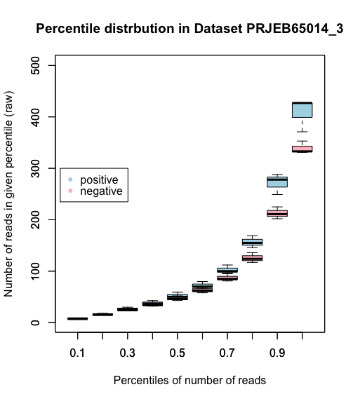
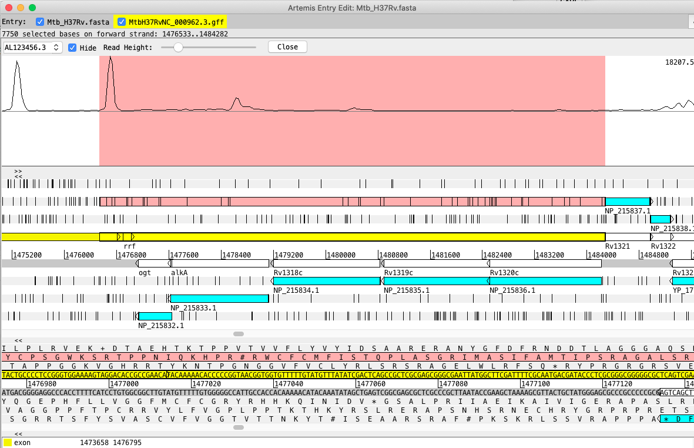

Checking out Rosanna's code making the gff3 file from baerhunter results. idea is to make a different feature file for each dataset and then combine features into one file to use for counting reads.

She first attempts to compare pairwise between each dataset using genomic ranges overlaps, but I'm not sure she continues with this path

Converts all files to bed files to use bedtools intersect


##############################################################################

working on baerhunter to customise parameters for the read depth of each .bam before determining peak union

1) Estimate amount of genome not transcribed (fraction that represents noise) for gff file provided. Use read.gff(file, na.strings = c(".", "?"), GFF3 = TRUE) and add up length of all 'Parent' elements. Add 80(?)bp for UTRs (5' and 3') for each CDS (need to count number of CDSs to estimate this). Add this as functionality on baerhunter.


```{R percent_transcribed.R}
## find proportion of Mtb genome that is transcribed

if (!require("BiocManager"))
  install.packages("BiocManager")
BiocManager::install("IRanges")
BiocManager::install("Rsamtools")
BiocManager::install("GenomicAlignments")
install.packages("ape")
BiocManager::install("GenomicRanges")


library(IRanges)
library(Rsamtools)
library(GenomicAlignments)
library(ape)
library(GenomicRanges)

# 1) write function that finds percentage of genome not likely to be transcribed using .gffs

# write function that uses gff as parameter
# output: % of genome likely to be non-transcribed and therefore can be used to estimate noise

mtb_gff<-read.gff("MtbH37RvNC_000962.3.gff")
head(mtb_gff)

#test data
#mtb_gff <- read.gff("short_mtb.gff")

#bovis_gff<-read.gff("LT708304_updated_aug19.gff")
#head(bovis_gff)
#rm(bovis_gff)

# make df selecting only coding regions
# this is likely to be problematic using different .gff formats
# original script uses 'parent' to exclude the redundant features
# but this designation not in all gffs
# 'type' column might be more useful designation of 'major features'?

# using other elements of attribute column will be problematic. The ID=gene is 
# also not present in bovis gff, whereas 'type' is

cd_mtb_gff <- mtb_gff[which(mtb_gff$type=="CDS"),]
View(cd_mtb_gff)

# subset non cds elements
nc_mtb_gff <- mtb_gff[which(mtb_gff$type %in% c("tRNA", "rRNA", "sRNA")),]
View(nc_mtb_gff)

# get total bp from first row of gff file 
# this can be type:'remark', 'source' or source: 'annotation' or 'feature'
# or get from header: ##sequence-region LT708304.1 1 4349904?
total_genome_len <- mtb_gff[1,5]
total_genome_len
#test with 13,000bp
#total_genome_len <- 13000

#need to use genomic ranges to determine length of non-overlapped regions

#create grange object with subsetted gff for only coding genes
mtb_gr <- GRanges(
  seqnames = "H37Rv",
  ranges   = IRanges(cd_mtb_gff$start, end = cd_mtb_gff$end),
  strand   = Rle(strand(cd_mtb_gff$strand))
)
mtb_gr

#create grange object with nc rnas
nc_gr <- GRanges(
  seqnames = "H37Rv",
  ranges   = IRanges(nc_mtb_gff$start, end = nc_mtb_gff$end),
  strand   = Rle(strand(nc_mtb_gff$strand))
  )

nc_gr

# need to add bp on each end of coding genes
five_p <-flank(mtb_gr, 50)
three_p <- flank(mtb_gr, 30, start=FALSE)
#take union of these 5' and 3' utrs and coding genes
m1 <- union(mtb_gr, five_p)
utrs_mtb_gr <- union(m1, three_p)
# now take union with ncRNAs
com_mtb_gr <- union(utrs_mtb_gr, nc_gr)

# to find regions that are not transcribed on either strand:

#gaps(g) should represent non-transcribed regions. need to specify to ignore strand
# have to use reduce method to do this first
# "the reduce method will align the ranges and merge overlapping ranges to produce 
# a simplified set."
red_mtb_gr <- reduce(com_mtb_gr, ignore.strand=T)
non_trx_mtb <- gaps(red_mtb_gr)
non_trx_mtb
# get width of each gap
# doesn't use gap from last gene to end of genome, need to add this in manually?
w<-width(non_trx_mtb)
# add widths together to get length of non-transcribed region
sum(w)

# add in distance from last entry in red_mtb_gr to end of genome
red_df<-as.data.frame(red_mtb_gr)
#last gap is end of last row to total genome length
last_gap <- total_genome_len - red_df[nrow(red_df), 3]

(sum(w) + last_gap)/total_genome_len
# [1] 0.06431417
# looks like about 6.4% non-transcribed at all?

```


2) Calculate quantiles for each .bam as it begins loop in baerhunter.

testing on SRR5689224_sorted.bam

```{R quantile_calc.R}
if (!require("BiocManager"))
  install.packages("BiocManager")
BiocManager::install("IRanges")
BiocManager::install("Rsamtools")
BiocManager::install("GenomicAlignments")
install.packages("ape")
BiocManager::install("GenomicRanges")


library(IRanges)
library(Rsamtools)
library(GenomicAlignments)
library(ape)
library(GenomicRanges)


# function to find coverage quantiles of individual bam files

# x is a class of GAlignments, Each row is a read
f <- "SRR5689224_sorted.bam"

# single end reads (need to get an example file)
x <- readGAlignments(f)
#Coverage of the reads : this will generate a RleList
#Rle is a run-length encoding
xcov <- coverage(x)
head(xcov)
xnum <- as.numeric(xcov$AL123456.3)   #Uncompress the coverage
head(xnum)


# paired end reads
# reversely stranded
# need to run this for each strand 'target_strand'

file_alignment <- readGAlignmentPairs(f, strandMode = 2)

## do this for - strand
target_strand = "-"
strand_alignment <- file_alignment[strand(file_alignment)==target_strand,]

#ycov_pos <- coverage(y)
#head(ycov_pos)
#ynum_pos <- as.numeric(ycov_pos$AL123456.3)
# this causes computer to freeze

## Create a strand coverage vector and extract coverage values for each strand
## IRanges function 'coverage' counts the number of ranges over each bp.
strand_cvg <- coverage(strand_alignment)
list_components <- names(strand_cvg) ## "AL123456.3"
target <- c()
if (length(list_components)==1) {
  target <- list_components
} else {
  return(paste("Invalid BAM file:",f, sep = " "))
}
vals <- runValue(strand_cvg)

lo_probs <- c(0.05, 0.06, 0.07, 0.08, 0.09, 0.1, 0.11, 0.12, 0.13, 0.14, 0.15, 0.16, 0.17, 0.18, 0.19, 0.20)
all_probs <- c(0.20, 0.25, 0.50, 0.75, 0.8, 0.85, 0.9, 0.95, 1.0)

lo_percent.df <- as.data.frame(quantile(vals, probs=lo_probs))
hi_percent.df <- as.data.frame(quantile(vals, probs=all_probs))

lo_df <- as.data.frame(matrix(0, 
                              nrow=nrow(lo_percent.df), ncol = 2))
colnames(lo_df)<-c("pos", "neg")
rownames(lo_df)<-rownames(lo_percent.df)
lo_df$neg<-lo_percent.df$AL123456.3

hi_df <- as.data.frame(matrix(0,
                              nrow=nrow(hi_percent.df), ncol = 2))
colnames(hi_df)<-c("pos", "neg")
rownames(hi_df)<-rownames(hi_percent.df)
hi_df$neg<-hi_percent.df$AL123456.3

lo_df
hi_df

## repeat for pos strand
target_strand = "+"
strand_alignment <- file_alignment[strand(file_alignment)==target_strand,]
strand_cvg <- coverage(strand_alignment)
list_components <- names(strand_cvg) ## "AL123456.3"
target <- c()
if (length(list_components)==1) {
  target <- list_components
} else {
  return(paste("Invalid BAM file:",f, sep = " "))
}
vals <- runValue(strand_cvg)
lo_percent.df <- as.data.frame(quantile(vals, probs=lo_probs))
hi_percent.df <- as.data.frame(quantile(vals, probs=all_probs))
head(lo_percent.df)
head(hi_percent.df)


# add to rel dataframe
lo_df$pos<-lo_percent.df$AL123456.3
hi_df$pos<-hi_percent.df$AL123456.3
lo_df
hi_df


plot(lo_probs, lo_df$pos,
     cex = 0.6, col="blue", 
     xlab="Percentiles of reads per bp",
     ylab = "Number of reads in a given percentile (Raw)",
     main = "Strand specific distribution of bp coverage",
)
points(lo_probs, lo_df$neg, col="red", cex = 0.6)


plot(all_probs, hi_df$pos,
     cex = 0.6, col="blue", 
     xlab="Percentiles of reads per bp",
     ylab = "Number of reads in a given percentile (Raw)",
     main = "Strand specific distribution of bp coverage",
)
points(all_probs, hi_df$neg, col="red", cex = 0.6)

hi_df

```


But why are these increasing constantly? look at overall distribution.


When I plot up to 100%, final position has a crazy amount of reads. PCR jackpot skewing everything?

```
> hi_df
         pos     neg
20%       92      88
25%      125     119
50%      384     370
75%      993     923
80%     1260    1123
85%     1676    1417
90%     2454    1908
95%     4141    3041
100% 2898199 3489469
```

eliminated 100% from plotting, and got a more normal curve.

do again with another sample from same dataset?
let's try it for more typical dataset (like Safa's?)

This makes me think we need some form of normalisation before we analyse this data. Looking at Yen-yi's paper, he shows the distribution boxplots of this data and there are a lot of outliers. The gold bars are this particular dataset, and this sample is first gold bar. Obviously can't normalise with others from dataset, but perhaps need to smooth data? Perhaps we can ignore top quantile(s?) Or basically that's what we do since we are really only interested in noise at low ranges.


Attempting to make boxplot using genomic alignments method used in baerhunter and comparing coverage between this and samtools method.

```{bash}

# to see .bam info, including chromosome name:
samtools view -H  ERR2103723_sorted.bam


#import short versions of 3 bams to test script

cd /d/in19/u/zchayyt/
samtools view -h -b ERR2103723_sorted.bam AL123456.3:1-10000 -o /d/in16/u/sj003/short_bams/sh_SERR210372_sorted.bam
# need to have .bai file in same directory

```

I will also need index files in my directory for genomic alignment

compare_covg_methods.R

Run script with full length .bam from small dataset (3 samples)
Very slow.

In order to use larger datasets, attempt to run it on server to get percentile files, and then make boxplots on my machine?

ran R script on server with small dataset to test (changed directories to find in yen yi's)

```{bash}
module load R
nohup R CMD BATCH $my_path/scripts/compare_covg_methods.R >& compare_covg_methods.Rout &
```


Want to compare individual sample using both methods (already done above with baerhunter(GA) method, do with samtools). Also make boxplots for other datasets using baerhunter(GA) method?

For samtools depth method, the positive and negative strand percentiles are exactly the same. For BH-GAlignments, they are different.

see compare_covg_methods.R for making of plots


plot percentiles from BH-GAlignments and samtools-depth for sample SRR5689224 from PRJNA390669_12 against each other.


3) Using data for particular genome coverage (see 1), take number of reads in bottom 20-50 (whatever is appropriate acc to 1 above) as the lower/upper parameters. (how to estimate upper parameter?).  ('peak width' parameter==min sRNA length which is entered by user along with min UTR length).

To figure this out, need to run bh on datasets with different read depths at various parameters and compare against benchmark list of ncRNAs (like one Laura is using). Use Jaccard coefficient to estimate distance/difference in overlap and generate heatmap. (code will be in baerhunter_paper github). Determine how different cutoffs affect identification of known ncRNAs.

Need boxplots to determine distribution of reads in each dataset. Use R method with GAlignments vs samtools which is not identifying strand correctly.

Uses this script compare_cvg_methods.R on server

```{R compare_cvg_methods.R}
## Jennifer J. Stiens
## 28/10/20


## script to cycle through all samples (.bam files) and make boxplots from entire
## dataset
## uses genomic alignments method used in baerhunter (see quantile_calc.R)

#cycle through all bam files in a dataset and make boxplot
# 1) make alignment of .bam
# 2) make coverage vector for each strand for each .bam
# 3) store covg info in pos and neg strand dataframes
# 3) can't unlist all covg info--too big. must use compressed cvg vector and apply 
# percentile function and store in dataset of percentiles (can run again for hi_percentiles)
# 4) use pos and neg strand percentile info for entire dataset (12 rows) 
#     to make boxplot of percentiles for each strand

if (!require("BiocManager"))
  install.packages("BiocManager")
BiocManager::install("IRanges")
BiocManager::install("Rsamtools")
BiocManager::install("GenomicAlignments")

library(IRanges)
library(Rsamtools)
library(GenomicAlignments)


lo_probs <- c(0.05, 0.06, 0.07, 0.08, 0.09, 0.1, 0.11, 0.12, 0.13, 0.14, 0.15, 0.16, 0.17, 0.18, 0.19, 0.20)
all_probs <- c(0.10, 0.20, 0.30, 0.40, 0.50, 0.60, 0.70, 0.8, 0.9, 0.95)

dataset <- "PRJNA390669_12"

files <- list.files("/d/in19/u/zchayyt/sample_accessions/PRJNA390669_12_RC/BWA_mem", pattern="*.bam$", full.names=TRUE, ignore.case = TRUE)


pos_per.df <- as.data.frame(matrix(0, nrow=length(all_probs), ncol=length(files)), 
                            row.names = all_probs)
#head(pos_per.df)
neg_per.df <- as.data.frame(matrix(0, nrow=length(all_probs), ncol=length(files)),
                            row.names = all_probs)

for (i in 1:length(files)){
  f<-files[i]
  # paired end reads
  # reversely stranded
  file_alignment <- readGAlignmentPairs(f, strandMode = 2)

  # do this for each strand
  strands <- c("+", "-")
  for (j in 1:2){
    target_strand = strands[j]
    strand_alignment <- file_alignment[strand(file_alignment)==target_strand,]
    strand_cvg <- coverage(strand_alignment)
    list_components <- names(strand_cvg)
    target <- c()
    if (length(list_components)==1) {
      target <- list_components
    } else {
      return(paste("Invalid BAM file:",f, sep = " "))
    }
    vals <- runValue(strand_cvg)

  # add to relevant dataframe
    if (target_strand == "+"){
      per_row <- lapply(vals, quantile, probs=all_probs)
      #add to pos_cvg.df
      pos_per.df[,i]<-per_row
    }else{
      per_row <- lapply(vals, quantile, probs=all_probs)
      #add to neg_cvg.df
      neg_per.df[,i]<-per_row
    }
  }
}
head(pos_per.df)
head(neg_per.df)

write.table(pos_per.df, file=paste(dataset, "_pos.tsv", sep=""), quote=F, sep=" ")
write.table(neg_per.df, file=paste(dataset, "_neg.tsv", sep=""), quote=F, sep=" ")
```

This is determined for 3 datasets already: PRJNA327080_15, PRJNA390669_12, PRJEB65014_3

PRJNA390669 is very high depth

```{R boxplot_PRJNA390669, echo=FALSE, fig.width=4, fig.asp=0.8, fig.align="center"}
dataset = "PRJNA390669_12"

pos_per.df<-read.delim("percentiles/PRJNA390669_12_pos.tsv", sep = " ",
                       stringsAsFactors = F)
neg_per.df<-read.delim("percentiles/PRJNA390669_12_neg.tsv", sep = " ",
                       stringsAsFactors = F)

boxplot(t(pos_per.df), show.names=TRUE,
        main = paste("Percentile distrbution in Dataset",dataset),
        ylab="Number of reads in given percentile (raw)",
        ylim = c(1,4000),
        col = "light blue",
        xlab= "Percentiles of number of reads"
)
par(new=T)
boxplot(t(neg_per.df), show.names=TRUE,
        col = "pink",
        ylim = c(1,4000)
        # ylab="Number of reads in given percentile (raw)"
        # xlab= paste("Percentiles of number of reads in dataset ", dataset, sep="")
)
legend(0.3, 3800, legend=c("positive", "negative"), col=c("light blue", "pink"), pch=20, cex = 1.0)

```


PRJNA327080_15 is a medium depth dataset

```{R boxplot PRNJNA327080_15, echo=FALSE, fig.width = 6, fig.asp = 0.80, fig.align="center"}
dataset = "PRJNA327080_15"

pos_per.df<-read.delim("percentiles/PRJNA327080_15_pos.tsv", sep = " ",
                       stringsAsFactors = F)
neg_per.df<-read.delim("percentiles/PRJNA327080_15_neg.tsv", sep = " ",
                       stringsAsFactors = F)

par(mfrow = c(1,1))
boxplot(t(pos_per.df), show.names=TRUE,
        main = paste("Percentile distrbution in Dataset",dataset),
        ylab="Number of reads in given percentile (raw)",
        ylim = c(1,1500),
        col = "light blue",
        xlab= "Percentiles of number of reads"
)
par(new=T)
boxplot(t(neg_per.df), show.names=TRUE,
        col = "pink",
        ylim = c(1,1500)
        # ylab="Number of reads in given percentile (raw)"
        # xlab= paste("Percentiles of number of reads in dataset ", dataset, sep="")
)
legend(0.3, 3800, legend=c("positive", "negative"), col=c("light blue", "pink"), pch=20, cex = 1.0)


```

Do again for lower percentiles

```{R boxplot PRNJNA327080_15_low, echo=FALSE, fig.width = 6, fig.asp = 0.80, fig.align="center"}
dataset = "PRJNA327080_15"

pos_per.df<-read.delim("percentiles/PRJNA327080_15_lo_pos.tsv", sep = " ",
                       stringsAsFactors = F)
neg_per.df<-read.delim("percentiles/PRJNA327080_15_lo_neg.tsv", sep = " ",
                       stringsAsFactors = F)

par(mfrow = c(1,1))
boxplot(t(pos_per.df), show.names=TRUE,
        main = paste("Percentile distrbution in Dataset",dataset),
        ylab="Number of reads in given percentile (raw)",
        ylim = c(1,180),
        col = "light blue",
        xlab= "Percentiles of number of reads"
)
par(new=T)
boxplot(t(neg_per.df), show.names=TRUE,
        col = "pink",
        ylim = c(1,180)
        # ylab="Number of reads in given percentile (raw)"
        # xlab= paste("Percentiles of number of reads in dataset ", dataset, sep="")
)
legend(0.3, 170, legend=c("positive", "negative"), col=c("light blue", "pink"), pch=20, cex = 0.80)


```

focus on <50% to identify where cutoff should be. Maybe raising cutoff will eliminate noise? Line becomes more curved between .3-.4. low cutoff could be 50? High cutoff double this? 100?


PRJEB65014 only has 3 samples, lower end of depth.




Run BH at different parameters based on boxplot and above info that about 50% of genome not transcribed.

Look at .gff3 files and compare with 'verified' ncRNA list generated for Laura's project. Just looking for ncRNAs, not UTRs at this point

Script adapted from Irilenia: baerhunter_paper_irilenia.Rmd

```{R verifying_BHgffs.R}
## Overlap of predicted and known ncRNAs
#Here, we check whether the features predicted by baerhunter have any 
#overlap with confirmed small RNAs from list made for
#Laura with verified TSS (Gerrick,2018; Cortes, 2013; Shell, 2015)
# Gerrick, E. R. et al. Small RNA profiling in mycobacterium tuberculosis 
#identifies mrsi as necessary for an anticipatory iron sparing response. 
#Proc. Natl. Acad. Sci. U. S. A. 115, 6464–6469 (2018).

library(rtracklayer)
library(GenomicRanges)

# We will repeat this process several times so worth packaging in a function
compare_known_with_predicted <- function(annotation_file, known_RNA_file, minoverlap=1L) {
  # import the homemade ncRNA file using rtracklayer's import function
  annot <- import.gff3(annotation_file)
  
  # create subsets of the putative sRNAs and UTRs first
  pred.sRNA <- subset(annot, type == "putative_sRNA")
  #pred.UTR <- subset(annot, type == "putative_UTR")
  num.pred.sRNA.plus <- length(ranges(subset(annot, (type == "putative_sRNA") & (strand == "+")) ) ) 
  num.pred.sRNA.minus <- length(ranges(subset(annot, (type == "putative_sRNA") & (strand == "-")) ) ) 
  #num.pred.UTRs.plus <- length(ranges(subset(annot, (type == "putative_UTR") & (strand == "+")) ) ) 
  #num.pred.UTRs.minus <- length(ranges(subset(annot, (type == "putative_UTR") & (strand == "-")) ) ) 
  
  # read in the data from ncRNAs_and_TSS.txt file made with Gerrick and TSS annotations
  known.ori <- read.table(file=known_RNA_file, header=FALSE,   
                          sep = " ", skip=1) 
  # select necessary columns
  known <- known.ori[,1:7]
  colnames(known)<-c("Chromosome", "sRNA_ID", "start", "end", "strand", "distance", "TSS")
  
  
  known.all <- GRanges(
                seqnames ="NC_000962.3", 
                ranges   =IRanges(start=known$start, end=known$end), 
                strand   =Rle(strand(known$strand)),
                sRNA_ID  =known$sRNA_ID
                )
  
  # we ignore the strand and count features on both strands 
  sRNA.hits <- findOverlaps(known.all, pred.sRNA, type="any", minoverlap=minoverlap, ignore.strand=TRUE) 
  #UTR.hits <- findOverlaps(known.all, pred.UTR, type="any", minoverlap=minoverlap, ignore.strand=TRUE ) 
  
  #how many predicted hits  are confirmed?
  #num_UTR_confirmed <- length(unique(subjectHits(UTR.hits)))
  num_sRNA_confirmed <- length(unique(subjectHits(sRNA.hits)))
  #num_all_confirmed <- length(unique(c(subjectHits(UTR.hits), subjectHits(sRNA.hits))))
  
  #num_UTR_confirmed
  num_sRNA_confirmed
  #num_all_confirmed
  
  #num_pred_UTR <- length(ranges(pred.UTR))
  num_pred_sRNA <- length(ranges(pred.sRNA))
  #num_pred_UTR
  num_pred_sRNA 
  res <- c(num_pred_sRNA, num_sRNA_confirmed)
  names(res) <- c('num_pred_sRNA', 'num_sRNA_confirmed')
  
  return(res)
}

# run function with BH run with default parameters (low=5,hi=10,min_srna=40,min_utr=50)
res_5_10_1 <- compare_known_with_predicted(
  annotation_file="BH_gffs_default/PRJNA327080_15.gff3", 
  minoverlap=1L, 
  known_RNA_file ="ncRNA_verified.txt"
  )
res_5_10_1
res_5_10_5 <- compare_known_with_predicted(
  annotation_file="BH_gffs_default/PRJNA327080_15.gff3", 
  minoverlap=5L, 
  known_RNA_file ="ncRNA_verified.txt"
)
res_5_10_10 <- compare_known_with_predicted(
  annotation_file="BH_gffs_default/PRJNA327080_15.gff3", 
  minoverlap=10L, 
  known_RNA_file ="ncRNA_verified.txt"
)
res_5_10_20 <- compare_known_with_predicted(
  annotation_file="BH_gffs_default/PRJNA327080_15.gff3", 
  minoverlap=20L, 
  known_RNA_file ="ncRNA_verified.txt"
)
res_5_10_50 <- compare_known_with_predicted(
  annotation_file="BH_gffs_default/PRJNA327080_15.gff3", 
  minoverlap=50L, 
  known_RNA_file ="ncRNA_verified.txt"
)
res_5_10_5
# Plot the results as barplots
install.packages("ggplot2")
library(ggplot2)
v.y  <- c(res_5_10_5[1], res_5_10_5[2], res_5_10_10[2], res_5_10_20[2])
v.labels <- c("predicted", "verified.5", "verified.10", "verified.20")
v.type <- c(rep("sRNA", 4))
df <- data.frame(cbind(v.labels, v.type, v.y))
colnames(df) <- c("labels", "type", "num_predictions")
df
#put the v.types factor in the right order in the plot
df$labels <- factor(df$labels, levels=c('predicted', 'verified.5', 'verified.10', 'verified.20'))
# df$v.y is factor and needs to be numeric
p <- ggplot(data=df, aes(x=type, y=as.numeric(as.character(num_predictions)), fill=labels)) +
  geom_bar(stat="identity", position=position_dodge()) +
  scale_y_continuous(limits=c(0, 2000)) +
  #xlab("sRNA") +
  ylab("Number of predictions") +
  labs(fill='') +
  scale_fill_grey() +
  labs(title="Baerhunter (6-11) predictions", caption="verified.x = predictions with min x nt overlap with ncRNAs from verified list") +
  theme(plot.caption = element_text(hjust=0.5))
p

head(df)
```

```{R}

res_PRJNA278760_5 <- compare_known_with_predicted(
  annotation_file="BH_gffs_default/PRJNA278760_22.gff3", 
  minoverlap=5L, 
  known_RNA_file ="ncRNA_verified.txt"
)
res_PRJNA278760_10 <- compare_known_with_predicted(
  annotation_file="BH_gffs_default/PRJNA278760_22.gff3", 
  minoverlap=10L, 
  known_RNA_file ="ncRNA_verified.txt"
)
res_PRJNA278760_20 <- compare_known_with_predicted(
  annotation_file="BH_gffs_default/PRJNA278760_22.gff3", 
  minoverlap=20L, 
  known_RNA_file ="ncRNA_verified.txt"
)
res_PRJNA278760_50 <- compare_known_with_predicted(
  annotation_file="BH_gffs_default/PRJNA278760_22.gff3", 
  minoverlap=50L, 
  known_RNA_file ="ncRNA_verified.txt"
)
res_PRJNA278760_10
## pretty much all finding same low numbers of sRNAs, despite predicting loads
## more with larger datasets. But my list isn't that long, 205 ncRNAs.
```

Work on different parameters to get these numbers close to others. Are others predicted sRNAs too high? finding spurious sites? see what happens if we change noise levels for these 'medium' depth--or has that been done already? If it reduces number predicted, but still finds the same number of verified sRNAs, then perhaps better (more precise/accurate)?

DeJesus (2017) describes 'BS_finder' and uses a minimum read depth threshold of 500(!) to identify 5' end. Uses negative slope of read depth coverage in sliding window to determine 3' end.

Very low number of predicted sRNAs for high depth dataset, PRJNA390669_12, and only matches about half of what the other sets find in the verified list. (like PRJNA278760_22)

Eventually, would like BH to make percentile estimates for 5-50% and use number of reads at 40-50% to determine low cutoff. Not sure how high to make high cutoff, i.e. what is significant elevation from baseline? Will this vary between different sequencing depths? Try same low parameter and different high parameters for high depth sample.


plan for medium-depth "typical" sample like PRJNA327080_15

1)Run compare_covg_methods.R using low percentiles to get idea of read thresholds for running BH

2)BH at diff parameters: default(5/10, already done), 40/60, 40/80, 50/80, 50/100 for medium depth (sample PRJNA327080_15)

  (BH at diff parameters for high depth sample, PRJNA390669_12: 100/200, 180/320, 180/360, 200/300, 200/400)
  
  Write script for this? Start with extremes, move inward?
  
3)Check how many total sRNAs predicted and how many of 'verified' sRNAs identified with each set of parameters. should I make a test set of UTRs? what should I use: Does Laura have a list? There is a list from DeJesus (Table S5, already downloaded)

-could also check list with known TSS's (they did this in paper work)?

-Irilenia mentioned making heatmap comparing Jaccard coefficients of amount of overlap. How do I determine amount of overlap? findoverlap finds overlapping ranges, and takes minoverlap as input. Perhaps use minoverlap=1 and then determine overlap using something else once have list of overlapping ncRNAs?

Jaccard coefficient determination
The formula to find the Index is:  
Jaccard Index = (the number in both sets) / (the number in either set) * 100
The same formula in notation is:
J(X,Y) = |X∩Y| / |X∪Y|  (intersection/union)
J(X,Y) = num bases shared by both ranges / num bases total between both ranges * 100

for GRanges, use 'intersect' and 'union' to determine these for each set

```{bash run_baerhunter}
module load R ##this is default v4.0.1
```

```
>library(baerhunter)
Error: package or namespace load failed for ‘baerhunter’:
 package ‘baerhunter’ was installed before R 4.0.0: please re-install it
> devtools::install_github("irilenia/baerhunter")
Error: package ‘devtools’ was installed before R 4.0.0: please re-install it
```

try to install devtools and BH into R v4
```{R}
install.packages("devtools")
#devtools::install_github("irilenia/baerhunter")
```

devtools install doesn't work--some dependencies not there, 
```
Error: package ‘callr’ was installed before R 4.0.0: please re-install it
Execution halted
ERROR: lazy loading failed for package ‘rcmdcheck’
* removing ‘/d/in16/u/sj003/R_packages/rcmdcheck’

Error: package ‘rlang’ was installed before R 4.0.0: please re-install it
Execution halted
ERROR: lazy loading failed for package ‘roxygen2’
* removing ‘/d/in16/u/sj003/R_packages/roxygen2’
ERROR: dependencies ‘rcmdcheck’, ‘roxygen2’ are not available for package ‘devtools’
* removing ‘/d/in16/u/sj003/R_packages/devtools’
```


reload v3.5.2 and try installing bh again:
```
>devtools::install_github("irilenia/baerhunter")
Error: package ‘S4Vectors’ 0.20.1 was found, but >= 0.25.14 is required by ‘IRanges’
In addition: Warning message:
package ‘IRanges’ was built under R version 4.0.1 

>library(baerhunter)
Warning: namespace ‘sessioninfo’ is not available and has been replaced
by .GlobalEnv when processing object ‘dataset’
Error: package or namespace load failed for ‘baerhunter’ in rbind(info, getNamespaceInfo(env, "S3methods")):
 number of columns of matrices must match (see arg 2)
 
> devtools::install_github("irilenia/baerhunter")
Warning: namespace ‘IRanges’ is not available and has been replaced
by .GlobalEnv when processing object ‘dataset’
Error in rbind(info, getNamespaceInfo(env, "S3methods")) : 
  number of columns of matrices must match (see arg 2)
```

I suspect problem is that IRanges has been updated and no longer works with Rv3.5.2,
but devtools not working on v4. Get Dave to update devtools?

re-loaded v4 and installed packages, callr (required install of 'processx')
and rlang. Re-install devtools, still getting error (but just one now):

```
ERROR: dependency ‘rcmdcheck’ is not available for package ‘devtools’
* removing ‘/d/in16/u/sj003/R_packages/devtools’
```
installed rcmdcheck (and first pkgbuild)

```
Error: package ‘usethis’ could not be loaded
```
when i loaded that, needed 'httr' will this be endless?


Instead, back to R v3.5.2 and installing earlier iranges version
(https://bioconductor.org/packages/3.8/bioc/html/IRanges.html)

```
if (!requireNamespace("BiocManager", quietly = TRUE))
    install.packages("BiocManager")
BiocManager::install("IRanges")
```

still no joy:

```
> library(baerhunter)
Error: package or namespace load failed for ‘baerhunter’ in rbind(info, getNamespaceInfo(env, "S3methods")):
 number of columns of matrices must match (see arg 2)
> devtools::install_github("irilenia/baerhunter")
Error in rbind(info, getNamespaceInfo(env, "S3methods")) : 
  number of columns of matrices must match (see arg 2)
```

had selected 'n' when asked if wanted to update packages. Did again and chose 'a'
Still have same error--now problems loading another source package, 'DT'. 

I think way forward is to ask Dave to install devtools on R on server instead of 
in personal library?

tried one more thing on earlier version, install earlier S4Vectors:
(https://bioconductor.org/packages/3.8/bioc/html/S4Vectors.html)

```
BiocManager::install("S4Vectors")

Error in rbind(info, getNamespaceInfo(env, "S3methods")) : 
  number of columns of matrices must match (see arg 2)
ERROR: lazy loading failed for package ‘DT’
```

Can I do something about DT? (DataTables source package)!

Installed using conda. See installing_conda.Rmd


How to measure where the threshold should be for each sample? Will actually perform for each strand, which is useful. Plotting distances between percentiles to get an idea of when slope of line begins to change. Perhaps when difference in 5% percentiles exceed twice baseline increase (between 5-10%), make this the low threshold (below which all is noise). for this dataset this seems to occur between 30-35%. This way we can avoid having to consider differences in amount of the genome that is transcribed in different genomes.

```{r}

# plot differences between percentiles of 5%
# see quantile_calc.R for getting these quantiles to work with

sample<-"SRR5689224"
x<-seq(10,50, 5)
x
diff_10<-diff(lo_df$pos)
diff_10_neg<-diff(lo_df$neg)
diff_10  #21 24 29 33 37 45 50 59 68
plot(x, diff_10,
     cex = 0.6, col="blue", 
     main = c("Plot of differences between percentiles ", sample),
     xlab="Percentiles of reads per bp",
     ylab = "Differences in number of reads between percentiles",
     cex.main = 0.9,
     type="p"
     )
points(x, diff_10_neg, cex=0.6, col="red")

# when difference between percentiles more than double over 5%, make threshold?
# different threshold (low_coverage_cutoff) for each strand
# make diff vector diff_5p<-diff(lo_df$pos)
diff_5p<-diff(lo_df$pos)
diff_5p
low_coverage_cutoff <- 5  #default value
found<-FALSE
# difference between 5-10% as baseline difference
baseline<-lo_df$pos[2]-lo_df$pos[1]
for (i in 1:length(diff_5p)){
  if (found != TRUE & diff_5p[i] > baseline*2){
    low_coverage_cutoff <- lo_df$pos[i]
    found == TRUE
    }
}
low_coverage_cutoff 
#257
rownames(lo_df)[lo_df$pos == low_coverage_cutoff]
#"40%"

# do again with neg strand
diff_5n<-diff(lo_df$neg)
diff_5n
low_coverage_cutoff <- 5  #default value
found<-FALSE
# difference between 5-10% as baseline difference
baseline<-lo_df$neg[2]-lo_df$neg[1]
for (i in 1:length(diff_5n)){
  if (found != TRUE & diff_5n[i] > baseline*2){
    low_coverage_cutoff <- lo_df$neg[i]
    found == TRUE
  }
}
low_coverage_cutoff 
#302
rownames(lo_df)[lo_df$neg == low_coverage_cutoff]
#45%
```
This is encouraging because it reflects the difference I see in the plots. Steeper
curve for positive strand earlier.


After creating conda env to use BH, re-run BH on dataset above (PRJNA390669_12) 
with low_cutoff as 300 and high cutoff as 450

```
Extracted plus strand data from BAM files
Error in match(x, table, nomatch = 0L) : 
  'match' requires vector arguments
```

Check what I've entered and try again. 
I had changed .gff from first time I ran. Changed to another one that Yenyi had used. now changed back.

```{r}
feature_file_editor(bam_directory="/d/in19/u/zchayyt/sample_accessions/PRJNA390669_12_RC/BWA_mem/",
                    original_annotation_file="MtbH37RvNC_000962.3.gff",
                    annot_file_dir = "/d/in16/u/sj003/refseqs/Mtb/",
                    output_file="output_BH_09_11/PRJNA390669_12.gff3",
                    original_sRNA_annotation="ncRNA",
                    low_coverage_cutoff=300, #cutoff for noise
                    high_coverage_cutoff=450,
                    min_sRNA_length=40,
                    min_UTR_length=50,
                    paired_end_data=TRUE,
                    strandedness="reversely_stranded")
```

Still having problems and same error at same point. Looks like a problem making the 
annotation file dataframe?

```{r}
## Plus strand
  plus_strand_peaks <- peak_union_calc(bam_location = bam_directory, "+", low_coverage_cutoff, high_coverage_cutoff, min_sRNA_length, paired_end_data, strandedness)
  print("Extracted plus strand data from BAM files")
  
## this must be where problem comes in, because the above prints and then the error  
  maj_plus_features <- major_features(original_annotation_file, annot_file_directory = annot_file_dir, "+", original_sRNA_annotation)
  plus_sRNA <- sRNA_calc(maj_plus_features, "+", plus_strand_peaks)
  plus_UTR <- UTR_calc(maj_plus_features, "+", plus_strand_peaks, min_sRNA_length)
  plus_annot_dataframe <- strand_feature_editor("+", plus_sRNA, plus_UTR, maj_plus_features)
  print("Built plus strand annotation dataframe")
```

The same error has come up on github issue:

>I think there is an issue with my environment, as feature_file_editor works when I redefine the problematic functions (sRNA_calc & UTR_calc) and then I redefine feature_file_editor using the redefined functions.

>For some reason when I call sRNA_calc/UTR_calc without redefinition, the error is thrown.

Maybe I need to have a clean R studio--it had a bunch of stuff on there to begin
with. 
```{r}
## remove only bh. if i clean up R it will erase all packages.

remove.packages("baerhunter", "/d/in16/u/sj003/anaconda3/envs/r_3.5/lib/R/library")

# reinstall with dependencies=FALSE
```

Ended up starting from scratch creating new environment, r_3.6


```{r}

library(GenomicAlignments)
library(IRanges)
library(Rsamtools)
library(DESeq2)
library(Rsubread)
library(devtools)
devtools::install_github("irilenia/baerhunter", dependencies=FALSE)
library(baerhunter)

feature_file_editor()
```

no warning this time about baerhunter corrupt files?

Try with smaller dataset to see if we get same error:

```{r}
feature_file_editor(bam_directory="/d/in19/u/zchayyt/sample_accessions/PRJEB65014_3/BWA_mem/",
                    original_annotation_file="MtbH37RvNC_000962.3.gff",
                    annot_file_dir = "/d/in16/u/sj003/refseqs/Mtb/",
                    output_file="output_BH_13_11/PRJEB65014_3.gff3",
                    original_sRNA_annotation="ncRNA",
                    low_coverage_cutoff=50, #cutoff for noise
                    high_coverage_cutoff=100,
                    min_sRNA_length=40,
                    min_UTR_length=50,
                    paired_end_data=TRUE,
                    strandedness="reversely_stranded")


# change these functions to specify IRanges functions:
sRNA_calc <- function(major_strand_features, target_strand, union_peak_ranges) {
  ## This function predicts sRNAs.
  ## Convert strand feature coordinates into IRanges.
  strand_IRange <- IRanges(start = maj_plus_features[,4], end = maj_plus_features[,5])
  
  ## Select only the ranges that do not overlap the annotated features. Also, disregard the ranges that finish/start 1 position before the genomic feature, because they should be considered as UTRs.
  IGR_sRNAs <- union_peak_ranges[! union_peak_ranges %in% IRanges::subsetByOverlaps(union_peak_ranges, strand_IRange, maxgap = 1L),]
  
  ## Construct the IDs for the new sRNAs to be added into the attribute colmn of the annotation.
  if (target_strand=="+") {
    names(IGR_sRNAs) <- apply(as.data.frame(IGR_sRNAs),1, function(x) paste("ID=putative_sRNA:p", x[1], "_", x[2], ";", sep = ''))
  } else if (target_strand== "-") {
    names(IGR_sRNAs) <- apply(as.data.frame(IGR_sRNAs),1, function(x) paste("ID=putative_sRNA:m", x[1], "_", x[2], ";", sep = ''))
  } else {
    return("Select strand")
  }
  return(IGR_sRNAs)
}

UTR_calc <- function(major_strand_features, target_strand, union_peak_ranges, min_UTR_length) {
  ## This function predicts UTRs.
  ## Convert strand feature coordinates into IRanges.
  strand_IRange <- IRanges(start = major_strand_features[,4], end = major_strand_features[,5])
  ## Find the peak union ranges that overlap with genomic features. Also, include the ranges that do not overlap the features but start/finish 1 position away from it.
  overapping_features <- IRanges::subsetByOverlaps(union_peak_ranges, strand_IRange, maxgap = 1L)
  ## Join the overlapping features with the genomic ones for further cutting.
  overapping_features <- c(overapping_features, strand_IRange)
  ## Cut the overlapping features on teh border where they overlap with the genomic features.
  split_features <- IRanges::disjoin(overapping_features)
  ## Now select only the UTR "overhangs" that are created by cutting overlapping features on the border.
  UTRs <- split_features[! split_features %in% IRanges::subsetByOverlaps(split_features, strand_IRange)]
  ## Select only UTRs that satisfy the minimum length condition.
  UTRs <- UTRs[IRanges::width(UTRs)>=min_UTR_length,]
  ## Construct the IDs for the new UTRs to be added into the attribute colmn of the annotation.
  if (target_strand=="+") {
    names(UTRs) <- apply(as.data.frame(UTRs),1, function(x) paste("ID=putative_UTR:p", x[1], "_", x[2],";", sep = ''))
  } else if (target_strand== "-") {
    names(UTRs) <- apply(as.data.frame(UTRs),1, function(x) paste("ID=putative_UTR:m", x[1], "_", x[2],";", sep = ''))
  } else {
    return("Select strand")
  }
  return(UTRs)
}

```

Yes, same error. so changing env didn't make any difference, nor did installing BH with 'dependencies=F'

worked on debugging sRNA_calc and UTR_calc functions. Added IRanges:: before subsetByOverlaps, disjoin and width functions. no effect

I hadn't actually 'redefined' the find_feature_editor function by copying into the 
script and initialising(?) it. Copied entire code file into a new script and initialised each function in script (including feature_file_editor), before running feature_file_editor with above settings for small 3-sample dataset. Re-run for high sequencing depth dataset (PRJNA390669_12)

```{r}
if (!(dir.exists("./output_BH_13_11/"))) { dir.create("./output_BH_13_11/")
}
feature_file_editor(bam_directory="/d/in19/u/zchayyt/sample_accessions/PRJNA390669_12_RC/BWA_mem/",
                    original_annotation_file="MtbH37RvNC_000962.3.gff",
                    annot_file_dir = "/d/in16/u/sj003/refseqs/Mtb/",
                    output_file="output_BH_09_11/PRJNA390669_12.gff3",
                    original_sRNA_annotation="ncRNA",
                    low_coverage_cutoff=300, #cutoff for noise
                    high_coverage_cutoff=450,
                    min_sRNA_length=40,
                    min_UTR_length=50,
                    paired_end_data=TRUE,
                    strandedness="reversely_stranded")

```

The results of this were definitely better than last time:

```
> res_300_450_PRJNA390669_12
     num_pred_sRNA num_sRNA_confirmed       num_pred_UTR 
               676                 10               1764 
 num_UTR_confirmed 
                58 

> res_default_PRJNA390669_12
num_pred_sRNA num_sRNA_confirmed       num_pred_UTR  num_UTR_confirmed 
232                  4               2699                134 
```

Need to do more tests, with different parameters to see if number of sRNA vs UTRs changes. Maybe 300/600 to test high cutoff and see if it matters. Also, why 40 as minimum sRNA length? can we make smaller? what is avg length of known sRNAs?

```{r}
known.srnas <- read.table(file="ncRNA_verified.txt", header=FALSE,   
                          sep = " ", skip=1) 
# select necessary columns
known.srnas<- known.srnas[,1:4]
colnames(known.srnas)<-c("Chromosome", "sRNA_ID", "start", "end")
w<-known.srnas$end - known.srnas$start
mean(w)
#115.6863
boxplot(w, horizontal=T, xlab="widths of known sRNAs")
sum(w<40)  #1
w[w<40]  #36
```

(finding some of the verified sRNAs have length of only 1 nt? This must be a mistake somewhere. looks like i messed up adding Dejesus srnas to list--have stop coordinate as both start and stop. Need to manually update file from DeJesus data.)

```{r}
known.ori <- read.table(file=known_RNA_file, header=FALSE,   
                          sep = " ", skip=1) 
# select necessary columns
known <- known.ori[,1:9]
colnames(known)<-c("Chromosome", "sRNA_ID", "start", "end", "strand", "distance", "TSS", "tss_ref", "srna_ref")
head(known)
  
q_srna <- known.all[which(width(known.all)==1)]
q_srna  
```

H37Rv ncRv0441c 530356 530356 - 367 530724 Cortes Dejesus, 2017
H37Rv ncRv0810c 905167 905167 - 3 905163 Cortes, Shell Dejesus, 2017
H37Rv ncRv11144c 1271966 1271966 - 107 1272074 Cortes Dejesus, 2017
H37Rv ncRv1621c 1821760 1821760 - 507 1822268 Shell Dejesus, 2017
H37Rv ncRv2986c 3343226 3343226 - 9 3343216 Cortes Dejesus, 2017
H37Rv ncRv13418cA 3837638 3837638 - 179 3837458 Cortes, Shell Dejesus, 2017
H37Rv ncRv13418cB 3837638 3837638 - 179 3837458 Cortes, Shell Dejesus, 2017
H37Rv ncRv3461c 3880473 3880473 - 151 3880321 Cortes Dejesus, 2017
H37Rv ncRv13660c 4099655 4099655 - 174 4099480 Cortes Dejesus, 2017

All on the negative strand. Two have tss sites within reasonable distance. Check original Gerrick data--none are in there.

Are there mistakes with start sequence on positive strand?

```{r}
head(known$srna_ref)
qp_srna <- known[which(grepl("Dejesus2017", known$srna_ref, fixed=TRUE) & known$strand=="+"),]
qp_srna
```

All of those on positive strand were correct, only negative strand entries needed
manual adjustment.

I really think it would be a good idea to include the BH settings (parameters) in the .gff file created by feature_file_editor.

build conda env on laptop and then I can edit bh more easily.

Used quantile_calc on sample from medium-depth dataset, PRJNA327080_15, and low_cutoff
was the same for both strands, 81 reads, which correlated to the 45% in both strands.
This is where difference between the 5% percentile cutoffs more than double. This
will be calculated/applied individually for each strand, but in this case was same
for both strands.Test BH on entire dataset (not what will happen once implemented)
with 80 as low cutoff and 120/160 as high cutoff.(output)

16/11/20
Ran BH on desktop with just two bams from dataset PRJNA327080_15 implementing parameter
calculation. This was run using R 4.0 and normal install of all packages using Rstudio (not conda). Seems to work just fine, as long as redefine each function before it's implemented. Tried editing lines with %in%, as suggested by Irilenia but it didn't change error messages (I don't think--didn't try exiting and restarting, but when function hadn't yet been redefined, still showed up. could re-check this, but I suspect problem still exists). Wonder how to de-bug this as it is intermittant and doesn't show when function run on its own. There is no record of parameters used--perhaps should be saved in a vector and printed/returned? Results in BH_test_4.gff3

Also ran BH using conda env on server using R 3.6 (still have to redefine all functions, so I'm not sure environment has anything to do with this problem), with PRJNA327080_15 dataset. Need to check this with Jaccard_index.R to see how higher parameters effect results.

  this dataset with default parameters:
  #num_pred_sRNA num_sRNA_confirmed       num_pred_UTR  num_UTR_confirmed 
  #  1674                  7               3066                140 
  
  this dataset with 80/160 parameters:
  #num_pred_sRNA num_conf_sRNA  num_pred_UTR  num_conf_UTR 
  1158             9          1947            75 

So it is finding fewer sRNAs, but more confirmed sRNAs. Fewer UTRs, with lower percentage confirmed with TSS sites.

I wonder if the high cutoff effects utrs more than sRNAs? would be interesting to 
compare results using 2* low vs 1.5* low.

How does this compare with two-sample test case for bh which finds own parameters?

```{r}
##tested on two .bams from PRJNA327080_15
test_features<-(feature_file_editor(bam_directory="PRJNA327080_15",
                                    original_annotation_file = "Mtb_h37rv.ASM19595v2_AL123456.3.gff3",
                                    annot_file_dir = ".",
                                    output_file = "BH_test_4.gff3",
                                    original_sRNA_annotation = "ncRNA", 
                                    min_sRNA_length=40, 
                                    min_UTR_length=50,
                                    paired_end_data=TRUE, 
                                    strandedness ="reversely_stranded"))
```


  test_PRJNA327080_2 (new script, custom parameters, two samples only)
  ## num_pred_sRNA num_conf_sRNA  num_pred_UTR  num_conf_UTR 
  ## 700            12          1348            49 

  Compare with:
  Using original script with default parameters (5/10) with entire dataset
  ## num_pred_sRNA num_sRNA_confirmed       num_pred_UTR  num_UTR_confirmed 
  ## 1674                  7               3066                140 


Definite improvement for sRNAs, even with just two samples. Seems much lower for UTRs. Is this an artefact of using just two samples? Test again on server with entire set and new script:

```{r}
if (!(dir.exists("./output_BH_17_11/"))) { dir.create("./output_BH_17_11/")
}
feature_file_editor(bam_directory="/d/in19/u/zchayyt/sample_accessions/PRJNA327080_15/BWA_mem/",
                    original_annotation_file="MtbH37RvNC_000962.3.gff",
                    annot_file_dir = "/d/in16/u/sj003/refseqs/Mtb/",
                    output_file="PRJNA327080_newBH.gff3",
                    original_sRNA_annotation="ncRNA",
                    min_sRNA_length=40,
                    min_UTR_length=50,
                    paired_end_data=TRUE,
                    strandedness="reversely_stranded")


PRJNA327080_newBH<-jaccard_known_with_predicted(
  annotation_file = "PRJNA327080_newBH.gff3",
  minoverlap = 5L,
  known_RNA_file = "ncRNA_verified.txt"
  )
PRJNA327080_newBH
## num_pred_sRNA num_conf_sRNA  num_pred_UTR  num_conf_UTR 
## 959             8          2005            71 

```

Number of confirmed sRNAs actually decreased, though there were more predicted overall. Better results for UTRs?


How many of the confirmed sRNAs have TSS sites?

```{r}

ncRNAs<-read.table("ncRNA_verified.txt", header=TRUE, stringsAsFactors = F, sep=" ")
ncRNA.df<-as.data.frame(ncRNAs)
tss_20<-nrow(ncRNA.df[which(ncRNA.df$distance<=20),])
tss_20     #70 confirmed sRNAs with TSS in first 20nt
tss_50<-nrow(ncRNA.df[which(ncRNA.df$distance<=50),])
tss_50     #87 within first 50 nt
```

There is another step of normalisation to filter out low expression candidates--it might be more helpful to compare after that step.


Trying to de-bug BH. using one .bam and trying the de-bugger. all works when using one line at a time, so not sure how to approach this.

Did look at distributions of size of sRNAs and UTRs from one .bam file, + strand. The UTRs are showing more widely distributed sizes--some are quite long--between 500-1000. sRNAs more compactly distributed, majority under 500, rest primarily under 1000. Isn't this quite long for SRNAs, however? I wonder if there is still too much noise, and transcripts are joined. maybe upper limit should be higher?  (for single .bam from above dataset, cutoffs were 66/132 for + strand)

Distributions of sizes of sRNAs and UTRs from dataset PRJNA327080_15:

```{r}
library(rtracklayer)
annot <- import.gff3("PRJNA327080_newBH.gff3")
  
# create subsets of the putative sRNAs and UTRs first
pred.sRNA <- subset(annot, type == "putative_sRNA")
srna_width<-width(pred.sRNA)
pred.utr<-subset(annot, (type == "putative_UTR"))
utr_width<-width(pred.utr)
mprobs<-c(0.1,0.2,0.3,0.4,0.5,0.6,0.7,0.8,0.9)
srna_qu<-quantile(srna_width, probs<-mprobs)
srna_qu
utr_qu<-quantile(utr_width, probs=mprobs)
plot(mprobs, srna_qu,
     cex = 0.6, col="blue",
     type='p',
     xlab="percentiles of widths",
     ylab= "width (nt)"
     )
points(mprobs, utr_qu, col="red", cex=0.6)
legend(0.2, 500, col = c("blue", "red"), pch=1, c("srna lengths", "utr lengths"))

br<-seq(1,3000,100)
hist(srna_width, br, freq=TRUE)
br_u<-seq(1, 8000, 100)
hist(utr_width, breaks=br_u,freq=TRUE)

par(mfrow=c(1,3))
boxplot(srna_width, horizontal=F, xlab="widths of pred sRNAs")
boxplot(utr_width, horizontal=F, xlab="widths of pred UTRs")

```

```{r}
## find srnas and utrs that are really long and look at on artemis
pred_utr.df<-as.data.frame(pred.utr)
head(pred_utr.df)
big_utrs<-pred_utr.df[which(pred_utr.df$width>2000),]
big_utrs
```


```{r}
pred_srna.df<-as.data.frame(pred.sRNA)
big_srnas<-pred_srna.df[which(pred_srna.df$width>2000),]
big_srnas
```

Installed artemis on new (desktop) machine via conda

```{bash}
conda install artemis
# launch
art
```

Looking at one of the bams from this dataset:




So this really big UTR (above coordinates) seems to be low expression from an area of lowish expression? Might contain a smaller feature. Why does positive strand seem to mirror negative strand? Has the peak union just joined a lot of overlapping utrs into one? Shouldn't it only take until coordinate of downstream gene? but this is only one bam

here is an example of a sRNA. there looks like there is a true one there, but coordinates are too broad--needs higher or lower coverage cutoff?


also, as one of known srNAs are 36 nt long, change parameters to min_length=30

Probably best to follow instructions in BH paper and normalise to exclude low expression
predicted sRNAs. Need to do this on server, as requires .bam files. don't worry about 
this for now.


```{r call_count_features}
# Call count_features() function
system("mkdir output/real_data/mtb_5_10")
count_features(bam_dir = "data/mapping/E-MTAB-1616/",
               annotation_dir= "./output/real_data/", 
               annotation_file = "mtb_5_10.gff3", 
               output_dir = "output/real_data/mtb_5_10/",
               chromosome_alias_file = "data/chromosome.txt" , 
               target_features = c("gene", "rRNA_gene", "ncRNA_gene", "putative_sRNA", "putative_UTR"), 
               strandedness = "stranded", 
               is_paired_end= FALSE)

```


```{r filter_by_expression}
# Filter out low expression putative sRNAs
# Calculate TPM values
tpm<- tpm_normalisation(count_table="output/real_data/mtb_5_10/putative_sRNA_Counts.csv",
                  complete_gff="output/real_data/mtb_5_10.gff3", 
                  target_feature="putative_sRNA", 
                  output_file="output/real_data/mtb_5_10/putative_sRNA_TPM.csv")
#repeat for putative UTRs
tpm <- tpm_normalisation(count_table="output/real_data/mtb_5_10/putative_UTR_Counts.csv", 
                  complete_gff="output/real_data/mtb_5_10.gff3", 
                  target_feature="putative_UTR", 
                  output_file="output/real_data/mtb_5_10/putative_UTR_TPM.csv")

```

Cloned BH repository from Irilenia's github and created local instance on my computer
[Forking and cloning local version of repo](https://www.digitalocean.com/community/tutorials/fork-clone-make-changes-push-to-github)

Loading a local version of package into R.
[using a forked version](https://www.reddit.com/r/rstats/comments/8sjxg8/how_do_use_a_forked_copy_of_a_package/)


```{r}
remove.packages("baerhunter")
library(devtools)
devtools::install_github("jenjane118/baerhunter", dependencies = FALSE)
```

But this is using my github version, not my local version.
To use local version, after changes:

```{r}
devtools::load_all()
```

Can use this to make functions available without loading them into the 'global workspace'

[R package manual](https://r-pkgs.org/whole-game.html)

Need to create a package? or maybe put the name of function in the brackets?

[devtools load_all](https://devtools.r-lib.org)

```{r}
remove.packages(baerhunter)
devtools::load_all("~/R_projects/baerhunter")
library(baerhunter)
```

Added round brackets around problematic line in sRNA_calc and UTR_calc functions to see if this will run without having to redefine function.

Testing with two .bams saved locally:

```{r running feature_file}
feature_file_editor(bam_directory="~/Data/PRJNA390669_12/bams",
                                    original_annotation_file = "Mtb_h37rv.ASM19595v2_AL123456.3.gff3",
                                    annot_file_dir = ".",
                                    output_file = "test_23.11.gff3",
                                    original_sRNA_annotation = "ncRNA", 
                                    min_sRNA_length=40, 
                                    min_UTR_length=50,
                                    paired_end_data=TRUE, 
                                    strandedness ="reversely_stranded")

```

Same error called:
```
Error in h(simpleError(msg, call)) : 
  error in evaluating the argument 'i' in selecting a method for function '[': 'match' requires vector arguments
  ```
  
So the logic in this command is clearly not the problem. I thought maybe it was calling the function that led to error? Somehow I think the match vector is empty, that there are no matches. So perhaps there is a problem from calling this function (sRNA_calc) from inside the feature_file_editor function, it isn't defining a parameter correctly? Check all local/global variables.

Tried creating IRange object for major strand features independent of srna_calc function, but that didn't make any difference.

when calling sRNA_calc, plus_strand_peaks is empty. But peak_union from peak_union_calc is fine. Why is this getting lost from one function to another?

Changed problematic line in sRNA_calc to address vector requirement directly:

```{r}
non_overlap<- !(as.vector(u_p_IRange) %in% as.vector(subs_over))
```

If it works, will still find error in UTR_calc, most probably.
"From Rle to other objects In the code snippets below, x and from are Rle objects:
as.vector(x, mode="any"), as(from, "vector"): Creates an atomic vector based on the values contained in x. The vector will be coerced to the requested mode, unless mode is "any", in which case the most appropriate type is chosen."

Error in as.vector(u_p_IRange) : 
  no method for coercing this S4 class to a vector
  
This didn't work. Try changing from IRanges object to dataframe:

```{r fix sRNA_calc}
subs_over<-subsetByOverlaps(union_peak_ranges, strand_IRange, maxgap = 1L)
#which union_peak_ranges are not in the subset of overlapping ranges?
u_p_IRange<-as.data.frame(union_peak_ranges)
non_overlap<- !(u_p_IRange %in% as.data.frame(subs_over))
IGR_sRNAs <- union_peak_ranges[non_overlap,]
```

Yes, this is the problem. change for UTR_calc as well.

```{r fix UTR_calc}
sub_overs <- subsetByOverlaps(split_features, strand_IRange)
# change to dataframe so %in% will work
split_features.df <- as.data.frame(split_features)
UTRs <- split_features[! (split_features.df %in% as.data.frame(sub_overs))]
```

Yay! worked and my parameter function worked, too!

25/11/20
Running on server to get .gff3 files from all datasets using automatic low/high threshold.

On thoth, create new conda env for R_4.0 and associated packages:

```{bash create r_4.0 conda env}
source ~/.bashrc
conda create -n r_4.0 r=4.0
conda activate r_4.0
#conda install r r=4.0
conda install -c bioconda bioconductor-genomicalignments bioconductor-iranges bioconductor-rsamtools bioconductor-rsubread bioconductor-deseq2
conda install -c conda-forge r-devtools
conda install -c r rstudio        

#try rstudio with command
rstudio
```

Can't get rstudio to install (keeps hanging on install). Either use 3.6 repo, or use 4.0 without rstudio (just rscript). These commands work fine on laptop.

Is my local version of baerhunter pushed to my repo? Need to do this, follow these instructions to push changes to my git repo:

(https://www.digitalocean.com/community/tutorials/fork-clone-make-changes-push-to-github)

Loading up r_3.6 repository

Then to load my version of baerhunter:

```{r}
## remove installed baerhunter package
remove.packages("baerhunter")
library(devtools)
devtools::install_github("jenjane118/baerhunter", dependencies=FALSE)
library(baerhunter)
```

```{r bh_run_ffe}
library(devtools)
devtools::install_github("jenjane118/baerhunter", dependencies=FALSE)
library(baerhunter)
library(GenomicAlignments)
library(IRanges)
library(Rsamtools)
library(Rsubread)
if (!(dir.exists("./output_BH_26_11/"))) { dir.create("./output_BH_26_11/")
}
feature_file_editor(bam_directory="/d/in19/u/zchayyt/sample_accessions/PRJNA278760_22_Safa/",
                    original_annotation_file="Mtb_h37rv.ASM19595v2_AL123456.3.gff3",
                    annot_file_dir = "/d/in16/u/sj003/refseqs/Mtb/",
                    output_file="output_BH_25_11/PRJNA278760_22.gff3",
                    original_sRNA_annotation="ncRNA",
                    min_sRNA_length=30,
                    min_UTR_length=50,
                    paired_end_data=TRUE,
                    strandedness="reversely_stranded")
```


In order to run scripts in correct environment, with nohup, made shell script:

```{bash conda_shell}
#!/bin/bash
source ~/.bashrc
conda activate r_3.6
R CMD BATCH /d/in16/u/sj003/scripts/bh_run_ffe.R 
```

Then run two commands:
```{bash}
chmod +x scripts/run_conda_r.sh
nohup scripts/run_conda_r.sh >& run_conda_r.out &
# definitely needed >& <filename>, or it looked for terminal and stopped job
```

Definitely running correct version of R, and baerhunter.

I changed min_sRNA_length to 30 because one of the predicted sRNAs is less than 40.

All of .gff3 for each of 4 datasets, are in directory: output_BH_25_11

Verify counts of sRNAs/UTRs in each dataset.

```{r bh_verification}

library(rtracklayer)
#compare_known_with_predicted <- function(annotation_file, known_RNA_file, minoverlap=minoverlap)
res_25.11_3 <- jaccard_known_with_predicted("output_BH_25_11/PRJEB65014_3.gff3", "ncRNA_verified.txt", minoverlap = 1)
res_25.11_3[1]

res_25.11_22 <- jaccard_known_with_predicted("output_BH_25_11/PRJNA278760_22.gff3", "ncRNA_verified.txt", minoverlap = 1)
res_25.11_22[1]

res_25.11_15 <- jaccard_known_with_predicted("output_BH_25_11/PRJNA327080_15.gff3", "ncRNA_verified.txt", minoverlap = 1)
res_25.11_15[1]

res_25.11_12 <- jaccard_known_with_predicted("output_BH_25_11/PRJNA390669_12.gff3", "ncRNA_verified.txt", minoverlap = 1)
res_25.11_12[1]


```
These are just finding way too many sRNAs and UTRs. 

Run on some single .bams from each set, and look on artemis.

samples to run:

from 'medium' depth--how do I know this? can I calculate avg reads per position?
~/bam_files/PRJNA327080_15/SRR3725585_sorted.bam

gff3file: output_BH_27_11/PRJNA327080_585.gff3

high depth: 
~/bam_files/PRJNA390669_12/SRR5689235_sorted.bam

```{r run_single_bam}
library(GenomicAlignments)
library(Rsamtools)
library(IRanges)
library(Rsubread)

bam_location = "~/bam_files/PRJNA390669_12"

peak_union_calc <- function(bam_location = ".", target_strand, peak_width, paired_end_data = FALSE, strandedness  = "unstranded") {
  ## Find all BAM files in the directory.
  bam_files <- list.files(path = bam_location, pattern = ".BAM$", full.names = TRUE,   ignore.case = TRUE)
  bam_files
  # use GenomicAlignments (dependent on Rsamtools) to identify mapped sequence start/end
  # from .bam file
  peak_union <- IRanges()
  ## Go over each BAM file to extract coverage peaks for a target strand and 
  # gradually build a union of all peak sets.
  for (f in bam_files) {
    ## Read a BAM file in accordance with its type and select only the reads aligning to a target strand.
    f = bam_files
    strand_alignment <- c()
    if (paired_end_data == FALSE & strandedness  == "stranded") {
      file_alignment <- readGAlignments(f)
      strand_alignment <- file_alignment[strand(file_alignment)==target_strand,]
    } else if (paired_end_data == TRUE & strandedness  == "stranded") {
      # positively stranded, strandMode = 1 
      file_alignment <- readGAlignmentPairs(f, strandMode = 1)
      strand_alignment <- file_alignment[strand(file_alignment)==target_strand,]
    } else if (paired_end_data == FALSE & strandedness  == "reversely_stranded") {
      file_alignment <- readGAlignments(f)
      relevant_strand <- c()
      if (target_strand=="+") {
        relevant_strand <- "-"
      } else {
        relevant_strand <- "+"
      }
      strand_alignment <- file_alignment[strand(file_alignment)==relevant_strand,]
    } else if (paired_end_data == TRUE & strandedness  == "reversely_stranded") {
      # reversely stranded, strandMode = 2
      file_alignment <- readGAlignmentPairs(f, strandMode = 2)
      strand_alignment <- file_alignment[strand(file_alignment)==target_strand,]
    }
      
    ## Create a strand coverage vector and extract it
    # IRanges function 'coverage' counts the number of ranges over each position.
    strand_cvg <- coverage(strand_alignment)
    #mean(strand_cvg)  # mean coverage at all positions, 170
    #min(strand_cvg)   # 0
    #max(strand_cvg)   # max 269853 
    
    list_components <- names(strand_cvg)
    target <- c()
    if (length(list_components)==1) {
      target <- list_components
    } else {
      return(paste("Invalid BAM file:",f, sep = " "))
    }
    # makes an atomic list from covg values
    vals <- runValue(strand_cvg)
    
    #head(vals)
    
    ## at this point we determine coverage quantiles 
    ## use the difference between 5-10% percentiles as baseline increase in reads
    ## to establish parameters for selecting boundaries of expression peaks
    
    #probs <- c(0.05, 0.1, 0.15, 0.20, 0.25, 0.30, 0.35, 0.40, 0.45, 0.50, 0.55, 0.60, 0.65, 0.70, 0.75)
    probs_10 <- c(0.10, 0.20, 0.30, 0.40, 0.50, 0.60, 0.70, 0.8, 0.9)
    #lo_percent <- quantile(vals, probs=probs)
    #lo_percent
    ten_percent<-quantile(vals, probs=probs_10)
    #ten_percent
    # find differences between percentiles of 5%
    #diff_5<-diff(lo_percent)
    #diff_5
    diff_10<-diff(ten_percent)
    #plot(probs_10[2:9], diff_10)
    #diff_10
    found<-FALSE
    # difference between 5-10% as baseline difference--still too low to discriminate, lots of spurious calls
    # change to where difference increases from first difference by 3 (use 10-20 as baseline?)
    for (i in 2:length(diff_10)){
      if (found != TRUE & diff_10[i] > diff_10[1]*3){
        low_coverage_cutoff <- ten_percent[i]
        found<-TRUE
      }
    }
    
    low_coverage_cutoff
    # set 5 as lowest possible low coverage cutoff
    if (low_coverage_cutoff <5){
      low_coverage_cutoff<-5
    }
    high_coverage_cutoff <- low_coverage_cutoff * 2
    #check what percentile that corresponds to
    #low_coverage_cutoff #240
    rownames(ten_percent)[ten_percent == low_coverage_cutoff]
    #50%
    #viewApply is IRanges method
    ## Cut the coverage vector to obtain the expression peaks with the coverage above the low cut-off values.
    peaks <- slice(strand_cvg[[target]], lower = low_coverage_cutoff, includeLower=TRUE)
    ## Examine the peaks for the stretches of coverage above the high cut-off. The stretches have to be a defined width.
    ## this uses function (below) peak_analysis
    test <- viewApply(peaks, function(x) peak_analysis(x,high_coverage_cutoff,peak_width))
    ## Select only the peaks that satisfy the high cut-off condition.
    selected_peaks <- peaks[lapply(test, function(x) !is.null(x))==TRUE]
    ## Convert peak coordinates into IRanges.
    peaks_IRange <- IRanges(start = start(selected_peaks), end = end(selected_peaks))
    ## Calculate the peak union in with the previous peak sets.
    peak_union <- union(peak_union,peaks_IRange)
  }
  return(peak_union)
}

peak_analysis <- function(View_line, high_cutoff, min_sRNA_length) {
  ## This is a helper function that is used to examine if the peak had a continuous stretch of a given width that has coverage above the high cut-off value.
  cvg_string <- as.vector(View_line)
  target_peak <- which(cvg_string>high_cutoff)
  if (length(target_peak)>min_sRNA_length) {
    return(View_line)
  }
}


peaks_high_pos<-peak_union_calc("~/bam_files/PRJNA390669_12", "+", "30", "paired_end", "reversely-stranded")

head(peak_union)

```

Looking at file on artemis--it's obvious that it is calling an sRNA and a UTR at every CDS. Maybe this is a result of using a different .gff3 file? perhaps the 'major features' function isn't working properly for this file. Though, these are marked as CDS on gff. Otherwise, check that changing GRanges object to dataframe to fix the 'match' bug hasn't changed something downstream. I don't think this is an issue with the parameter setting.

First look at function for finding major features in .gff file:
```{r}
library(rtracklayer)

annotation_file<-"ref_seqs/Mtb_h37rv.ASM19595v2_AL123456.3.gff3"
annot_file_directory<-"."
target_strand = "+"
major_features <- function(annotation_file, annot_file_directory = ".", target_strand, original_sRNA_annotation) {
  annot_file_loc <- c()
  if (annot_file_directory==".") {
    annot_file_loc <- annotation_file
  } else {
    annot_file_loc <- paste(annot_file_directory, annotation_file, sep = "")
  }
  
  gff <- read.delim(annot_file_loc, header = FALSE, comment.char = "#")
  ## Pre-annotated sRNAs always have a defined biotype, which can be found in the attribute column.
  ## The following code creates a regex that will recognise pre-annotated sRNAs
  ori_sRNA_biotype <- c()
  ## In case if the user does not know how the sRNA is annotated, it can be set as "unknown". In this case, all RNAs apart from tRNAs and rRNAs will be removed from the selection.
  original_sRNA_annotation="ncRNA"
  if (original_sRNA_annotation=="unknown") {
    ori_sRNA_biotype <- "biotype=.*?[^tr]RNA;"
  } else {
    ori_sRNA_biotype <- paste("biotype=", original_sRNA_annotation, sep = "")
  }
  
  ## Select onlythe major genomic features: remove all child features (like CDS, mRNA etc.), previously annotated sRNAs and extra features
  major_f <- gff[grepl("Parent", gff[,9], ignore.case = TRUE)==FALSE & gff[,3]!='chromosome' & gff[,3]!='biological_region' & grepl(ori_sRNA_biotype, gff[,9], ignore.case = TRUE)==FALSE & gff[,3]!='region' & gff[,3]!='sequence_feature',]
  ## Select only major features for the target strand.
  m_strand_features <- data.frame()
  if (target_strand=="+") {
    m_strand_features <- major_f[major_f[,7]=="+",]
  } else if (target_strand=="-") {
    m_strand_features <- major_f[major_f[,7]=="-",]
  } else {
    return(major_f)
  }
  head(major_f)
  return(m_strand_features)
}

head(m_strand_features)
head(major_f)
m_s_f_pos<-major_features("ref_seqs/Mtb_h37rv.ASM19595v2_AL123456.3.gff3", ".", "+", "unknown")
#m_s_f_neg<-major_features("Mtb_h37rv.ASM19595v2_AL123456.3.gff3", ".", "-", "unknown")
head(m_s_f_pos)

```
This is working fine.

Should I run with original bh? Run original bh with changes for parameters only.

```{r test_bh}
# test bh with only parameter change (changed bug back)
# 3/12/2020
#first load libraries
library(IRanges)
library(GenomicAlignments)
library(Rsamtools)
library(devtools)

remove.packages("baerhunter")
devtools::load_all("~/R_projects/baerhunter")
library(baerhunter)

# then redefine functions on feature_file_editor.R

#call function for test bams (1)

feature_file_editor(bam_directory="~/bam_files/PRJNA390669_12/",
                    original_annotation_file = "ref_seqs/Mtb_h37rv.ASM19595v2_AL123456.3.gff3",
                    annot_file_dir = ".",
                    output_file = "test.3.12.gff3",
                    original_sRNA_annotation = "ncRNA", 
                    min_sRNA_length=30, 
                    min_UTR_length=50,
                    paired_end_data=TRUE, 
                    strandedness ="reversely_stranded")

```

7/12/20
Try including peak_union_calc() before calling feature_file_editor function? Do you really have to redefine all of them? Yes? what about defining returned iranges object at beginning of srna_calc and utr_calc (like is done in peak_union_calc)?


```{r running_ffe.R}
## run feature file editor from baerhunter 
## re-define functions from inside script
## 07/12/20


library(GenomicAlignments)
library(IRanges)
library(Rsamtools)
library(devtools)
library(Rsubread)
devtools::load_all("~/R_projects/baerhunter")
library(baerhunter)

## functions to get functions to re-define
get_peak_union_calc<-function(peak_union_calc, bam_location = ".", target_strand, 
                              peak_width, paired_end_data = FALSE, strandedness  = "unstranded"){
  peak_union_calc(bam_location = ".", target_strand, peak_width, paired_end_data = FALSE, 
                  strandedness  = "unstranded")
}
get_peak_analysis <- function(peak_analysis, View_line, high_cutoff, min_sRNA_length) {
  peak_analysis(View_line, high_cutoff, min_sRNA_length)
} 
get_sRNA_calc<-function(sRNA_calc,major_strand_features, target_strand, union_peak_ranges){
  sRNA_calc(major_strand_features, target_strand, union_peak_ranges)
}
get_UTR_calc<-function(UTR_calc, major_strand_features, target_strand, union_peak_ranges){
  UTR_calc(major_strand_features, target_strand, union_peak_ranges)
}
get_major_features <- function(major_features, annotation_file, annot_file_directory = ".", 
                               target_strand, original_sRNA_annotation) {
  major_features(annotation_file, annot_file_directory = ".", target_strand, 
                 original_sRNA_annotation)
}
get_strand_feature_editor <- function(strand_feature_editor, target_strand, sRNA_IRanges, 
                                      UTR_IRanges, major_strand_features) {
  strand_feature_editor(target_strand, sRNA_IRanges, UTR_IRanges, major_strand_features)
}
get_feature_file_editor <- function(feature_file_editor, bam_directory = ".", 
                                    original_annotation_file, annot_file_dir = ".", 
                                    output_file, original_sRNA_annotation, min_sRNA_length, 
                                    min_UTR_length, paired_end_data = FALSE, 
                                    strandedness  = "stranded") {
  feature_file_editor(bam_directory = ".", original_annotation_file, annot_file_dir = ".", 
                      output_file, original_sRNA_annotation, min_sRNA_length, min_UTR_length, 
                      paired_end_data = FALSE, strandedness  = "stranded")
}    


feature_file_editor(bam_directory="~/bam_files/PRJNA390669_12/",
                    original_annotation_file = "ref_seqs/Mtb_h37rv.ASM19595v2_AL123456.3.gff3",
                    annot_file_dir = ".",
                    output_file = "test.3.12.gff3",
                    original_sRNA_annotation = "ncRNA", 
                    min_sRNA_length=30, 
                    min_UTR_length=50,
                    paired_end_data=TRUE, 
                    strandedness ="reversely_stranded")

```

This does not successfully redefine functions.

```{r}
## functions to get functions to re-define
source("~/R_projects/baerhunter/R/feature_file_editor.R")

feature_file_editor(bam_directory="~/bam_files/PRJNA390669_12/",
                    original_annotation_file = "ref_seqs/Mtb_h37rv.ASM19595v2_AL123456.3.gff3",
                    annot_file_dir = ".",
                    output_file = "test.3.12.gff3",
                    original_sRNA_annotation = "ncRNA", 
                    min_sRNA_length=30, 
                    min_UTR_length=50,
                    paired_end_data=TRUE, 
                    strandedness ="reversely_stranded")

```

This does seem to work. In order to do this on server, made a local copy of repository on server and use to access scripts. This might be an issue if I change locally and then need to access changes? But probs not changing functions any further.

```{r}
library(devtools)
#devtools::install_github("jenjane118/baerhunter", dependencies=FALSE)
# local copy of bh
devtools::load_all("/d/in16/u/sj003/baerhunter")
library(baerhunter)
library(GenomicAlignments)
library(IRanges)
library(Rsamtools)
library(Rsubread)

## command to get functions to re-define (from local version)
source("/d/in16/u/sj003/baerhunter/R/feature_file_editor.R")

# create new directory for results

if (!(dir.exists("./output_BH_07_12/"))) { dir.create("./output_BH_07_12/")
}

# run feature_file_editor to create .gff3 file with new annotations
feature_file_editor(bam_directory="/d/in19/u/zchayyt/sample_accessions/PRJNA390669_12_RC/BWA_mem/",
                    original_annotation_file="Mtb_h37rv.ASM19595v2_AL123456.3.gff3",
                    annot_file_dir = "/d/in16/u/sj003/refseqs/Mtb/",
                    output_file="output_BH_07_12/PRJNA390669_12.gff3",
                    original_sRNA_annotation="ncRNA",
                    min_sRNA_length=30,
                    min_UTR_length=50,
                    paired_end_data=TRUE,
                    strandedness="reversely_stranded")


```

Check file to see how many sRNAs/UTRs for each dataset.
```
res_07_12_327080
#num_pred_sRNA num_sRNA_confirmed       num_pred_UTR  num_UTR_confirmed 
#574                 10               1623                 52 

res_07_12_390669
#num_pred_sRNA num_sRNA_confirmed       num_pred_UTR  num_UTR_confirmed 
#495                  9               1843                 61 

```
Pretty consistent numbers between two datasets.


Install Apero and run on sample .bam

[Apero docs/code](https://github.com/Simon-Leonard/APERO)

```{r apero}
install.packages("reshape2")
install.packages("snowfall")
devtools::install_github("Simon-Leonard/APERO")

library(Rsamtools)
library(reshape2)
library(snowfall)

library(APERO)
# 5'end detection
res=APERO_start_detection(work_dir = ".", bam_name = "~/bam_files/PRJNA327080_15/SRR3725585_sorted.bam",
                          wmax = 3, min_dist = 10, enrichment = 0.1, min_read_number = 0, genome_size = 4411532
                          )

```

Used a smaller wmax than default, as it starts with 1 and then keeps looking at larger windows until max. Wmax is start site window--how big the window is that has a significantly larger number of start sites of reads within it (width of start peak). Usually 1-3nt. But they use window of 10? for all their analysis in paper. (same as distance?). Takes hours.

Apero particularly suited to size-selected, unfragmented, RNA where entire fragment is represented by a read. ONly for paired-end reads. (https://academic.oup.com/nar/article/47/15/e88/5506866)

Will not automatically filter between or before/after CDS. You can enter an annotation file but this must be in .ptt form and loaded in R. I'm considering just checking against IRanges object from baerhunter.

Ran BH for all 4 datasets and combined the .gff3 files into one file. It's a little messy with the annotation, but the coordinates ok.

```{r comb_gff.R}
#combining .gff3 files with predicted sRNA/UTR annotations to get one master list

library(GenomicRanges)
library(rtracklayer)
library(baerhunter)

# 1. Subset elements by ncRNAs (sRNA and UTR)
# 2. make genomic ranges object for each dataset
# 3. combine all ncRNAs together in one grange object
# 4. reduce to simplified set of ncRNA coordinates
# 5. map back to get names of ncRNAs? if combine sRNAs and UTRs, to identify which? 

# import each .gff and subset by ncRNAs
ref<-import.gff3("ref_seqs/Mtb_h37rv.ASM19595v2_AL123456.3.gff3")

g1<-import.gff3("output_BH_07_12/PRJNA327080_15.gff3")
g2<-import.gff3("output_BH_07_12/PRJNA390669_12.gff3")
g3<-import.gff3("output_BH_08_12/PRJEB65014_3.gff3")
g4<-import.gff3("output_BH_08_12/PRJNA278760_22.gff3")

# add all sRNAs and utrs to common list (do these separately)
srnas_gr1<-g1[elementMetadata(g1)[,"type"] %in% "putative_sRNA"]
utrs_gr1<-g1[elementMetadata(g1)[,"type"] %in% "putative_UTR"]
srnas_gr2<-g2[elementMetadata(g2)[,"type"] %in% "putative_sRNA"]
utrs_gr2<-g2[elementMetadata(g2)[,"type"] %in% "putative_UTR"]
srnas_gr3<-g3[elementMetadata(g3)[,"type"] %in% "putative_sRNA"]
utrs_gr3<-g3[elementMetadata(g3)[,"type"] %in% "putative_UTR"]
srnas_gr4<-g4[elementMetadata(g4)[,"type"] %in% "putative_sRNA"]
utrs_gr4<-g4[elementMetadata(g4)[,"type"] %in% "putative_UTR"]

total_srnas_gr<-c(srnas_gr1, srnas_gr2, srnas_gr3, srnas_gr4)
length(total_srnas_gr)
#1552

# reduce to align ranges and merge overlapping ranges, those with specified gap between 
# will not be merged, revmap returns list of overlapping ranges
red_srnas_gr<-reduce(total_srnas_gr, min.gapwidth=1L)
## with 1L min.gapwidth==2879 ranges, with 3L==2874 ranges, with 5L==2866 ranges

# do the same with utrs
total_utrs_gr<-c(utrs_gr1, utrs_gr2, utrs_gr3, utrs_gr4)
red_utrs_gr<-reduce(total_utrs_gr, min.gapwidth=1L)


## how to get names back? 
#extract ID info as a dataframe:
# total_srna_ids<-mcols(total_srnas_gr)$ID
# total_srna_ids[1:10]
# #get list of all overlapping ranges for each reduced ncrna range, can see which 
# # srnas are in how many datasets
# total_ncrnas_gr[5221]$ID
# total_ncrnas_gr[5221]$upstream_feature
# ## use findoverlaps 'within' ?
# ncrnas_gr<-NULL
# ov_gr1<-findOverlaps(ncrnas_gr1, red_ncrnas_gr, type="any")
# ncrnas_gr<-ncrnas_gr1[queryHits(ov_gr1)]
# length(ncrnas_gr) 
# length(ncrnas_gr1)
# # maybe easier to use union?
# union_ncrnas<-NULL
# union_ncrnas<-union(ncrnas_gr1, ncrnas_gr2)
# union_ncrnas<-union(union_ncrnas, ncrnas_gr3)
# union_ncrnas<-union(union_ncrnas, ncrnas_gr4)
# union_ncrnas
# #2879 ranges, also no metadata columns!
# make into data frame and add back at least id, like in bh? still will need a naming
# step, but maybe don't need to be named unless verified?

length(red_srnas_gr)
length(red_utrs_gr)

# subset by strand
pos_srnas_gr<-subset(red_srnas_gr, strand=="+")
neg_srnas_gr<-subset(red_srnas_gr, strand=="-")
# use code from srna_calc and utr_calc to re-name the new elements 
# (needed to add 'as.integer' to remove whitespace before coordinates)
names(pos_srnas_gr) <- apply(as.data.frame(pos_srnas_gr), 1, function(x) paste("ID=putative_sRNA:p", as.integer(x[2]), "_", as.integer(x[3]), ";", sep = ""))
names(neg_srnas_gr) <- apply(as.data.frame(neg_srnas_gr), 1, function(x) paste("ID=putative_sRNA:m", as.integer(x[2]), "_", as.integer(x[3]), ";", sep = ""))

pos_utrs_gr<-subset(red_utrs_gr, strand=="+")
neg_utrs_gr<-subset(red_utrs_gr, strand=="-")
names(pos_utrs_gr) <- apply(as.data.frame(pos_utrs_gr),1, function(x) paste("ID=putative_UTR:p", as.integer(x[2]), "_", as.integer(x[3]), ";", sep = ""))
names(neg_utrs_gr) <- apply(as.data.frame(neg_utrs_gr),1, function(x) paste("ID=putative_UTR:m", as.integer(x[2]), "_", as.integer(x[3]), ";", sep = ""))

# add to major features with strand feature editor

# make 'major features file' for each strand (use major_features func from BH)
pos_features<-major_features("ref_seqs/Mtb_h37rv.ASM19595v2_AL123456.3.gff3", ".", "+", "ncRNA")
neg_features<-major_features("ref_seqs/Mtb_h37rv.ASM19595v2_AL123456.3.gff3", ".", "-", "ncRNA")

# strand_feature_editor(target_strand, sRNA_IRanges, UTR_IRanges, major_strand_features) 
pos_strand<-strand_feature_editor(target_strand = "+", pos_srnas_gr, pos_utrs_gr, pos_features)
neg_strand<-strand_feature_editor(target_strand = "-", neg_srnas_gr, neg_utrs_gr, neg_features)

# use last step of ffe to create new file

## Creating the final annotation dataframe by combining both strand dataframe and adding missing information like child features from the original GFF3 file.

gff <- read.delim("ref_seqs/Mtb_h37rv.ASM19595v2_AL123456.3.gff3", header = FALSE, comment.char = "#")
annotation_dataframe <- rbind(gff, pos_strand, neg_strand)
## Remove all the repeating information.
annotation_dataframe <- unique(annotation_dataframe)
## Order the dataframe by feature start coordinates.
annotation_dataframe <- annotation_dataframe[order(annotation_dataframe[,4]),]

## Restore the original header.
f <- readLines("ref_seqs/Mtb_h37rv.ASM19595v2_AL123456.3.gff3")
header <- c()
i <- 1
while (grepl("#",f[i])==TRUE) {
  f_line <- f[i]
  header <- c(header,f_line)
  i <- i+1
}
# add a line to indicate the origin of the file (single # commas should be ignored by programs)
header <- c(header, "# produced by baerhunter")

## Create the final GFF3 file.
output_file<-"combined_gffs_08_12"
write.table(header, output_file, sep = "\t", quote = FALSE, row.names = FALSE, col.names = FALSE)
write.table(annotation_dataframe, output_file, sep = "\t", quote = FALSE, row.names = FALSE, col.names = FALSE, append = TRUE)

#how many in combined list are confirmed?
source("~/git/mtb_modules/Scripts/verifying_BHgffs.R")
res_combined_08_12<-compare_known_with_predicted(annotation_file = "combined_gffs_08_12", 
                                                 minoverlap = 5L,
                                                 known_RNA_file = "ncRNA_verified.txt"
)
res_combined_08_12
#num_pred_sRNA num_sRNA_confirmed       num_pred_UTR  num_UTR_confirmed 
# 972                 25               2170                150 

# I wonder if there should be a bigger gap so it merges some utrs that have only
# 1 nt between them? Changed to 5L for UTRs and only reduced predicted by 2 and 
# confirmed by 1.

# need to make a naming program to implement nomenclature from lamichlane

```


Want to look at length of some of the sRNAs 

```{r}

annot <- import.gff3("combined_gffs_08_12.gff3")
pred.sRNA <- subset(annot, type == "putative_sRNA")
pred.UTR <- subset(annot, type == "putative_UTR")
w<-width(pred.sRNA)
mean(w)
min(w)
max(w)
long_srnas<-as.data.frame(pred.sRNA[which(width(pred.sRNA)>1000),2:3])
write.table(long_srnas, "long_srnas.txt", sep = "\t", quote = FALSE, row.names = FALSE, col.names = FALSE, append = TRUE)

```

56 are longer than 1000 nts. This is a really long one:
AL123456.3	.	putative_sRNA	1065730	1066752	.	-	.	ID=putative_sRNA:m1065730_1066752;upstream_feature=m1067194_1073291;downstream_feature=m1064963_1065474

Is this the same one Irilenia and I looked at that overlapped with rRNA gene with super high expression?

Look at some of the others on artemis, but we can filter out longest sRNAs. Maybe better to do this step BEFORE combining into gff? Look at individual gffs and see if eliminating longest srnas in each will avoid putting several into one long srna?

Used presrat server and downloaded predicted srna from genome of h37rv. Maybe look to see if there is any overlap between any of these and our predicted srnas?

