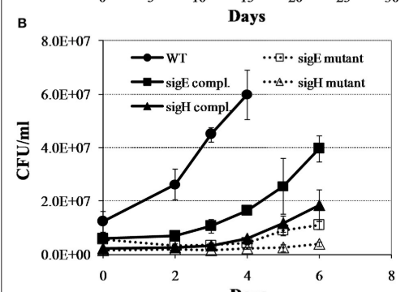
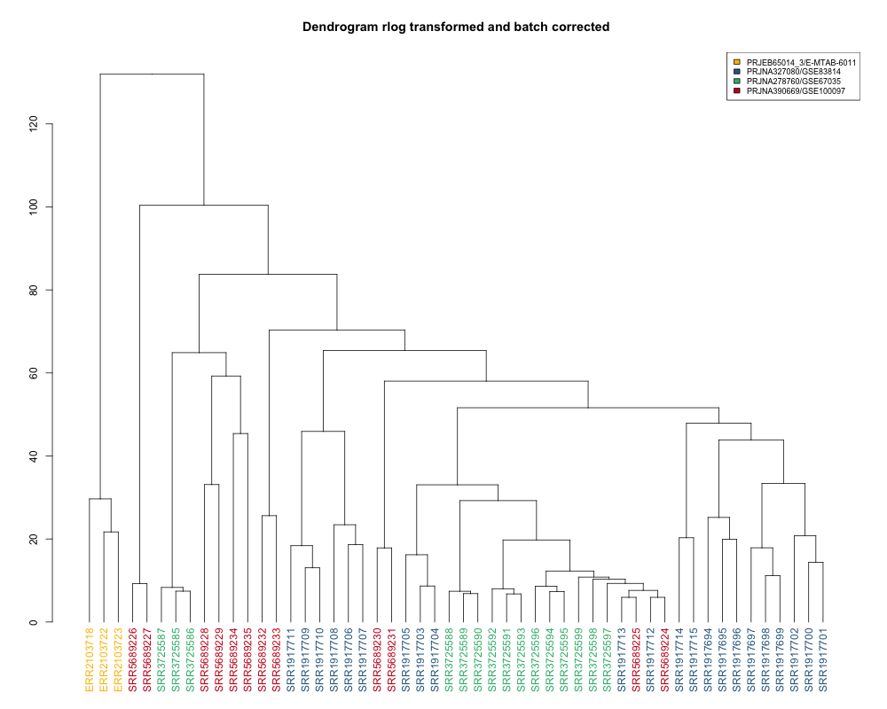

This notebook continues on from 'Mtb_modules_notebook.Rmd", using the counts matrix generated from applying Baerhunter's predicted ncRNAs to multiple Mtb RNAseq datasets. It involves count normalisation, transformation, batch correction, PCA and WGCNA analysis.


```{r}
setwd("~/git/mtb_modules")

        #installation of R packages 
        if (!requireNamespace("BiocManager", quietly = TRUE))
          install.packages("BiocManager")
        #BiocManager::install("Rsubread")
        library(Rsubread)
        #BiocManager::install("DESeq2")
        library(DESeq2)
        #BiocManager::install("sva")
        library(sva)
        #BiocManager::install("limma")
        library(limma)
        #BiocManager::install("WGCNA")
        library(WGCNA)
        #install.packages("devtools")
        #devtools::install_github("hadley/devtools",force=TRUE)
        #library(devtools)
        #devtools::install_github("irilenia/baerhunter",force=TRUE)
        library(baerhunter)
        #devtools::install_github("zhangyuqing/sva-devel")
        #install.packages("ggplot2")
        library(ggplot2)
        #install.packages("dendextend")
        library(dendextend)
        #install.packages("viridis")
        library(viridis)
        library(colorspace)
        library(RColorBrewer)
        library(Rsamtools)
        library(vsn)
```

1) Create counts matrix and DESeq object

Create deseq dataset from counts matrix (can use variety of objects including ranged summarised experiments, etc.). Must include formula for design of experiment.
"By default, the functions in this package will use the last variable in the formula for building results tables and plotting. ~ 1 can be used for no design, although users need to remember to switch to another design for differential testing."

so I don't really have to indicate a 'control' for this experiment since I'm not really going to be looking at differential expression. 


```{r deseq_construct}
# read in counts matrix and create deseq dataset

countdata<-read.csv("count_matrix_complete.csv")
head(countdata)
#inspection of matrix 
class(countdata)
nrow(countdata)
length(countdata)

# read in sample/dataset
datasets<-read.table("dataset_samples.txt", sep = " ", header=F)
colnames(datasets)<-c("sample", "study")

# read in conditions/sample
conditions<-read.csv("mtb_conditions.txt")
conditions$study<-datasets$study
View(conditions)

# create DeSeq dataset

#check order is same for count data and conditions data
all(conditions$sample_names == colnames(countdata))
#construct deseq dataset
dds_raw<-DESeqDataSetFromMatrix(countData = countdata,
                              colData = conditions,
                              design = ~1)
nrow(dds_raw)
#6486
# pre-filter reads to exclude rows with very low expression--makes more efficient
keep <- rowSums(counts(dds_raw)) >= 10
dds_filter <- dds_raw[keep,]
nrow(dds_filter)
#6483
# this filters only 3 rows, so not really much point
dds_raw<-dds_filter
```

2) Normalisation  
Sequencing depth normalisation probably quite important here since depth varies quite a bit between experiments.


```{r normalisation}
#sequencing depth normalisation

#calculate size factor
dds_raw<-estimateSizeFactors(dds_raw)
sizeFactors(dds_raw)

#retrieve normalised read counts
counts_normalized<-counts(dds_raw, normalized=TRUE)
class(counts_normalized)
#sum of depth after normalization
colSums(counts(dds_raw, normalized=F))

#boxplot(counts_normalized, notch = TRUE , las=2, cex.axis = 0.7,ylim = c(0,4500),
#        main = "untransformed  read  counts", ylab = "read  counts")


#boxplot for normalised data 
par(cex.axis=0.5) 
par(mar=c(4,2,1,1))
study_colors = c(rep("#440154FF",3),rep("#31688EFF",22),rep("#FDE725FF",15),rep("#35B779FF",12))
norm_boxplot <- boxplot(counts_normalized, 
                        PchCex =0.01,
                        axes=TRUE,
                        las=2,
                        col=study_colors, 
                        ylim = c(0,4500),
                        outline =TRUE,
                        outcex=0.35,
                        main="deseq normalized, no transformation")
legend("topright", legend=c("E-MTAB-6011", "GEO:GSE67035", "GEO:GSE83814", "GEO:GSE100097"), 
               col = c("#440154FF","#31688EFF","#FDE725FF","#35B779FF"), 
               fill = c("#440154FF","#31688EFF","#FDE725FF","#35B779FF"),
               cex = 0.75, 
               pt.cex = 1)


```

3) Transformation: will use both Rlog and VST to see what gives best results. We know batch effects exist from plot of log counts

>For genes with high counts, both the VST and the rlog will give similar result 
to the ordinary log2 transformation of normalized counts. For genes with lower 
counts, however, the values are shrunken towards a middle value. The VST or 
rlog-transformed data then become approximately homoskedastic (more flat trend 
in the meanSdPlot), and can be used directly for computing distances between samples, making PCA plots, or as input to downstream methods which perform best with homoskedastic data. In datasets with large variation in sequencing depth (dynamic range of size factors 4) we observed undesirable artifacts in the performance of the VST

>The rlog is less sensitive to size factors, which can be an issue when size factors vary widely. Should check these for my samples. Try with both rlog and vst.

>The more the size factors differ, the more residual dependence of the variance on the mean will be found in the transformed data. rlog is a transformation which can perform better in these cases. As shown in the vignette, the function meanSdPlot from the package vsn can be used to see whether this is a problem.

```{r meanSDPlot}
library(vsn)
# When the expected amount of variance is approximately the same across different 
# mean values, the data is said to be homoskedastic. For RNA-seq counts, however, 
# the expected variance grows with the mean.
SdPlot <- meanSdPlot(counts_normalized, ranks = F, plot = F)  
SdPlot$gg + ggtitle("sequencing depth normalized") + ylab("standard deviation")


```


```{r rlog_transformation, message=FALSE}
# use raw count data, not normalised for sequencing depth

# rlog transformed blind=F
rld<-rlog(dds_raw, blind=F)
#create summarized experiment matrix (se=summarized experiment)
rlog_norm_se <- assay(rld)
                 
# rlog blind=T
rld_T<-rlog(dds_raw)
rlog_T_norm_se<-assay(rld_T)

par(mfrow=c(1,2))
plot(rlog_norm_se[,18:19], cex=.1, main = "rlog transformed, blind=F", xlim=c(0,18), ylim=c(0,18))

plot(rlog_T_norm_se[,18:19], cex=.1, main = "rlog transformed, blind=TRUE", xlim=c(0,18), ylim=c(0,18))
```
Don't see any difference with blind T/F. There are no controls set, so shouldn't really make a difference here. YenYi used blind=FALSE with VST. 

```{r boxplot_rlog}
par(mfrow=c(1,1))
rlog_boxplot <- boxplot(rlog_norm_se, 
                        PchCex =0.01,
                        axes=TRUE,
                        las=2,
                        col=study_colors, 
                        #ylim = c(0,4500),
                        outline =TRUE,
                        outcex=0.35,
                        main=c("rlog transformed"))
legend("topright", legend=c("E-MTAB-6011", "GEO:GSE67035", "GEO:GSE83814", "GEO:GSE100097"), 
               col = c("#440154FF","#31688EFF","#FDE725FF","#35B779FF"), 
               fill = c("#440154FF","#31688EFF","#FDE725FF","#35B779FF"),
               cex = 0.75, 
               pt.cex = 1)

```
There are still a lot of low counts here. 

VST transformation

```{r vst_transformation}

vst_dds<-vst(dds_raw, blind=F)
# create summarised experiment matrix from dds
vst_norm_se<-assay(vst_dds)

plot(vst_norm_se[,18:19], cex=.1, main = "vst transformed", xlim=c(0,18), ylim=c(0,18))

vst_boxplot <- boxplot(vst_norm_se, 
                        PchCex =0.01,
                        axes=TRUE,
                        las=2,
                        col=study_colors, 
                        #ylim = c(0,4500),
                        outline =TRUE,
                        outcex=0.35,
                        main="VST")
legend("topright", legend=c("E-MTAB-6011", "GEO:GSE67035", "GEO:GSE83814", "GEO:GSE100097"), 
               col = c("#440154FF","#31688EFF","#FDE725FF","#35B779FF"), 
               fill = c("#440154FF","#31688EFF","#FDE725FF","#35B779FF"),
               cex = 0.75, 
               pt.cex = 1)


```
A lot fewer low counts, but when I plot different studies against each other, lower correlation than with rlog. Perhaps this is because of different sequencing depths in the different studies. 

4) PCA plots and hierarchical dendrograms: these will help us identify any batch effects. 

>Related to the distance matrix is the PCA plot, which shows the samples in the 2D plane spanned by their first two principal components. This type of plot is useful for visualizing the overall effect of experimental covariates and batch effects.

There will be batch effects, we can try to eliminate using limma.

```{r PCA_rlog_transformation}
library(ggplot2)
library("pheatmap")
library(RColorBrewer)

# Sample distances with summarised exper of rlog counts (rld)
# rlog_norm_se <- assay(rld)
sampleDists_rld <- dist(t(rlog_norm_se))
head(sampleDists_rld)

# Transform sample distances to matrix
sampleDistMatrix_rld <- as.matrix( sampleDists_rld )

# Colors palette
hm_colors <- colorRampPalette( rev(brewer.pal(9, "Blues")) )(255)
study_colors <- c(rep("#440154FF",3),rep("#31688EFF",22),rep("#FDE725FF",15),rep("#35B779FF",12))

# Draw heatmap
heatmap <- pheatmap(sampleDistMatrix_rld,
                    clustering_distance_rows = sampleDists_rld,
                    clustering_distance_cols = sampleDists_rld,
                    col = hm_colors)

#not that useful because hard to see if batch effects going on--is there maybe a way to colour text of sample names by study? maybe add to annotation


#PCA plotting with DESeq2 in built function on conditions, plots using rlog transformed counts
PCA.prelim <- plotPCA(rld,intgroup="condition")
PCA.prelim

#generating PCA table 
PCA.data <- data.frame(row.names=colnames(countdata),
                               condition=factor(conditions$condition),
                               dataset=factor(conditions$study))
      
PCA.data.plot <- prcomp(t(rlog_norm_se))
pca_rlog_df <- as.data.frame(PCA.data.plot$x)
pca_rlog_df$condition<-PCA.data$condition
pca_rlog_df$dataset <-PCA.data$dataset
summary(PCA.data.plot)

#establishing a custom viridis colour palette
toned_down_pal <- c("#FFBF00","#31688EFF","#35B779FF","#CA0020")

#PCA plot for rlog transformed data 
custom <- ggplot(pca_rlog_df,aes(x=PC1,y=PC2,color=dataset,shape=condition)) + scale_shape_manual(values = 0:21) + geom_point(size=3) + xlab("PC1 (37%)") + ylab("PC2 (20%)")
custom <- custom + scale_color_manual(values = toned_down_pal) + theme_bw()
custom
```

```{r dendrogram_prelimma}
# make hierarchical dendrogram to compare with post-limma
#dendrogram for rlog transformed data
library(WGCNA)

sizeGrWindow(12,9)
par(cex=0.6)
par(mar=c(5,6,2,0))

group <-as.factor(conditions$study) 
n_group <- length(unique(group)) 
cols <- toned_down_pal    #(n_group)
col_group <- cols[group] 
hc <- hclust(dist(t(rlog_norm_se)),method="average")
dend <- as.dendrogram(hc) 
col_group <- col_group[order.dendrogram(dend)] 
rlog_dend <- dend %>% 
            set("labels_colors", col_group) %>% #change label colors to group
            plot(main = "Dendrogram rlog transformed")
legend("topright", 
       legend = unique(group), 
       fill = cols, 
       cex = 0.75, 
       pt.cex = 1)

```
These show obvious batch effects, especially for studies GSE83814 and E-MTAB-6011.

5) Eliminate batch effects with limma

>The design matrix is used to describe comparisons between the samples, for example treatment effects, that should not be removed. The function (in effect) fits a linear model to the data, including both batches and regular treatments, then removes the component due to the batch effects.

>In most applications, only the first batch argument will be needed. This case covers the situation where the data has been collected in a series of separate batches.


```{r limma_batchcorr}
#batch effect correction using limma; requirement to define batch effect 
library(limma)

batch.table <- data.frame(study=conditions$study,condition=conditions$condition) 
#head(batch.table)

# uses log-expression values for series of samples, and needs design matrix
limma_rlog<-removeBatchEffect(x=rlog_norm_se,
                                      batch=batch.table$study,
                                      batch2=NULL,
                                      covariates=NULL,
                                      design=model.matrix(~batch.table$condition)) 
#Coefficients not estimable: batch1 batch2 batch3 
#Partial NA coefficients for 6486 probe(s)

#Despite warning, is limma still correcting for purposes of visualisation for use with pca, etc?

# make PCA plot for limma batch corrected

#generating PCA table 
PCA.data <- data.frame(row.names=colnames(countdata),
                               condition=factor(conditions$condition),
                               dataset=factor(conditions$study))
      
PCA.data.plot <- prcomp(t(limma_rlog))
pca_rlog_limma_df <- as.data.frame(PCA.data.plot$x)
pca_rlog_limma_df$condition<-PCA.data$condition
pca_rlog_limma_df$dataset <-PCA.data$dataset
summary(PCA.data.plot)

#PCA plot for rlog transformed data 
limma_plot <- ggplot(pca_rlog_limma_df,aes(x=PC1,y=PC2,color=dataset,shape=condition)) + scale_shape_manual(values = 0:21) + geom_point(size=3) + xlab("PC1 (32%)") + ylab("PC2 (18%)")
limma_plot <- limma_plot + scale_color_manual(values = toned_down_pal) + theme_bw()
limma_plot
## does not look corrected at all--identical plot to pre-limma?
# check dendrogram
```


```{r dedrogram_limma}
# make hierarchical dendrogram to compare with pre-limma
#dendrogram for rlog transformed data with batch correction
sizeGrWindow(12,9)
par(cex=0.6)
par(mar=c(5,6,2,0))

group <-as.factor(conditions$study) 
n_group <- length(unique(group)) 
cols <- toned_down_pal    #(n_group)
col_group <- cols[group] 
hc <- hclust(dist(t(limma_rlog)),method="average")
dend <- as.dendrogram(hc) 
col_group <- col_group[order.dendrogram(dend)] 
limma_rlog_dend <- dend %>% 
            set("labels_colors", col_group) %>% #change label colors to group
            plot(main = "Dendrogram rlog transformed and batch corrected")
legend("topright", 
       legend = unique(group), 
       fill = cols, 
       cex = 0.75, 
       pt.cex = 1)

# Exactly the same--no batch correction at all. Need to include some control data in the design? Maybe all exponential cultures?

```
I got this same message when doing limma on VST data.
I suspect it has more to do with lack of controls in design matrix.

Can I use day 3 and 4 from study GEO# GSE83814? These look like exponential growth. Can I use day 2?



So for controls: reaeration days 3-4, tyloxapol_pH7.0, dextrose exponential

Create new dseq matrix with control design. Start with new dataframe of conditions.

```{r control_df}

# replace reaeration days 3-4, tyloxapol ph7.0 and dextrose exponential with 'control'
controls<-c("reaeration_day3", "reaeration_day4", "tyloxapol_pH7.0", "dextrose_exponential")
# create new df from first two cols of old one
control_conditions.df<-data.frame(conditions[,1:2])
control_conditions.df[which(conditions$condition %in%       controls),2]<-'control' 
class(control_conditions.df)
View(control_conditions.df)
```

Create new deseq dataset with design matrix using controls

# create DeSeq dataset
```{r}
#this step defined control samples as the base reference 
control_conditions.df$condition <- factor(control_conditions.df$condition)
control_conditions.df$condition <- relevel(control_conditions.df$condition, "control") 
#if the metadata is somehow already ordered, this line unorders it (is this necessary?)
control_conditions.df$condition <- factor(control_conditions.df$condition, ordered = FALSE)
#check order is same for count data and conditions data
all(control_conditions.df$sample_names == colnames(countdata))


#construct deseq dataset
dds_control<-DESeqDataSetFromMatrix(countData = countdata,
                              colData = control_conditions.df,
                              design = ~condition)
nrow(dds_control)
#6486
# pre-filter reads to exclude rows with very low expression--makes more efficient
keep <- rowSums(counts(dds_control)) >= 10
dds_filter <- dds_control[keep,]
nrow(dds_filter)
#6483
# this filters only 3 rows, so not really much point, but might as well
dds_control<-dds_filter
```

Do rlog transformation blind T/F to see if control effects

```{r rlog_transf_control, message=FALSE}
# use raw count data, not normalised for sequencing depth

# rlog transformed blind=F
rlog_control<-rlog(dds_control, blind=F)
#create summarized experiment matrix (se=summarized experiment)
rlog_control_se <- assay(rlog_control)
                 
# rlog blind=T
rlc_T<-rlog(dds_control)
rlc_T_control_se<-assay(rlc_T)

par(mfrow=c(1,2))
plot(rlog_control_se[,18:19], cex=.1, main = "rlog transformed, blind=F", xlim=c(0,18), ylim=c(0,18))

plot(rlc_T_control_se[,18:19], cex=.1, main = "rlog transformed, blind=TRUE", xlim=c(0,18), ylim=c(0,18))
```
```{r boxplot_rlog_controls}
par(mfrow=c(1,1))
rlc_boxplot <- boxplot(rlog_control_se, 
                        PchCex =0.01,
                        axes=TRUE,
                        las=2,
                        col=study_colors, 
                        ylim = c(0,30),
                        outline =TRUE,
                        outcex=0.35,
                        main=c("rlog transformed with controls"))
legend("topright", legend=c("E-MTAB-6011", "GEO:GSE67035", "GEO:GSE83814", "GEO:GSE100097"), 
               col = c("#440154FF","#31688EFF","#FDE725FF","#35B779FF"), 
               fill = c("#440154FF","#31688EFF","#FDE725FF","#35B779FF"),
               cex = 0.75, 
               pt.cex = 1)

```

use limma to attempt to eliminate batch effects:

```{r limma_batchcorr_controls}
#batch effect correction using limma; requirement to define batch effect 
library(limma)
batch.table2 <- data.frame(study=conditions$study,
                           condition=control_conditions.df$condition) 

# uses log-expression values for series of samples, and needs design matrix
limma_rlogc<-removeBatchEffect(x=rlog_control_se,
                                  batch=batch.table2$study,
                                  batch2=NULL,
                                  covariates=NULL,
                                  design=model.matrix(~batch.table2$condition)) 

#Coefficients not estimable:  batch3 
#Partial NA coefficients for 6486 probe(s)

```
Look at PCA for limma corrected.

```{r pca_limma_rlogc}
# make PCA plot for limma batch corrected control set (limma_rlogc)

#generating PCA table 
PCA.data <- data.frame(row.names=colnames(countdata),
                               condition=factor(conditions$condition),
                               dataset=factor(conditions$study))
      
PCA.data.plot <- prcomp(t(limma_rlogc))
pca_rlogc_limma_df <- as.data.frame(PCA.data.plot$x)
pca_rlogc_limma_df$condition<-PCA.data$condition
pca_rlogc_limma_df$dataset <-PCA.data$dataset
summary(PCA.data.plot)

png("PCA12_rlog_limma.png", type="quartz", width=720, height=480)
#PCA plot for rlog transformed data 
limma_rlogc_plot <- ggplot(pca_rlogc_limma_df,aes(x=PC1,y=PC2,color=dataset,shape=condition)) + scale_shape_manual(values = 0:21) + geom_point(size=3) + xlab("PC1 (33%)") + ylab("PC2 (24%)")
limma_rlogc_plot <- limma_rlogc_plot + scale_color_manual(values = toned_down_pal) + theme_bw()
limma_rlogc_plot
dev.off()

#PC 2 and 3
limma_rlogc_plot23 <- ggplot(pca_rlogc_limma_df,aes(x=PC2,y=PC3,color=dataset,shape=condition)) + scale_shape_manual(values = 0:21) + geom_point(size=3) + xlab("PC2 (24%)") + ylab("PC3 (11%)")
limma_rlogc_plot23 <- limma_rlogc_plot23 + scale_color_manual(values = toned_down_pal) + theme_bw()
limma_rlogc_plot23

#PC 3 and 4
limma_rlogc_plot34 <- ggplot(pca_rlogc_limma_df,aes(x=PC3,y=PC4,color=dataset,shape=condition)) + scale_shape_manual(values = 0:21) + geom_point(size=3) + xlab("PC3 (11%)") + ylab("PC4 (7%)")
limma_rlogc_plot34 <- limma_rlogc_plot34 + scale_color_manual(values = toned_down_pal) + theme_bw()
limma_rlogc_plot34


```

Dendrogram to look at hierarchical clustering

```{r dendrogram_limma_controls}
# make hierarchical dendrogram to compare with pre-limma
#dendrogram for rlog transformed data with batch correction
sizeGrWindow(12,9)
par(cex=0.6)
par(mar=c(5,6,2,0))

group <-as.factor(conditions$study) 
n_group <- length(unique(group)) 
cols <- toned_down_pal    #(n_group)
col_group <- cols[group] 
hc_logc <- hclust(dist(t(limma_rlogc)),method="average")
dend_logc <- as.dendrogram(hc_logc) 
col_group <- col_group[order.dendrogram(dend_logc)] 
limma_rlogc_dend <- dend_logc %>% 
            set("labels_colors", col_group) %>% #change label colors to group
            plot(main = "Dendrogram rlog transformed and batch corrected")
legend("topright", 
       legend = unique(group), 
       fill = cols, 
       cex = 0.75, 
       pt.cex = 1)
png("~/git/mtb_modules/limma_rlogc_dend.png", width=1000, height = 800)
limma_rlogc_dend <- dend_logc %>% 
            set("labels_colors", col_group) %>% #change label colors to group
            plot(main = "Dendrogram rlog transformed and batch corrected")
legend("topright", 
       legend = unique(group), 
       fill = cols, 
       cex = 0.75, 
       pt.cex = 1)
dev.off()
```
Yay, that seemed to work, controls seem to cluster together, along with re-aeration days 1 and 2, and high iron.



6) WGCNA 

[WGCNA website](https://horvath.genetics.ucla.edu/html/CoexpressionNetwork/Rpackages/WGCNA/)


