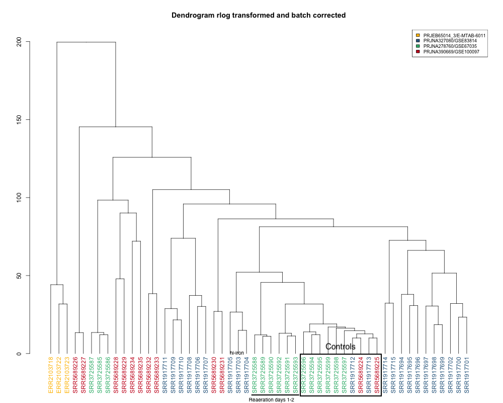

This notebook continues on from 'Mtb_modules_notebook.Rmd", using the counts matrix generated from applying Baerhunter's predicted ncRNAs to multiple Mtb RNAseq datasets. It involves count normalisation, transformation, batch correction, PCA and WGCNA analysis.


```{r message=FALSE}
setwd("~/git/mtb_modules")

        #installation of R packages 
        if (!requireNamespace("BiocManager", quietly = TRUE))
          install.packages("BiocManager")
        #BiocManager::install("Rsubread")
        library(Rsubread)
        #BiocManager::install("DESeq2")
        library(DESeq2)
        #BiocManager::install("sva")
        library(sva)
        #BiocManager::install("limma")
        library(limma)
        BiocManager::install("WGCNA")
        library(WGCNA)
        #install.packages("devtools")
        #devtools::install_github("hadley/devtools",force=TRUE)
        #library(devtools)
        #devtools::install_github("irilenia/baerhunter",force=TRUE)
        library(baerhunter)
        #devtools::install_github("zhangyuqing/sva-devel")
        #install.packages("ggplot2")
        library(ggplot2)
        #install.packages("dendextend")
        library(dendextend)
        #install.packages("viridis")
        library(viridis)
        library(colorspace)
        library(RColorBrewer)
        library(Rsamtools)
        library(vsn)
```

1) Create counts matrix and DESeq object

Create deseq dataset from counts matrix (can use variety of objects including ranged summarised experiments, etc.). Must include formula for design of experiment.
"By default, the functions in this package will use the last variable in the formula for building results tables and plotting. ~ 1 can be used for no design, although users need to remember to switch to another design for differential testing."

so I don't really have to indicate a 'control' for this experiment since I'm not really going to be looking at differential expression. 


```{r deseq_construct}
# read in counts matrix and create deseq dataset

countdata<-read.csv("count_matrix_complete.csv", header=T, row.names=1)
head(countdata)
#inspection of matrix 
class(countdata)
nrow(countdata)
length(countdata)

# read in sample/dataset
datasets<-read.table("dataset_samples.txt", sep = " ", header=F)
colnames(datasets)<-c("sample", "study")

# read in conditions/sample
conditions<-read.csv("mtb_conditions.txt")
conditions$study<-datasets$study
#View(conditions)

# create DeSeq dataset

#check order is same for count data and conditions data
all(conditions$sample_names == colnames(countdata))
#construct deseq dataset
dds_raw<-DESeqDataSetFromMatrix(countData = countdata,
                              colData = conditions,
                              design = ~1)
nrow(dds_raw)
#6486
# pre-filter reads to exclude rows with very low expression--makes more efficient
keep <- rowSums(counts(dds_raw)) >= 10
dds_filter <- dds_raw[keep,]
nrow(dds_filter)
#6483
# this filters only 3 rows, so not really much point
dds_raw<-dds_filter
```

2) Normalisation  
Sequencing depth normalisation probably quite important here since depth varies quite a bit between experiments.


```{r normalisation}
#sequencing depth normalisation

#calculate size factor
dds_raw<-estimateSizeFactors(dds_raw)
sizeFactors(dds_raw)

#retrieve normalised read counts
counts_normalized<-counts(dds_raw, normalized=TRUE)
class(counts_normalized)
#sum of depth after normalization
colSums(counts(dds_raw, normalized=F))

#boxplot(counts_normalized, notch = TRUE , las=2, cex.axis = 0.7,ylim = c(0,4500),
#        main = "untransformed  read  counts", ylab = "read  counts")


#boxplot for normalised data 
par(cex.axis=0.5) 
par(mar=c(4,2,1,1))
study_colors = c(rep("#440154FF",3),rep("#31688EFF",22),rep("#FDE725FF",15),rep("#35B779FF",12))
norm_boxplot <- boxplot(counts_normalized, 
                        PchCex =0.01,
                        axes=TRUE,
                        las=2,
                        col=study_colors, 
                        ylim = c(0,4500),
                        outline =TRUE,
                        outcex=0.35,
                        main="deseq normalized, no transformation")
legend("topright", legend=c("E-MTAB-6011", "GEO:GSE67035", "GEO:GSE83814", "GEO:GSE100097"), 
               col = c("#440154FF","#31688EFF","#FDE725FF","#35B779FF"), 
               fill = c("#440154FF","#31688EFF","#FDE725FF","#35B779FF"),
               cex = 0.75, 
               pt.cex = 1)


```

3) Transformation: will use both Rlog and VST to see what gives best results. We know batch effects exist from plot of log counts

>For genes with high counts, both the VST and the rlog will give similar result 
to the ordinary log2 transformation of normalized counts. For genes with lower 
counts, however, the values are shrunken towards a middle value. The VST or 
rlog-transformed data then become approximately homoskedastic (more flat trend 
in the meanSdPlot), and can be used directly for computing distances between samples, making PCA plots, or as input to downstream methods which perform best with homoskedastic data. In datasets with large variation in sequencing depth (dynamic range of size factors 4) we observed undesirable artifacts in the performance of the VST

>The rlog is less sensitive to size factors, which can be an issue when size factors vary widely. Should check these for my samples. Try with both rlog and vst.

>The more the size factors differ, the more residual dependence of the variance on the mean will be found in the transformed data. rlog is a transformation which can perform better in these cases. As shown in the vignette, the function meanSdPlot from the package vsn can be used to see whether this is a problem.

```{r meanSDPlot}
library(vsn)
# When the expected amount of variance is approximately the same across different 
# mean values, the data is said to be homoskedastic. For RNA-seq counts, however, 
# the expected variance grows with the mean.
SdPlot <- meanSdPlot(counts_normalized, ranks = F, plot = F)  
SdPlot$gg + ggtitle("sequencing depth normalized") + ylab("standard deviation")


```


```{r rlog_transformation, message=FALSE}
# use raw count data, not normalised for sequencing depth

# rlog transformed blind=F
rld<-rlog(dds_raw, blind=F)
#create summarized experiment matrix (se=summarized experiment)
rlog_norm_se <- assay(rld)
                 
# rlog blind=T
rld_T<-rlog(dds_raw)
rlog_T_norm_se<-assay(rld_T)

par(mfrow=c(1,2))
plot(rlog_norm_se[,18:19], cex=.1, main = "rlog transformed, blind=F", xlim=c(0,18), ylim=c(0,18))

plot(rlog_T_norm_se[,18:19], cex=.1, main = "rlog transformed, blind=TRUE", xlim=c(0,18), ylim=c(0,18))
```
Don't see any difference with blind T/F. There are no controls set, so shouldn't really make a difference here. YenYi used blind=FALSE with VST. 

```{r boxplot_rlog}
par(mfrow=c(1,1))
rlog_boxplot <- boxplot(rlog_norm_se, 
                        PchCex =0.01,
                        axes=TRUE,
                        las=2,
                        col=study_colors, 
                        #ylim = c(0,4500),
                        outline =TRUE,
                        outcex=0.35,
                        main=c("rlog transformed"))
legend("topright", legend=c("E-MTAB-6011", "GEO:GSE67035", "GEO:GSE83814", "GEO:GSE100097"), 
               col = c("#440154FF","#31688EFF","#FDE725FF","#35B779FF"), 
               fill = c("#440154FF","#31688EFF","#FDE725FF","#35B779FF"),
               cex = 0.75, 
               pt.cex = 1)

```
There are still a lot of low counts here. 

VST transformation

```{r vst_transformation}

vst_dds<-vst(dds_raw, blind=F)
# create summarised experiment matrix from dds
vst_norm_se<-assay(vst_dds)

plot(vst_norm_se[,18:19], cex=.1, main = "vst transformed", xlim=c(0,18), ylim=c(0,18))

vst_boxplot <- boxplot(vst_norm_se, 
                        PchCex =0.01,
                        axes=TRUE,
                        las=2,
                        col=study_colors, 
                        #ylim = c(0,4500),
                        outline =TRUE,
                        outcex=0.35,
                        main="VST")
legend("topright", legend=c("E-MTAB-6011", "GEO:GSE67035", "GEO:GSE83814", "GEO:GSE100097"), 
               col = c("#440154FF","#31688EFF","#FDE725FF","#35B779FF"), 
               fill = c("#440154FF","#31688EFF","#FDE725FF","#35B779FF"),
               cex = 0.75, 
               pt.cex = 1)


```
A lot fewer low counts, but when I plot different studies against each other, lower correlation than with rlog. Perhaps this is because of different sequencing depths in the different studies. 

4) PCA plots and hierarchical dendrograms: these will help us identify any batch effects. 

>Related to the distance matrix is the PCA plot, which shows the samples in the 2D plane spanned by their first two principal components. This type of plot is useful for visualizing the overall effect of experimental covariates and batch effects.

There will be batch effects, we can try to eliminate using limma.

```{r PCA_rlog_transformation}
library(ggplot2)
library("pheatmap")
library(RColorBrewer)

# Sample distances with summarised exper of rlog counts (rld)
# rlog_norm_se <- assay(rld)
sampleDists_rld <- dist(t(rlog_norm_se))
head(sampleDists_rld)

# Transform sample distances to matrix
sampleDistMatrix_rld <- as.matrix( sampleDists_rld )

# Colors palette
hm_colors <- colorRampPalette( rev(brewer.pal(9, "Blues")) )(255)
study_colors <- c(rep("#440154FF",3),rep("#31688EFF",22),rep("#FDE725FF",15),rep("#35B779FF",12))

# Draw heatmap
heatmap <- pheatmap(sampleDistMatrix_rld,
                    clustering_distance_rows = sampleDists_rld,
                    clustering_distance_cols = sampleDists_rld,
                    col = hm_colors)

#not that useful because hard to see if batch effects going on--is there maybe a way to colour text of sample names by study? maybe add to annotation


#PCA plotting with DESeq2 in built function on conditions, plots using rlog transformed counts
PCA.prelim <- plotPCA(rld,intgroup="condition")
PCA.prelim

#generating PCA table 
PCA.data <- data.frame(row.names=colnames(countdata),
                               condition=factor(conditions$condition),
                               dataset=factor(conditions$study))
      
PCA.data.plot <- prcomp(t(rlog_norm_se))
pca_rlog_df <- as.data.frame(PCA.data.plot$x)
pca_rlog_df$condition<-PCA.data$condition
pca_rlog_df$dataset <-PCA.data$dataset
summary(PCA.data.plot)

#establishing a custom viridis colour palette
toned_down_pal <- c("#FFBF00","#31688EFF","#35B779FF","#CA0020")

#PCA plot for rlog transformed data 
custom <- ggplot(pca_rlog_df,aes(x=PC1,y=PC2,color=dataset,shape=condition)) + scale_shape_manual(values = 0:21) + geom_point(size=3) + xlab("PC1 (37%)") + ylab("PC2 (20%)")
custom <- custom + scale_color_manual(values = toned_down_pal) + theme_bw()
custom
```

```{r dendrogram_prelimma}
# make hierarchical dendrogram to compare with post-limma
#dendrogram for rlog transformed data

sizeGrWindow(12,9)
par(cex=0.6)
par(mar=c(5,6,2,0))

group <-as.factor(conditions$study) 
n_group <- length(unique(group)) 
cols <- toned_down_pal    #(n_group)
col_group <- cols[group] 
hc <- hclust(dist(t(rlog_norm_se)),method="average")
dend <- as.dendrogram(hc) 
col_group <- col_group[order.dendrogram(dend)] 
rlog_dend <- dend %>% 
            set("labels_colors", col_group) %>% #change label colors to group
            plot(main = "Dendrogram rlog transformed")
legend("topright", 
       legend = unique(group), 
       fill = cols, 
       cex = 0.75, 
       pt.cex = 1)

```
These show obvious batch effects, especially for studies GSE83814 and E-MTAB-6011.

5) Eliminate batch effects with limma

>The design matrix is used to describe comparisons between the samples, for example treatment effects, that should not be removed. The function (in effect) fits a linear model to the data, including both batches and regular treatments, then removes the component due to the batch effects.

>In most applications, only the first batch argument will be needed. This case covers the situation where the data has been collected in a series of separate batches.


```{r limma_batchcorr}
#batch effect correction using limma; requirement to define batch effect 
library(limma)

batch.table <- data.frame(study=conditions$study,condition=conditions$condition) 
#head(batch.table)

# uses log-expression values for series of samples, and needs design matrix
limma_rlog<-removeBatchEffect(x=rlog_norm_se,
                                      batch=batch.table$study,
                                      batch2=NULL,
                                      covariates=NULL,
                                      design=model.matrix(~batch.table$condition)) 
#Coefficients not estimable: batch1 batch2 batch3 
#Partial NA coefficients for 6486 probe(s)

#Despite warning, is limma still correcting for purposes of visualisation for use with pca, etc?

# make PCA plot for limma batch corrected

#generating PCA table 
PCA.data <- data.frame(row.names=colnames(countdata),
                               condition=factor(conditions$condition),
                               dataset=factor(conditions$study))
      
PCA.data.plot <- prcomp(t(limma_rlog))
pca_rlog_limma_df <- as.data.frame(PCA.data.plot$x)
pca_rlog_limma_df$condition<-PCA.data$condition
pca_rlog_limma_df$dataset <-PCA.data$dataset
summary(PCA.data.plot)

#PCA plot for rlog transformed data 
limma_plot <- ggplot(pca_rlog_limma_df,aes(x=PC1,y=PC2,color=dataset,shape=condition)) + scale_shape_manual(values = 0:21) + geom_point(size=3) + xlab("PC1 (32%)") + ylab("PC2 (18%)")
limma_plot <- limma_plot + scale_color_manual(values = toned_down_pal) + theme_bw()
limma_plot
## does not look corrected at all--identical plot to pre-limma?
# check dendrogram
```


```{r dedrogram_limma}
# make hierarchical dendrogram to compare with pre-limma
#dendrogram for rlog transformed data with batch correction
sizeGrWindow(12,9)
par(cex=0.6)
par(mar=c(5,6,2,0))

group <-as.factor(conditions$study) 
n_group <- length(unique(group)) 
cols <- toned_down_pal    #(n_group)
col_group <- cols[group] 
hc <- hclust(dist(t(limma_rlog)),method="average")
dend <- as.dendrogram(hc) 
col_group <- col_group[order.dendrogram(dend)] 
limma_rlog_dend <- dend %>% 
            set("labels_colors", col_group) %>% #change label colors to group
            plot(main = "Dendrogram rlog transformed and batch corrected")
legend("topright", 
       legend = unique(group), 
       fill = cols, 
       cex = 0.75, 
       pt.cex = 1)

# Exactly the same--no batch correction at all. Need to include some control data in the design? Maybe all exponential cultures?

```
I got this same message when doing limma on VST data.
I suspect it has more to do with lack of controls in design matrix.

Can I use day 3 and 4 from study GEO# GSE83814? These look like exponential growth. Can I use day 2?


So for controls: reaeration days 3-4, tyloxapol_pH7.0, dextrose exponential

Create new dseq matrix with control design. Start with new dataframe of conditions.

```{r control_df}

# replace reaeration days 3-4, tyloxapol ph7.0 and dextrose exponential with 'control'
controls<-c("reaeration_day3", "reaeration_day4", "tyloxapol_pH7.0", "dextrose_exponential")
# create new df from first two cols of old one
control_conditions.df<-data.frame(conditions[,1:2])
control_conditions.df[which(conditions$condition %in%       controls),2]<-'control' 
class(control_conditions.df)
View(control_conditions.df)
#write_table of df
write.csv(control_conditions.df, "~/git/mtb_modules/control_conditions_df.txt", quote=F, row.names = F, )
```

Create new deseq dataset with design matrix using controls

# create DeSeq dataset
```{r}
#this step defined control samples as the base reference 
control_conditions.df$condition <- factor(control_conditions.df$condition)
control_conditions.df$condition <- relevel(control_conditions.df$condition, "control") 
#if the metadata is somehow already ordered, this line unorders it (is this necessary?)
control_conditions.df$condition <- factor(control_conditions.df$condition, ordered = FALSE)
#check order is same for count data and conditions data
all(control_conditions.df$sample_names == colnames(countdata))


#construct deseq dataset
dds_control<-DESeqDataSetFromMatrix(countData = countdata,
                              colData = control_conditions.df,
                              design = ~condition)
nrow(dds_control)
#6486
# pre-filter reads to exclude rows with very low expression--makes more efficient
keep <- rowSums(counts(dds_control)) >= 10
dds_filter <- dds_control[keep,]
nrow(dds_filter)
#6483
# this filters only 3 rows, so not really much point, but might as well
dds_control<-dds_filter
```

Do rlog transformation blind T/F to see if control effects

```{r rlog_transf_control, message=FALSE}
# use raw count data, not normalised for sequencing depth

# rlog transformed blind=F
#rlog_control<-rlog(dds_control, blind=F)
#create summarized experiment matrix (se=summarized experiment)
#rlog_control_se <- assay(rlog_control)
                 
# rlog blind=T
rlog_control<-rlog(dds_control)
rlog_control_se<-assay(rlog_control)

par(mfrow=c(1,2))
plot(rlog_control_se[,18:19], cex=.1, main = "rlog transformed, blind=T", xlim=c(0,18), ylim=c(0,18))

```

```{r boxplot_rlog_controls}
study_colors <- c(rep("#440154FF",3),rep("#31688EFF",22),rep("#FDE725FF",15),rep("#35B779FF",12))
par(mfrow=c(1,1))
rlc_boxplot <- boxplot(rlog_control_se, 
                        PchCex =0.01,
                        axes=TRUE,
                        las=2,
                        col=study_colors, 
                        ylim = c(0,30),
                        outline =TRUE,
                        outcex=0.35,
                        main=c("rlog transformed with controls"))
legend("topright", legend=c("E-MTAB-6011", "GEO:GSE67035", "GEO:GSE83814", "GEO:GSE100097"), 
               col = c("#440154FF","#31688EFF","#FDE725FF","#35B779FF"), 
               fill = c("#440154FF","#31688EFF","#FDE725FF","#35B779FF"),
               cex = 0.75, 
               pt.cex = 1)

```

use limma to attempt to eliminate batch effects:

```{r limma_batchcorr_controls}
#batch effect correction using limma; requirement to define batch effect 
library(limma)
batch.table2 <- data.frame(study=conditions$study,
                           condition=control_conditions.df$condition) 

# uses log-expression values for series of samples, and needs design matrix
limma_rlogc<-removeBatchEffect(x=rlog_control_se,
                                  batch=batch.table2$study,
                                  batch2=NULL,
                                  covariates=NULL,
                              design=model.matrix(~batch.table2$condition)) 

#Coefficients not estimable:  batch3 
#Partial NA coefficients for 6486 probe(s)
head(limma_rlogc)

# write to csv to save for wgcna: 
write.csv(limma_rlogc2, "~/git/mtb_modules/limma_rlogc.csv", quote=F)

```
Look at PCA for limma corrected.

```{r pca_limma_rlogc}
# make PCA plot for limma batch corrected control set (limma_rlogc)
#establishing a custom viridis colour palette
toned_down_pal <- c("#FFBF00","#31688EFF","#35B779FF","#CA0020")

#generating PCA table 
PCA.data <- data.frame(row.names=colnames(countdata),
                               condition=factor(conditions$condition),
                               dataset=factor(conditions$study))
      
PCA.data.plot <- prcomp(t(limma_rlogc))
pca_rlogc_limma_df <- as.data.frame(PCA.data.plot$x)
pca_rlogc_limma_df$condition<-PCA.data$condition
pca_rlogc_limma_df$dataset <-PCA.data$dataset
summary(PCA.data.plot)

png("PCA12_rlog_limma.png", type="quartz", width=720, height=480)
#PCA plot for rlog transformed data 
limma_rlogc_plot <- ggplot(pca_rlogc_limma_df,aes(x=PC1,y=PC2,color=dataset,shape=condition)) + scale_shape_manual(values = 0:21) + geom_point(size=3) + xlab("PC1 (33%)") + ylab("PC2 (24%)")
limma_rlogc_plot <- limma_rlogc_plot + scale_color_manual(values = toned_down_pal) + theme_bw()
limma_rlogc_plot
dev.off()

#PC 2 and 3
limma_rlogc_plot23 <- ggplot(pca_rlogc_limma_df,aes(x=PC2,y=PC3,color=dataset,shape=condition)) + scale_shape_manual(values = 0:21) + geom_point(size=3) + xlab("PC2 (24%)") + ylab("PC3 (11%)")
limma_rlogc_plot23 <- limma_rlogc_plot23 + scale_color_manual(values = toned_down_pal) + theme_bw()
limma_rlogc_plot23

#PC 3 and 4
limma_rlogc_plot34 <- ggplot(pca_rlogc_limma_df,aes(x=PC3,y=PC4,color=dataset,shape=condition)) + scale_shape_manual(values = 0:21) + geom_point(size=3) + xlab("PC3 (11%)") + ylab("PC4 (7%)")
limma_rlogc_plot34 <- limma_rlogc_plot34 + scale_color_manual(values = toned_down_pal) + theme_bw()
limma_rlogc_plot34


```

Dendrogram to look at hierarchical clustering

```{r dendrogram_limma_controls}
# make hierarchical dendrogram to compare with pre-limma
#dendrogram for rlog transformed data with batch correction
sizeGrWindow(12,9)
par(cex=0.6)
par(mar=c(5,6,2,0))

group <-as.factor(conditions$study) 
n_group <- length(unique(group)) 
cols <- toned_down_pal    #(n_group)
col_group <- cols[group] 
hc_logc <- hclust(dist(t(limma_rlogc)),method="average")
dend_logc <- as.dendrogram(hc_logc) 
col_group <- col_group[order.dendrogram(dend_logc)] 
limma_rlogc_dend <- dend_logc %>% 
            set("labels_colors", col_group) %>% #change label colors to group
            plot(main = "Dendrogram rlog transformed and batch corrected")
legend("topright", 
       legend = unique(group), 
       fill = cols, 
       cex = 0.75, 
       pt.cex = 1)
png("~/git/mtb_modules/limma_rlogc_dend.png", width=1000, height = 800)
limma_rlogc_dend <- dend_logc %>% 
            set("labels_colors", col_group) %>% #change label colors to group
            plot(main = "Dendrogram rlog transformed and batch corrected")
legend("topright", 
       legend = unique(group), 
       fill = cols, 
       cex = 0.75, 
       pt.cex = 1)
dev.off()
```
Yay, that seemed to work, controls seem to cluster together, along with re-aeration days 1 and 2, and high iron.



6) WGCNA 

[WGCNA website](https://horvath.genetics.ucla.edu/html/CoexpressionNetwork/Rpackages/WGCNA/)

[blockwise analysis for large datasets](https://horvath.genetics.ucla.edu/html/CoexpressionNetwork/Rpackages/WGCNA/Tutorials/FemaleLiver-02-networkConstr-blockwise.pdf)

Do we need to do blockwise analysis? We have 6000+ genes.
"A 16GB workstation should handle up to 20000 probes. In general it is preferable to analyze a data set in as few blocks as possible" I've set max block size as 6500 so that should include all the genes. THese should have very similar results, and since I did it all in one block anyway, shouldn't be an issue.

```{r data_formatting}
#WGCNA 

library(WGCNA)
options(stringsAsFactors = FALSE)

# rather than generate limma_rlogc every time, can use limma_rlogc.csv
# these are batch corrected expression values:
limma_rlogc<-read.csv("~/git/mtb_modules/limma_rlogc.csv", header = T, row.names = 1)  #row.names=1 so won't assign colname to col of rownames

analysis <- as.data.frame(t(limma_rlogc))

head(analysis)
# rows are samples (52), cols are genes (6483)
dim(analysis)

save(analysis, file = "~/git/mtb_modules/datExpr.RData")

#defining trait data with control conditions 
control_conditions.df<-
               read.csv("~/git/mtb_modules/control_conditions_df.txt",                 )

traitData <- control_conditions.df
dim(traitData)

# column names are 'sample_names' and 'condition'
#reformatting data to match
sample.names <- rownames(analysis)
traitRows    <- match(colnames(rlog_control_se),traitData$sample_name)
datTraits    <- traitData[traitRows,-1, drop=FALSE]  ## drop = F so that stays a dataframe instead of factor
#relabel row names with sample names 
rownames(datTraits)         <- traitData[traitRows,1]
datTraits[is.na(datTraits)] <- 0 
head(datTraits)
# save for further analysis
save(datTraits, file="~/git/mtb_modules/datTraits.RData")

#head(datTraits)
```

```{r soft_threshold_choice}
 #choose a set of soft-thresholding powers
        powers = c(c(1:10), seq(from = 12, to=20, by=2))
        #call the network topology analysis function
        sft = pickSoftThreshold(analysis, 
                                powerVector = powers, 
                                verbose = 5)
        #plotting the output 
        sizeGrWindow(9, 5)
        par(mfrow = c(1,1))
        cex1 = 0.9
        # Scale-free topology fit index as a function of the soft-thresholding power
        plot(sft$fitIndices[,1], 
             -sign(sft$fitIndices[,3])*sft$fitIndices[,2],
             xlab="Soft Threshold (power)",
             ylab="Scale Free Topology Model Fit,signed R^2",
             type="n",
             main = paste("Scale independence"))
        text(sft$fitIndices[,1], 
             -sign(sft$fitIndices[,3])*sft$fitIndices[,2],
             labels=powers,
             cex=cex1,
             col="red")
        #R^2 cut-off line
        abline(h=0.80,col="red")
        #mean connectivity as a function of the soft-thresholding power
        plot(sft$fitIndices[,1], 
             sft$fitIndices[,5],
             xlab="Soft Threshold (power)",
             ylab="Mean Connectivity", 
             type="n",
             main = paste("Mean connectivity"))
        text(sft$fitIndices[,1], 
             sft$fitIndices[,5], 
             labels=powers, 
             cex=cex1,
             col="red")
```

I will try 14 first and see how that looks.

Parameters that may need adjustment:

corType="bicor": biweight midcorrelation (vs Pearson)
I think this is faster and requires less computation than pearson?
(Looking up info on this in this book: "Introduction to Robust Estimation and Hypothesis Testing", Rand Wilcox, Academic Press, 1997.)

'deepSplit' is measure of how sensitive module detection should be to module splitting. 0-4, 4 is most sensitive, 2 is medium 

'minModuleSize' is minimum module size for module detection

'reassignThreshold' is p-value ratio threshold for reassigning genes between modules
>After all blocks have been processed, the function checks whether there are genes whose KME in the module they assigned is lower than KME to another module. If p-values of the higher correlations are smaller than those of the native module by the factor reassignThresholdPS, the gene is re-assigned to the closer module.

'mergeCloseModules'
>In the last step, modules whose eigengenes are highly correlated are merged. This is achieved by clustering module eigengenes using the dissimilarity given by one minus their correlation, cutting the dendrogram at the height mergeCutHeight and merging all modules on each branch. The process is iterated until no modules are merged. See mergeCloseModules for more details on module merging.

'mergeCutHeight': dendrogram cut height for module merging.


```{r coexpression_network}
#create coexpression network and identify modules
net = blockwiseModules(analysis, 
                      maxBlockSize = 6500,     
                      corType = "bicor", 
                      networkType = "signed",
                      power = 14, 
                      TOMType = "signed", 
                      minModuleSize = 20,
                      reassignThreshold = 0, 
                      mergeCutHeight = 0.15, 
                      deepSplit = 2,
                      numericLabels = TRUE,
                      saveTOMs = TRUE,
                      saveTOMFileBase = "testTOM", 
                      pamRespectsDendro = FALSE,
                      verbose = 3)
summary(net)

#minmodule size = 25, mergeCutHeight 0.15
net2 <-blockwiseModules(analysis, 
                      maxBlockSize = 6500,     
                      corType = "bicor", 
                      networkType = "signed",
                      power = 14, 
                      TOMType = "signed", 
                      minModuleSize = 25,
                      reassignThreshold = 0, 
                      mergeCutHeight = 0.20, 
                      deepSplit = 2,
                      numericLabels = TRUE,
                      saveTOMs = TRUE,
                      saveTOMFileBase = "testTOM", 
                      pamRespectsDendro = FALSE,
                      verbose = 3)
summary(net2)
# 48 modules

#how many modules identified and what colours are
module.table <- table(net$colors)  #this creates a 'contingency table'
module.table2 <- table(net2$colors)

write.csv(table(net$colors), file = "clusteringblocks.csv")
write.csv(table(net2$colors), file = "clust_blocks_net2.csv")
# display dendrogram 
png("power14_split2_minmod20_cuth15.png", width=1000, height=650)
#sizeGrWindow(12, 9)
#convert labels to colours for plotting
mergedColors <- labels2colors(net$colors)
#plot dendrogram and module colors underneath
plotDendroAndColors(net$dendrograms[[1]], 
                    mergedColors[net$blockGenes[[1]]],
                    "Module colors",
                    dendroLabels = FALSE, hang = 0.03,
                    addGuide = TRUE, guideHang = 0.05)
dev.off()

png("power14_split2_minmod25_cut20.png", width=1000, height=650)
mergedColors2 <- labels2colors(net2$colors)
plotDendroAndColors(net2$dendrograms[[1]],
                     mergedColors2[net2$blockGenes[[1]]],
                     "Module colors",
                     dendroLabels = F, hang = 0.03,
                     addGuide = T, guideHang = 0.05)
dev.off()

#save the module assignment and module eigengene info for subsequent analysis
# each gene assigned a module number
moduleLabels = net$colors
moduleLabels2 <- net2$colors
#each gene assigned a color
moduleColors = labels2colors(net$colors)
moduleColors2 <- labels2colors(net2$colors)
# module eigengenes
MEs = net$MEs;
MEs2 <- net2$MEs
#MEs

#save dendrogram data (hclust)
geneTree = net$dendrograms[[1]];
geneTree2<-net2$dendrograms[[1]]
# this saves info as R object
#save(MEs, moduleLabels, moduleColors, geneTree, 
#     file = "~/git/mtb_modules/TB_modules_network_construction.RData")
save(MEs2, moduleLabels2, moduleColors2, geneTree2,
     file= "~/git/mtb_modules/TB_mod_net2_construction.RData")
# to re-load modules data (MEs, etc)
load("~/git/mtb_modules/TB_mod_net2_construction.RData")


table(moduleColors)
s<-as.data.frame(table(moduleColors), row.names = NULL,
              responseName = "Freq", stringsAsFactors = TRUE,
              sep = "", base = list(LETTERS))
s<-s[order(s$Freq, decreasing = T),]
head(s)
# turquoise, blue, brown, yellow, green, red are largest modules

s<-as.data.frame(table(moduleColors2), row.names = NULL, 
                 responseName = "Freq", stringsAsFactors = T,
                 sep = "", base = list(LETTERS))
s<-s[order(s$Freq, decreasing = T),]
# same order of largest modules

write.csv(table(moduleColors), file = "clusteringblocks2.csv")

```

With 14: 
Not horrible, but maybe not as defined gene modules as I would like? good separation of colours, however?
Creates 38 clusters. 132 genes unassigned.
Try with 16: Looks worse.

Try deepSplit=3, no difference.
30 is a 'relatively large' minimum module setting acc to tutorial
minmodulesize up to 25 (from 20). This may put more in unassigned?
37 modules, 135 unassigned. not much different. 
try 30: 29 modules, 290 unassigned, no real improvement in dendrogram.

change mergecutheight to .15 from .25 (kept minmodule size at 30)
THis causes a lot more modules: 47.

minmodulesize=20, mergecutheight=.15. now it's 63 modules!Dendrogram looks similar, just more colours on bottom. With lower merge cut height, fewer modules are merged on each branch.

Going with this one for now--more modules. Let's see if we get some results with this--can always go back and raise the merge cut height and minmodulesize again.

[module determination wgcna tutorial](https://horvath.genetics.ucla.edu/html/CoexpressionNetwork/Rpackages/WGCNA/Tutorials/Simulated-05-NetworkConstruction.pdf)

TOM plot is a network connectivity plot that shows relationship between genes in module--shows intramodule connectivity in a heatmap

To get a sense how related modules are to one another--can summarize each module by its eigengene (1st PC):

The eigengene dendrogram and heatmap identify groups of correlated eigengenes termed 'meta-modules'. 


```{r adjacency_heatmap}
load("~/git/mtb_modules/datExpr.RData")

#define numbers of genes and samples
nGenes = ncol(analysis)
nSamples = nrow(analysis)
#recalculate MEs with color labels
#MEs0 = moduleEigengenes(analysis, moduleColors)$eigengenes
MEs02 <- moduleEigengenes(analysis, moduleColors2)$eigengenes
#MEs0
#MEs = orderMEs(MEs0)
MEs2 <- orderMEs(MEs02)

# Plot the heatmap matrix 
#par(cex = 1.0)
#plotEigengeneNetworks(MEs, "Eigengene adjacency heatmap", 
                      # marHeatmap = c(3,4,2,2),
                      # plotDendrograms = FALSE, 
                      # xLabelsAngle = 90)

#plot for net2

par(cex = 0.5)
plotEigengeneNetworks(MEs2, "Eigengene adjancency heatmap",
                      marHeatmap = c(3,4,2,2),
                      plotDendrograms = F,
                      xLabelsAngle = 90)


```


```{r}
# look at pairwise observations (use="p", method="pearson", default)
sum_conn<-signif(cor(MEs2, use="p"), 2)
#sum_conn[1:10,]
# use this to cluster the eigengenes
dissimME=(1-t(cor(MEs2, method="p")))/2 
hclustdatME=hclust(as.dist(dissimME), method="average" )
# Plot the eigengene dendrogram
png("~/git/mtb_modules/clust_eigengenes.png", height = 800, width=1200)
par(mfrow=c(1,1))
plot(hclustdatME, main="Clustering tree based on the module eigengenes")
dev.off()
```


Make heatmap plots of module expressions. This may help identify modules that are “held together” by spurious correlations caused by outlying arrays

```{r heatmap_plots_modules}
#make heatmaps of module membership for 5 biggest modules

png("mod_mem_heatmaps.png", width=1000, height=3000)
#sizeGrWindow(8,9)
par(mfrow=c(5,1), mar=c(1, 2, 4, 1))
for (i in 1:5){
  which.module=s$moduleColors2[i];
  plotMat(t(scale(analysis[,moduleColors2==which.module ])),
        nrgcols=63,
        rlabels=T,
        clabels=T,
        rcols=which.module, 
        title=which.module )
}  
dev.off()
```


[wgcna tutorial on visualising networks](https://horvath.genetics.ucla.edu/html/CoexpressionNetwork/Rpackages/WGCNA/Tutorials/FemaleLiver-05-Visualization.pdf)


>It is often interesting to study the relationships among the found modules. One can use the eigengenes as representative profiles and quantify module similarity by eigengene correlation. The package contains a convenient function plotEigengeneNetworks that generates a summary plot of the eigengene network. It is usually informative to add a clinical trait (or multiple traits) to the eigengenes to see how the traits fit into the eigengene network:

How to use plotEigengeneNetwork without adding traits? (datTraits)

I want to measure module significance to determine which are most interesting modules:

>Measure of module significance as average gene significance
>One can also define a measure of module significance as the average gene significance of all genes in the module. We use the absolute value for defining a correlation based gene significance measure.
>A gene significance measure could be defined without reference to a sample trait. For example, it could indicate pathway membership (1 or 0) or essentiality (1 or 0). 

We could find some gene pathways associated with certain genes in particular modules and test module for correlation with that pathway?

First do some trait correlation: hypoxia (+dextrose dormancy), low iron, cholesterol, control=exponential?

2 methods.

1) Correlate the module eigengenes with the trait
2) use avg gene significance to measure module significance


```{r trait_data}

#We use the absolute value for defining a correlation based gene significance measure.
# need to define gene significance
# y is a particular trait we want to look at
# y=datTraits$y

# rearrange so condition is column and associated samples = 1, unassociated samples = 0

trait_df<-data.frame(matrix(0, nrow = nrow(control_conditions.df), ncol=14))
dim(trait_df)
# hypoxia includes dextrose_NRP1dormancy, cholesterolfattyacids_NRP1dormancy, and hypoxia_day0
# exponential is all control conditions (dextrose exponential, later reaeration)
# cholesterol includes all growth phases? (exponential, stationary, dormancy)
rownames(trait_df)<-control_conditions.df$sample_names
colnames(trait_df)<-c("ammonium", "histidine", "lysine", "dormancy", "reaeration_1to2", "exponential", "butyrate", "butyrate_plus_glu", "glucose", "hi_iron", "low_iron", "acid", "cholesterol", "stationary")
trait_df$ammonium[1]<-1
trait_df$histidine[2]<-1
trait_df$lysine[3]<-1
trait_df$dormancy[c(4,5,6, 45,46, 51, 52)]<-1  #hypoxia and dormancy
trait_df$reaeration_1to2[c(7:12)]<-1
trait_df$exponential[c(13:18, 37,38, 41,42)]<-1 
trait_df$butyrate[c(19:20)]<-1
trait_df$butyrate_plus_glu[c(19:27)]<-1
trait_df$glucose[c(25:27)]<-1
trait_df$hi_iron[c(28:30)]<-1
#trait_df$low_iron_1day[c(31:33)]<-1
#trait_df$low_iron_1week[c(34:36)]<-1
trait_df$low_iron[c(31:36)]<-1
trait_df$acid[c(39,40)]<-1
trait_df$cholesterol[c(47:52)]<-1 #also 51 and 52 in dormancy
#trait_df$dext_stat[c(43,44)]<-1
#trait_df$dext_dorm[c(45,46)]<-1 (add this to hypoxia)
#trait_df$chol_expo[c(47,48)]<-1
#trait_df$chol_stat[c(49,50)]<-1
#trait_df$chol_dorm[c(51,52)]<-1
trait_df$stationary[c(43,44,49,50)]<-1   # stat cholesterol,dextrose
#View(trait_df)
```

```{r module_significance}
#1 correlate module eigengenes with trait
y = trait_df$hypoxia
hypox_signif<-signif(cor(y,MEs, use="p"),2)
# using pearson? wouldn't kendall be better or is there something else? 

int_hypox<- data.frame(hypox_signif[1,abs(hypox_signif)>0.4])
nrow(int_hypox) #24 (down to 11 without dextrose_dorm)
colnames(int_hypox)<-c("correlation")

max(hypox_signif) #turquoise (0.53) #these values went down when i removed samples associated with hypoxia such as dext dorm.j Only dark green still > 0.5 (-0.51)
min(hypox_signif) #maroon (-0.60)

# compute p-values with interesting modules
turq_test<-cor.test(y, MEs$MEturquoise)
turq_test
turq_test$p.value
#4.978723e-05  # significance of these particular modules much less without dextrose_dormancy
maroon_test<-cor.test(y, MEs$MEmaroon)
maroon_test$p.value
#2.400853e-06
MEs_hypox<-rownames(int_hypox)

#get all p-values
p.values = corPvalueStudent(cor(y,MEs[MEs_hypox], use="p"), nSamples = length(y))
#add to df
int_hypox$p_value<-t(p.values)

# use control/exponential
y = trait_df$exponential
expo_signif<-signif(cor(y,MEs, use="p"),2)
int_expo<- data.frame(expo_signif[1,abs(expo_signif)>0.5])
nrow(int_expo) #4
colnames(int_expo)<-c("correlation")
int_expo
#            correlation
#MEbrown4           0.57
#MEwhite           -0.58
#MEthistle1        -0.55
#MEroyalblue        0.53

MEs_expo<-rownames(int_expo)
#get all p-values
p.values = corPvalueStudent(cor(y,MEs[MEs_expo], use="p"), 
                            nSamples = length(y))
#add to df
int_expo$p_value<-t(p.values)

# low-iron
y = trait_df$low_iron
iron_signif<-signif(cor(y,MEs, use="p"),2)
int_iron<- data.frame(iron_signif[1,abs(iron_signif)>0.5])
nrow(int_iron) #7
colnames(int_iron)<-c("correlation")
int_iron
#                 correlation
#MEsteelblue             0.57
#MEdarkorange            0.59
#MEcoral1               -0.51
#MEpalevioletred3       -0.56
#MEantiquewhite4         0.52
#MElightpink4            0.52
#MEmaroon                0.64

MEs_iron<-rownames(int_iron)
#get all p-values
p.values = corPvalueStudent(cor(y,MEs[MEs_iron], use="p"), 
                            nSamples = length(y))
#add to df
int_iron$p_value<-t(p.values)

#acid
y = trait_df$acid
acid_signif<-signif(cor(y,MEs, use="p"),2)
int_acid<- data.frame(acid_signif[1,abs(acid_signif)>0.4])
nrow(int_acid) #0
# none correlated with acid (only 2 samples)

# cholesterol
y = trait_df$cholesterol
chol_signif<-signif(cor(y, MEs, use="p"),2)
int_chol<-data.frame(chol_signif[1,abs(chol_signif)>0.4])
nrow(int_chol) #7 (using lower threshold of 0.4)
#add to df
colnames(int_chol)<-c("correlation")
MEs_chol<-rownames(int_chol)
#get all p-values
p.values = corPvalueStudent(cor(y,MEs[MEs_chol], use="p"), 
                            nSamples = length(y))
#add to df
int_chol$p_value<-t(p.values)
int_chol
#           correlation      p_value
#MEgreen           0.50 1.545646e-04
#MEmagenta         0.43 1.654566e-03
#MEdarkgrey        0.45 7.378448e-04
#MEdarkred         0.56 1.348458e-05
#MEyellow         -0.43 1.555336e-03
#MEplum1          -0.44 1.191917e-03
#MEsienna3        -0.47 4.000961e-04

```

Maybe should use different function for this: bicorAndPvalue instead of this cor test that finds Pearson correlations.This is what Yen-Yi did.

>faster, one-step calculation of Student correlation p-values for multiple biweight midcorrelations, properly taking into account the actual number of observations. 

```{r bicor_method}
#construction of biweight midcorrelation and fdr corrected significance of module eigengenes and experimental conditions
# robustY = F because using binary data for this trait
# moduleTraitBicor.data = bicorAndPvalue(MEs, 
#                               trait_df, 
#                               maxPOutliers=0.05, 
#                               robustY = FALSE)
# moduleTraitBicor <- moduleTraitBicor.data$bicor
# moduleTraitBicorPvalue = as.data.frame(moduleTraitBicor.data$p)

moduleTraitBicor.data2 <- bicorAndPvalue(MEs2,
                                trait_df,
                                maxPOutliers=0.05,
                                robustY = F)
moduleTraitBicor2 <- moduleTraitBicor.data2$bicor
moduleTraitBicorPvalue2 <- as.data.frame(moduleTraitBicor.data2$p)


# fdr for multiple testing applied for each trait
# traitNames<-colnames(trait_df)
# modNames <- substring(colnames(MEs),3)
# p_adj_bicor<-data.frame(matrix(0, nrow=length(modNames),
#               ncol=length(traitNames)), 
#               row.names = modNames)
# colnames(p_adj_bicor)<-traitNames
# traitNames == colnames(moduleTraitBicorPvalue)
# for (i in 1:length(traitNames)){
#     p_adj_bicor[,i]<-p.adjust(moduleTraitBicorPvalue[,i],method="fdr")
#         }
# #View(p_adj_bicor)
# # convert df to matrix
# p_adj_moduleTraitBicorPvalue <- as.matrix(p_adj_bicor)

# for net2
traitNames<-colnames(trait_df)
modNames2 <- substring(colnames(MEs2),3)
p_adj_bicor2<-data.frame(matrix(0, nrow=length(modNames2),
              ncol=length(traitNames)), 
              row.names = modNames2)
colnames(p_adj_bicor2)<-traitNames
traitNames == colnames(moduleTraitBicorPvalue2)
for (i in 1:length(traitNames)){
    p_adj_bicor2[,i]<-p.adjust(moduleTraitBicorPvalue2[,i],method="fdr")
        }
p_adj_moduleTraitBicorPvalue2 <- as.matrix(p_adj_bicor2)


# make heatmap of module/trait correlations
# this includes bicor correlation calc / adjusted p-value
# textMatrix <- paste(signif(moduleTraitBicor, 2), 
#                              "\n(",
#                              signif(p_adj_moduleTraitBicorPvalue, 1), 
#                              ")", 
#                              sep = "")
# View(textMatrix)
# dim(textMatrix) <- dim(moduleTraitBicor)
# #sizeGrWindow(10,6)
# #par(mar = c(8, 12, 2, 2))
# png("labeled_heatmap.png", width = 1920, height = 1920)
# #heatmap plot 
# par(mar = c(8, 12, 2, 2))
#         labeledHeatmap(Matrix <- moduleTraitBicor,
#                        xLabels = colnames(trait_df),
#                        yLabels = colnames(MEs),
#                        ySymbols = colnames(MEs),
#                        colorLabels = TRUE,
#                        colors = blueWhiteRed(50),
#                        textMatrix = textMatrix,
#                        setStdMargins = FALSE,
#                        cex.text = 1,
#                        cex.lab.x = 1,
#                        cex.lab.y = 1,
#                        zlim = c(-1,1),
#                        main = paste("Module-trait relationships FDR adjusted p-values"))
# dev.off()
# 
# # for net2
textMatrix2 <- paste(signif(moduleTraitBicor2, 2),
                             "\n(",
                             signif(p_adj_moduleTraitBicorPvalue2, 1),
                             ")",
                             sep = "")
dim(textMatrix2) <- dim(moduleTraitBicor2)
# 
png("labeled_heatmap_net2.png", width = 2400, height = 1920)
#heatmap plot
par(mar = c(8, 12, 2, 2))
        labeledHeatmap(Matrix <- moduleTraitBicor2,
                       xLabels = colnames(trait_df),
                       yLabels = colnames(MEs2),
                       ySymbols = colnames(MEs2),
                       colorLabels = TRUE,
                       colors = blueWhiteRed(50),
                       textMatrix = textMatrix2,
                       setStdMargins = FALSE,
                       cex.text = 1,
                       cex.lab.x = 1,
                       cex.lab.y = 0.75,
                       zlim = c(-1,1),
                       main = paste("Module-trait relationships FDR adjusted p-values: net2"))
dev.off()


```


Combining cholesterol samples gives some more modules with significant correlation. Also, combining low iron and dormancy. 3 minimal media with specific amino acids all correlating together. butyrate/glucose no real change with combining-still not informative.

There are some interesting modules that are upregulated in dormancy and downregulated in exponential. also low iron vs exponential and stationary. cholesterol vs exponential 

Maybe calculate gene significance for cholesterol, dormancy and exponential, low iron?

see what it looks like with fewer modules?
I think this looks better--but actually has fewer signif. correlations overall. Perhaps, focus on certain modules? how many modules are significant?


```{r compare_bicor}
length(moduleTraitBicor)
#882
sum(abs(moduleTraitBicor) >=0.4)/882
#0.122
sum(p_adj_moduleTraitBicorPvalue<=0.05)/882
#0.204
sum(abs(moduleTraitBicor2) >= 0.4)/length(moduleTraitBicor2)
#0.125
sum(p_adj_moduleTraitBicorPvalue2<=0.05)/length(moduleTraitBicor2)
#0.21

```

Now how do we look at what genes are members of particular modules? How to determine if they are functionally related?
I am more interested in describing the relationships between genes in one module.

[determining membership in important modules](https://horvath.genetics.ucla.edu/html/CoexpressionNetwork/Rpackages/WGCNA/Tutorials/Simulated-07-Membership.pdf)

>One can also define a measure of module significance as the average gene significance of all genes in the module. When gene significance is defined as the correlation of gene expression profiles with an external trait y, this measure tends to be highly related to the correlation between the module eigengene and y.


```{r gene_significance, warning=FALSE}

y = trait_df$dormancy
GS_dorm=as.numeric(bicor(y,analysis, maxPOutliers=0.05, 
                              robustY = FALSE, use="p"))
# We use the absolute value for defining a correlation based gene significance measure
dorm_GS=abs(GS_dorm)
# Next 'module significance' is defined as average gene significance.
Mod_Sig_dorm=tapply(dorm_GS, moduleColors2, mean, na.rm=T)

y = trait_df$exponential
GS_expo <- as.numeric(bicor(y,analysis, maxPOutliers=0.05, 
                              robustY = FALSE,use="p", pearsonFallback = "i"))
expo_GS=abs(GS_expo)
Mod_Sig_expo=tapply(expo_GS, moduleColors2, mean, na.rm=T)

y= trait_df$cholesterol
GS_chol<-as.numeric(bicor(y,analysis, maxPOutliers=0.05, 
                              robustY = FALSE, use="p", pearsonFallback = "i"))
chol_GS <- abs(GS_chol)
Mod_Sig_chol<-tapply(chol_GS, moduleColors2, mean, na.rm=T)

y = trait_df$low_iron
GS_iron<-as.numeric(bicor(y, analysis, maxPOutliers=0.05, 
                              robustY = FALSE, use="p", pearsonFallback = "i"))
iron_GS<-abs(GS_iron)
Mod_Sig_iron <- tapply(iron_GS, moduleColors2, mean, na.rm=T)

y = trait_df$stationary
GS_stat <- as.numeric(bicor(y, analysis, maxPOutliers=0.05, 
                              robustY = FALSE, use="p", pearsonFallback = "i"))
stat_GS <- abs(GS_stat)
Mod_Sig_stat <- tapply(stat_GS, moduleColors2, mean, na.rm=T)

# make dataframe of module/trait significance (based on mean GS)

module_sig <- data.frame(Mod_Sig_dorm, Mod_Sig_chol, Mod_Sig_expo, Mod_Sig_iron, Mod_Sig_stat)
View(module_sig)

#Plot gene significance against module membership:
#he function calculates the module significance for each module as the average gene
#significance of the genes within the module (like Mod_Sig_<condition> above). The result is plotted in a barplot or boxplot form. Each bar or box is labeled by the corresponding module color.

png("gene_significance_plots.png", width = 2800, height = 1400)
#sizeGrWindow(8,7)
par(mfrow=c(5,1), mar=c(3, 2, 4, 1))
#par(mfrow = c(1,1))
plotModuleSignificance(dorm_GS,moduleColors2, main = "Dormancy gene signif",
                       cex.names=.8, boxplot = T)
plotModuleSignificance(expo_GS,moduleColors2, main ="Exponential gene signif",
                       cex.names=.8, boxplot=T)
plotModuleSignificance(chol_GS,moduleColors2, main = "Cholesterol gene signif",
                       cex.names=.8, boxplot=T)
plotModuleSignificance(iron_GS,moduleColors2, main = "Low iron gene signif",
                       cex.names=.8, boxplot=T)
plotModuleSignificance(stat_GS,moduleColors2, main = "Stationary gene signif",
                       cex.names=.8, boxplot=T)
dev.off()
```


Intramodular connectivity:  For each node (gene), the function sums adjacency entries (excluding the diagonal) to other nodes within the same module. 

```{r intramodular_conn}
#calculate intramodular connectivity ('degree')
#whole network connectivity = kTotal
#within module connectivity = kwithin
#kOut=kTotal-kWithin
#kDiff=kIn-kOut=2*kIn-kTotal

# create adjacency matrix from expression data
#Optionally, the connectivities can be scaled by the maximum connectivy in each module.
ADJ1=abs(bicor(analysis, use="p",maxPOutliers=0.05, 
                              robustY = FALSE))^6   #they use 6 in tutorial which is same as soft power threshold they use. should i use softpower threshold I used? (14)

# the function sums adjacency entries (excluding the diagonal) to other nodes within the same module
# returns a vector of intramodular connectivities
Alldegrees1=intramodularConnectivity(ADJ1, moduleColors2)
head(Alldegrees1)

#plot the gene significance of dormancy against intramodular connectivity
# Irrespective of the specified correlation function, the p-value is always calculated for pearson correlation.
colorlevels=unique(moduleColors2)
#plot 6 modules at at time
sizeGrWindow(9,6) 
#png("~/git/mtb_modules/intramodule_conn_plot.png", width = 1200, height = 800)
par(mfrow=c(2,as.integer(0.5+6/2)))
par(mar = c(3,4,2,0.5))
for (i in c(1:48))
{
  #png(paste("~/git/mtb_modules/intramodule_conn_plot", i,".png", sep=""))
  whichmodule=colorlevels[[i]];
  restrict1 = (moduleColors2==whichmodule);
  verboseScatterplot(Alldegrees1$kWithin[restrict1],
                  dorm_GS[restrict1],
                  corFnc = "bicor",
                   col=moduleColors2[restrict1],
                   main=whichmodule,
                   xlab = "Connectivity", ylab = "Gene Significance", abline = TRUE)
  #dev.off()
}
#dev.off()
```
For dormancy: blue, brown, black, green, magenta, lightcyan1, steelblue, bisque4? intramodular hub genes show the highest gene significance/connectivity. Blue actually looks like a lot of genes not well-connected--plot looks quite different from plot of KME further down.

Cholesterol: weaker correlations--same as above (blue, brown, black, green, magenta), but these are big modules and have weaker correlation with this condition. White, violet and darkred are more strongly negatively correlated. 

Correlations were stronger when I switched to bicor method vs just 'cor' (Pearson?)

Create plot to explain relationship between modules (heatmap) and corresponding module eigengene (barplot)

x axis is samples, y axis is genes in the module, barplot is eigengene expression in module

```{r module_heatmap_and_eigengene_for_condition}
dorm_mods <- c("blue", "brown", "black", "green", "magenta", "lightcyan", "steelblue")

which.module <- dorm_mods
for (i in 1:length(which.module)){
  sizeGrWindow(8,7);
  ME=MEs2[, paste("ME",which.module[i], sep="")] 
  par(mfrow=c(2,1), 
  mar=c(0.3, 5.5, 3, 2)) 
  plotMat(t(scale(analysis[,moduleColors2==which.module[i] ])),
        nrgcols=30,
        rlabels=F,
        rcols=which.module[i],
        main=which.module[i], 
        cex.main=2) 
  par(mar=c(5, 4.2, 0, 0.7))
  barplot(ME, col=which.module[i], main="", 
        cex.main=2, ylab="eigengene expression",
        xlab="array sample")
}
```


define a module eigengene-based connectivity measure for each gene as the correlation between a the gene expression and the module eigengene

>kMEbrown(i) = cor(xi, MEbrown)

xi is the gene expression profile of gene i and MEbrown is the module eigengene

>Signed eigengene-based connectivity of a gene in a module is defined as the correlation of the gene with the corresponding module eigengene

>It often happens that one gene (probeset) has a high kME to several modules. Since modules are based on TOM, not on the adjacency (correlations), they provide a slightly different picture of the data which can change the apparent module membership, especially if the modules have strongly correlated eigengenes. TOM also often seems to "prefer" larger modules over small ones. Which one should you settle on? I personally prefer the kME as measured by bicor, but I often settle on simple binary module membership as determined by tree cutting. The point is that the most important genes are those that are intramodular hub genes, and the module to which the hubs belong is usually pretty clear. From: https://support.bioconductor.org/p/72377/

```{r gene_expr_me_cor}
# signed eigengene-based connectivity = module membership

# create dataframe with module membership values (MM) for each module
# values are module membership for each gene in each module

# datKME=signedKME(analysis, MEs, outputColumnName = "MM.", corFnc="bicor")
# head(datKME)
# dim(datKME)
# sum(datKME[,] > 0.5)/(nrow(datKME)*ncol(datKME))

datKME2=signedKME(analysis, MEs2, outputColumnName = "MM.", corFnc="bicor")
dim(datKME2)
sum(datKME2[,] >0.5)/(nrow(datKME2)*ncol(datKME2))
#0.09632565
head(datKME2)

#slightly better connected modules in net2?
```
How to get lists of genes in each module?

```{r}
genes_blue<-colnames(analysis[,moduleColors2=="blue"])
length(genes_blue)
#578

# can also filter these below to get gene names

```


THis is a lot of genes and a lot of modules assoc with dormancy. Either take only the top few modules? maybe chase some really characteristic genes to what module they associate with and choose that one (like dosR)

Filter genes for high intramodular connectivity (and high gene significance). filter for intramodule connectivity is how modules are created anyway (though some difference in cutoff between using signedKME and tree cutting). Don't worry about p-value? p-value calculated for correlation of module with trait. intramodular connectivity measure of how connected particular gene is to module, and gene significance is how correlated gene is to trait

```{r filter_genes}
#kMEbrown(i) = cor(x(i), MEbrown)
# get module correlation and pvalue for specific gene in module
kMEroyalblue_Rv0040c = bicorAndPvalue(analysis[,"gene:Rv0040c"], MEs2$MEroyalblue)
kMEroyalblue_Rv0040c

# filtering for condition gene significance and module membership

FilterGenes= abs(GS_chol)> .2 & abs(datKME2$MM.blue)>.8 
table(FilterGenes)
# get list of gene names
KME_filtered_blue<-dimnames(data.frame(analysis))[[2]][FilterGenes]
head(KME_filtered_blue)
length(KME_filtered_blue)
#364

# scatter plot of genes (GS vs module connectivity) using KME (dormancy condition)
colorlevels=unique(moduleColors2)
colorlevels[i]
#plot 6 modules at at time
sizeGrWindow(9,6) 
#png("~/git/mtb_modules/intramodule_conn_plot.png", width = 1200, height = 800)
par(mfrow=c(2,as.integer(0.5+6/2)))
par(mar = c(3,4,2,0.5))
for (i in c(1:48)){
  whichmodule = substring(colnames(datKME2)[i], 4);
  #png(paste("~/git/mtb_modules/intramodule_conn_plot", whichmodule,".png", sep=""))
  restrict1 = (moduleColors2==whichmodule);
  verboseScatterplot(datKME2[,i][restrict1],
                   GS_dorm[restrict1],
                   corFnc = "bicor",
                   col=moduleColors2[restrict1],
                   main=whichmodule,
                   xlab = "Connectivity", 
                   ylab = "Gene Significance for dormancy", 
                   abline = TRUE)
#dev.off()
}

```
These plots not as convincing as earlier plot using adjMat to calculate intramodular connectivity? Changed to 'bicor' in scatterplot.


Install GO.db and annotation.dbi to use for functional analysis of module genes

There doesn't seem to be an organism-specific annotation package for TB, so I may have to use web service. Panther download doesn't include Mtb annotation package (only uses ones in bioconductor). will need to export files and use web service.

Plan:
1) get list of genes from modules of interest (make dataframe to evaluate module membership and significance of each module)
  a) divide CDS from predicted UTRs and sRNAs
  b) match UTRs with CDS
  c) check ensembl and uniprot for annotation of CDS
  d) use Panther to determine GOs for annotated genes
2) use list of known/annotated sRNAs and determine module membership of these
    -are they associated with genes of any particular gene pathway?
3) find out if any of the interesting modules contain predicted sRNAs


Determine modules of interest. These depend on trait/condition. Hypoxia, low iron, stationary and cholesterol seem to show the most signif. correlations (esp hypoxia and low iron).

```{r module_gene_summary_df}
#constructing a data frame holding information for the gene ID, module colours, GS, GS p-value, MM and MM p-values; modules are ordered by significance for weight
        geneInfo0.b = data.frame(gene_ID = names(analysis),
                                 moduleColor = moduleColors2,
                                 geneTraitSignificance.b,
                                 GSPvalue.b)
        modOrder.b = order(-abs(bicor(MEs, hypoxic.latent)))
        #adding module membership information in the chosen order
        for (mod in 1:ncol(geneModuleMembership.b)){
          oldNames = names(geneInfo0.b)
          geneInfo0.b = data.frame(geneInfo0.b, geneModuleMembership.b[, modOrder.b[mod]],
                                   MMPvalue.b[, modOrder.b[mod]])
          names(geneInfo0.b) = c(oldNames, paste("MM.", modNames[modOrder.b[mod]], sep=""),
                                 paste("p.MM.", modNames[modOrder.b[mod]], sep=""))
        }
        #order genes in the geneInfo variable by module color, then by geneTraitSignificance
        geneOrder.b= order(geneInfo0.b$moduleColor, -abs(geneInfo0.b$GS.Hypoxic.Latent));
        geneInfo.b = geneInfo0.b[geneOrder.b, ]
        write.csv(geneInfo.b, file = "geneInfo.b.csv")

```


```{r dataframe_module_mem}

#1) make dataframe for each condition rows:module colours, cols: Module signif (ME/trait), MS p-val, MM, MM p-value (recalculate?), #genes, #filtered genes

#2) make list of filtered genes for each module/condition

#condition dataframes
trait_col = 4
trait_module_df <- data.frame(matrix(0, nrow=48, ncol=6))
colnames(trait_module_df) <- c("MS", "MS_pval", "Mod_con", "Mcon_pval", "no_genes", "no_filtered_genes")
rownames(trait_module_df) <- modNames2

```


Check module of specific genes (Rv1456c)

```{r}
#head(datKME2)
Rv1456c_mods<-datKME2["gene:Rv1456c", abs(datKME2["gene:Rv1456c", ])> 0.5]
Rv1456c_mods  #cyan module is highest mod membership
# midnight blue also nearly at 0.8

# get module correlation and pvalue for specific gene in module
kMEmidnightblue_Rv1456c = bicorAndPvalue(analysis[,"gene:Rv1456c"], MEs2$MEmidnightblue)
kMEmidnightblue_Rv1456c$bicor 
kMEmidnightblue_Rv1456c$p

#list genes in cyan module with membership > 0.8?
x <- (abs(datKME2$MM.midnightblue)> 0.7)
y<-datKME2$MM.midnightblue[x]
length(y)

# see how many genes related to low iron in cyan
midnightblue_filtered<- abs(GS_iron)> .2 &  abs(datKME2$MM.midnightblue) > 0.7 
table(midnightblue_filtered)
# get list of gene names
KME_filtered_midnightblue<-dimnames(data.frame(analysis))[[2]][midnightblue_filtered]
KME_filtered_midnightblue
# export gene list
# first select for genes only (not putative ncRNA)
midnightblue_genes<-KME_filtered_midnightblue[grepl("gene", KME_filtered_midnightblue)]
# remove 'gene.' substring
midnightblue_genes<-sub("gene.", "", midnightblue_genes)
#export to text file
writeLines(midnightblue_genes, con="~/git/mtb_modules/midnightblue_genes.txt", sep = "\n")
# all genes incl. non-coding
writeLines(KME_filtered_midnightblue, con="~/git/mtb_modules/midnightblue_all_genes.txt", sep="\n")

cyan_genes[cyan_genes %in% midnightblue_genes]
#79 genes in common

```

Submit list to Panther (Pantherdb.org) to get GO terms

chart: Chart tooltips are read as: Category name (Accession): # genes; Percent of gene hit against total # genes; Percent of gene hit against total # Function hits

```{r read_chart}
cyan_panther_chart<-read.delim("~/git/mtb_modules/cyan_pantherChart.txt", header = F, row.names=1)
colnames(cyan_panther_chart)<-c( "GO-SLIM_mol_func", "n_genes","gene_hits/total_genes", "gene_hits/function_hits")
cyan_panther_chart

```
Both cyan and midnight blue linked to catalytic activity, esp oxidoreductase activity and hydrolase activity. Irilenia checked upstream genes and none are in module.

Check Rv2182c. (fatty acid metabolism)

```{r module_Rv2182c}
mods_Rv2182c <- datKME2["gene:Rv2182c", abs(datKME2["gene:Rv2182c", ])> 0.8]
mods_Rv2182c

# yellow, darkred, brown, magenta
# these are associated with dormancy the most
# yellow: - correl. in dorm/ + in expoenential
#darkredF: - correlation in dormancy/ + correlation in exponential
# magenta: less well + correlated to dormancy (0.4), -0.34 to exponential, 0.38 to cholesterol, -0.31 to low iron
# brown: 0.56 to dorm/ -0.49 exponential

#look at dark red (and dormancy?)
gene <- "gene:Rv2182c"
mod_interest<- MEs2$MEdarkred

# get module correlation and pvalue for specific gene in module
kMEdarkred_Rv2182c <- bicorAndPvalue(analysis[,"gene:Rv2182c"], MEs2$MEdarkred)
kMEdarkred_Rv2182c$bicor 
kMEdarkred_Rv2182c$p

#list genes in darkred module with membership > 0.8?
x <- (abs(datKME2$MM.darkred)> 0.8)
y<-datKME2$MM.darkred[x]
length(y)
#248

# see how many genes related to dormancy in darkred
darkred_filtered<- abs(GS_dorm)> .2 &  abs(datKME2$MM.darkred) > 0.8
table(darkred_filtered)
# get list of gene names
KME_filtered_darkred<-dimnames(data.frame(analysis))[[2]][darkred_filtered]
head(KME_filtered_darkred)
# export gene list
# first select for genes only (not putative ncRNA)
darkred_genes<-KME_filtered_darkred[grepl("gene", KME_filtered_darkred)]
# remove 'gene.' substring
darkred_genes<-sub("gene.", "", darkred_genes)
#export to text file
writeLines(darkred_genes, con="~/git/mtb_modules/module_genes/darkred_genes.txt", sep = "\n")
# all genes incl. non-coding
writeLines(KME_filtered_darkred, con="~/git/mtb_modules/module_genes/darkred_all_genes.txt", sep="\n")

```

Write script to assign utrs to genes.

Name of putative non-coding utr in gff: "putative_UTR.m210813_210891"
m=minus strand, p=plus strand followed by genome coordinates
Doesn't specify 3' or 5'

change to 3UTR.RvXXXXx or 5UTR.RvXXXXx

What if is in-between two genes? Choose upstream gene: 3UTR? 
Could double-check with TSS? If TSS present= 5UTR, no TSS = 3UTR.
Manually checked UTRs from midnightblue: very few have adjacent genes in module

```{r}

# use genomic ranges to assign gene name to UTRs
library(GenomicRanges)
library(rtracklayer)
library(stringr)
#BiocManager::install("GenomicFeatures")
#library(GenomicFeatures)
#define the GRanges object subject as the collection of genes 
# read in gff for mtb (use same one as for BH prediction) as genomic ranges object
mtb_granges<-import("~/git/mtb_modules/ref_seqs/Mtb_h37rv.ASM19595v2_AL123456.3.gff3")
# filter for type='gene'
mtb_granges<-mtb_granges[mcols(mtb_granges)$type=="gene"]
head(mtb_granges)
KME_filtered_darkred<-readLines("~/git/mtb_modules/module_genes/darkred_all_genes.txt")

#create granges objects for all the utrs in list of module genes
# parse list of genes for start and end coordinates
dark_red_UTRs <- KME_filtered_darkred[grepl("UTR", KME_filtered_darkred)]
utrs <- str_split_fixed(dark_red_UTRs, "UTR.", 2)[,2]
length(utrs)
darkred_UTR_df <- data.frame(matrix(0, nrow=length(utrs), ncol=3),stringsAsFactors = F)
colnames(darkred_UTR_df) <- c("strand", "start", "stop")
for (i in 1:length(utrs)){
  strand <- substr(utrs[i], 1, 1)
  start  <- str_split_fixed(utrs[i], "_", 2)[,1]
  start  <- sub(".", "", start)
  stop   <- str_split_fixed(utrs[i], "_", 2)[,2]
  darkred_UTR_df$strand[i] <- strand
  darkred_UTR_df$start[i]  <- as.numeric(start)
  darkred_UTR_df$stop[i]   <- as.numeric(stop)
}
darkred_UTR_df$strand <- sub('p', '+', darkred_UTR_df$strand)
darkred_UTR_df$strand <- sub('m', '-', darkred_UTR_df$strand)
#View(darkred_UTR_df)

darkred_Granges<-GRanges(seqnames = "AL123456.3",
                         ranges   = IRanges(darkred_UTR_df$start, end = darkred_UTR_df$stop),
                         strand   = Rle(strand(darkred_UTR_df$strand))
)

# nearest(utrs, refseq, select="all", ignore.strand = F) will give me nearest gene feature. But will it look at strand? select=all means returns both nearest features in case of a tie, arbitrary chooses one. (or can use precede() or follow()). Maybe use both when searching whether utr co-locates with gene?

a<-precede(darkred_Granges, mtb_granges,ignore.strand=F)
# have to coerce to matrix because 'arbitrary' not working otherwise
b<-as.matrix(a)
mtb_genes<-as.data.frame(mtb_granges)
utr_precede_genes<-mtb_genes$gene_id[b]

a<-follow(darkred_Granges, mtb_granges, ignore.strand=F)
b<- as.matrix(a)
utr_follow_genes<-mtb_genes$gene_id[b]

# see how many ties
a<-nearest(darkred_Granges, mtb_granges, select="all", ignore.strand=F)
head(a)
b<-as.matrix(a)
#show frequency of hits for each utr
c<-as.data.frame(table(b[,1]))
utr_tied<-c$Freq
# see nearest gene (arbitrarily choose in ties)
a<-nearest(darkred_Granges, mtb_granges, select="arbitrary", ignore.strand=F)
b<-as.matrix(a)
utr_nearest_genes<-mtb_genes$gene_id[b]
length(utr_nearest_genes)


#make dataframe with utr, preceding and following genes
utr_df_darkred<-data.frame(dark_red_UTRs)
utr_df_darkred$precede<-utr_precede_genes
utr_df_darkred$follow <-utr_follow_genes
utr_df_darkred$nearest<-utr_nearest_genes
utr_df_darkred$tied   <-utr_tied
View(utr_df_darkred)
# if nearest == precede, 3' UTR; if nearest ==follow, 5'UTR
# if tied? need to look for tss

# find TSS in utrs
# how many of srna-seq are verified with TSS at start??
# subset darkredGranges by strand (is this necessary?)
darkred_fwd_Granges<-darkred_Granges[strand(darkred_Granges) == "+"]
fwd_df<-as.data.frame(darkred_fwd_Granges)
darkred_rev_Granges<-darkred_Granges[strand(darkred_Granges) =="-"]
rev_df<-as.data.frame(darkred_rev_Granges)
# read in tss and make into granges obj
tss<-read.delim("~/git/mtb_modules/Data/shell_cortes_srna_tss.txt", sep=" ")
tss_gr<-GRanges(seqnames = "AL123456.3",
                         ranges   = IRanges(tss$Genome.position, 
                                            end = tss$Genome.position),
                         strand   = Rle(strand(tss$Strand))
                         )
head(tss_gr)

## find overlap of each to tss within 10 bp of start (will this use wrong end of - strand utrs?)
fwd_tss_overlaps <-
  findOverlaps(
    darkred_fwd_Granges,
    tss_gr,
    type = "start",
    maxgap = 10,
    select = "first",
    ignore.strand = FALSE
  )

qh<-as.matrix(fwd_tss_overlaps)
fwd_df$tss<-ifelse(is.na(qh), FALSE, tss[qh])
View(fwd_df)
# reverse strand
rev_tss_overlaps<-
  findOverlaps(
    darkred_rev_Granges,
    tss_gr,
    type = "end",
    maxgap = 10,
    select = "first",
    ignore.strand = FALSE
  )

qh<-as.matrix(rev_tss_overlaps)
rev_df$tss<-ifelse(is.na(qh), FALSE, tss[qh])
#put back together
df_tss<-rbind(fwd_df, rev_df)

df_tss_o<-df_tss[order(df_tss$start),]
nrow(df_tss_o)

# using start position of - strand, need to divide up by strands, needs to be 'end' of rev strand 

```

