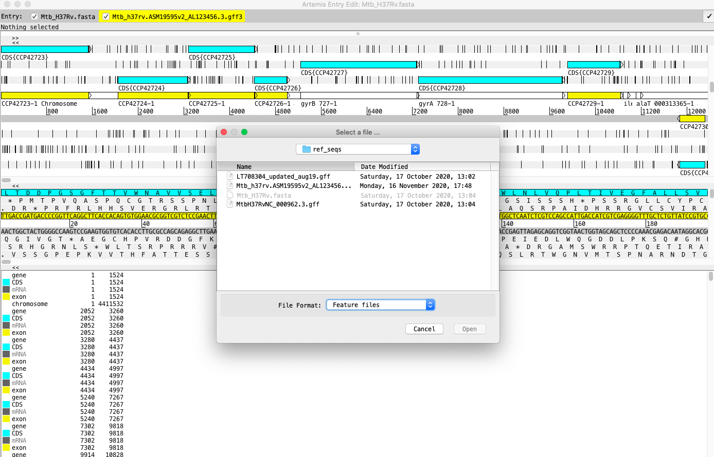

setwd("~/git/mtb_modules")

```{bash}
# to run artemis I found file in anaconda and clicked it, but this came up on terminal

/Users/jenniferstiens/anaconda3/pkgs/artemis-18.1.0-0/share/artemis-18.1.0-0/art ; exit;
# need to add this to my path?
export PATH=${PATH}:~/anaconda3/pkgs/artemis-18.1.0-0/share/artemis-18.1.0-0/art
# and add line to ~/.bash_profile
art
```

Load sequence file (project manager, select file, open)

File/Read an entry/select file format: 'feature file'from pull-down in window and select file for .gff3



look at .bams
File/Read BAM/CRAM?VCF, select .bam file

To look at only one of pair of reads: right-click on graph, filter: Hide/Show pair
